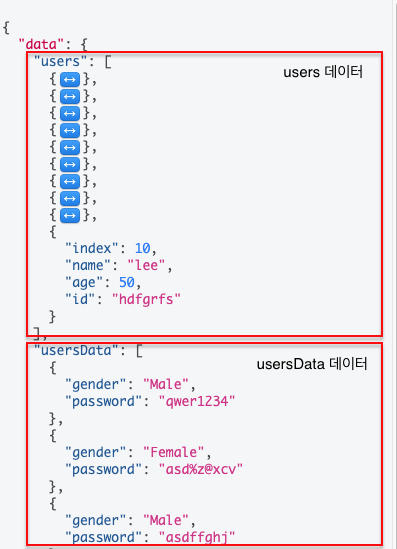

# GraphQL

#### 작성자 : [이병민](https://github.com/ByeongminLee)

<br>


### Reference

[Grapyql](https://graphql.org/)

[Grapyql-kr](https://graphql-kr.github.io/)

<br>

## GraphQL이란?

<code>GraphQL</code>은 2015년도에 Facebook에서 발표한 "데이터 질의어"이다.

<code>GraphQL</code>L은 Graph Query Language의 약자로 QueryLanguage 뜻은 데이터베이스 또는 데이터 관리 시스템에 접근하기 위한 언어로 ServerAPI 정보를 주고 받는 것에 특화된 QueryLanguage이다.

<br>

### GraphQL 공식 페이지에서의 GraphQL 소개

GraphQL은 특정한 데이터베이스나 특정한 스토리지 엔진과 관계되어 있지 않으며 기존 코드와 데이터에 의해 대체된다.

GraphQL은 API를 위한 쿼리 언어이며 이미 존재하는 데이터로 쿼리를 수행하기 위한 런타임이다.

GraphQL은 API에 있는 데이터에 대한 완벽하고 이해하기 쉬운 설명을 제공하고 클라이언트에게 필요한 것을 정확하게 요청할 수 있는 기능을 제공하며 시간이 지남에 따라 API를 쉽게 진화시키고 강력한 개발자 도구를 지원한다.

#### GraphQL 장점

-   필요한 것을 구체적으로 요청할 수 있으며 항상 예측 가능한 결과를 반환한다.
-   단일 요청으로 필요한 모든 데이터를 얻을 수 있다.
-   강력한 개발자 도구가 있다.
    (자체적으로 API 테스트 도구가있다.)

<br>

### GraphQL에 대한 설문

[https://2020.stateofjs.com/ko-KR/technologies/datalayer/](https://2020.stateofjs.com/ko-KR/technologies/datalayer/)

“state of JS 2020”의 설문에서 DataLayer 부분에서 관심도와 만족도 비율 1위를 차지 했다.<br>
또한 사용해봤고 다시 사용할 것임이 45%, 들어봤고 배우고 싶음이 45%으로 긍정도도 매우 높다.

<br>

### RESTAPI의 문제점

<code>GraphQL</code>은 다음과 같은 <code>RESTAPI</code>의 문제점을 해결 할 수 있다.

#### 1. Over Fetching

다음은 같은 책 온라인 쇼핑몰에서 보여지는 다른 페이지의 책 정보이다.


첫번째 사진에는 "제목", "지은이", "출판사", "가격"외에 "출판일"과 같이 아래 부분의 정보에는 없는 정보가 있다.<br>

보통 API를 구성할 때 다음과 같이 책에 대한 정보를 구성하고

```json
    {
        "title": "컴퓨터구조론 (김종현)",
        "price": 28000,
        "publisher": "생능",
        "author": "김종현",
        "publishedDate": "2019.02"
        ...
    }
```

각 페이지에서 필요한 데이터만 화면에 보여 주게 된다.<br>
즉, 불필요한 데이터까지 같이 전달 받게 된다.

> 필요한 정보보다 더 많은 데이터를 전달 받아 불필요한 리소스 낭비가 발생하고, 필요한 정보만 골라내기 위한 작업을 추가로 진행하여야한다.

→ 이것을 <code>Over-Fetching</code>이라 한다.

#### 2. Under Fetching

다음 문제점은 Under Fetcing이다.

사이트를 들어 가게 되면 상품에 대한 정보 뿐만 아니라 중간 중간 광고가 보이는 부분이 있다.

사이트의 경우 단 한번의 API를 통해서 받아 오는게 아니라 프론트엔드의 영역별로 페이지의 필요한 부분을 각기 다른 API로 부터 값을 받아 오게 된다.


그렇기 때문에 한 화면에서 필요로하는 데이터는 하나의 endpoint로의 요청으로는 충분한 데이터를 받지 못하고 그 이상의 endpoint에 요청해야한다.

> 필요한 데이터를 만들기 위해 여러 번의 호출이 필요하여 추가적인 리소스 요청이 발생하게 되고, 여러 요청을 통해 전달 받은 정보를 조합하는 추가 작업이 발생한다.

→ 이러한 경우를 <code>Under-Fetching</code>이라고 한다.

#### 3. 기타

<code>Over-Fetching</code>과 <code>Under-Fetching</code> 이외에도 <code>RESTAPI</code>를 사용하면 일일이 API의 URL를 지정해 주어야하는데 <code>GraphQL</code>에서는 단일 <code>endpoint</code>를 사용하기 때문에 이러한 불편함도 해소 할 수 있다.

또한 API를 개발하면서 테스트를 진행해야 하는데 GraphQL에서는 자체적으로 개발 도구를 지원한다.


다음과 같이 따로 테스트 도구를 만들거나 사용하지 않고도 쉽게 테스트가 가능하다.

> <code>RESTAPI</code>를 테스트할 때 사용하는 <code>Insomnia</code>와 같은 개발 도구 이다.

<br>

## GraphQL 개념

-   query

    쿼리는 RESTAPI에서 보면 CRUD중 R이라고 보면된다.<br>
    원하는 데이터를 작성해서 요청하고 받을 수 있다.

-   mutation

    뮤테이션은 쿼리와 다른 것은 없지만 RESTAPI에서 CRUD중 CUD에 해당한다. <br>
    데이터의 추가, 수정, 삭제 요청을 할 수 있다.

-   schema

    객체 type을 정의해 두는 부분이다.

    ```js
        type User {
            name: String!
        }
    ```

    <code>User</code>는 GraphQL의 필드가 있는 객체 타입이다.<br>
    <code>name</code>은 <code>User</code>의 타입의 필드 이고 <code>String</code>은 스칼라 타입중 하나이며, <code>!</code>는 이 필드를 쿼리할 때 항상 값을 반환 하는 것을 의미한다.

-   resolver
    데이터를 가져오는 구체적인 구현 과정을 구현하는 부분이다.<br>
    요청하는 값의 데이터의 구조를 원하는데로 바꾸어서 반환 할 수 있다.

<br>

## GraphQL 예제

<code>GraphQL</code>은 프레임워크같은 것이 아닌 질의어이다. <br>
그렇기 때문에 여러 환경에서 적용할 수 있는 솔루션이 있다.

GraphQL은 백엔드 뿐만아니라 프론트엔드에서 사용 할 수 있다.<br>
그중에서 대표적으로는<code>apollo</code>가 있다.<br>
<code>apollo</code>는 <code>apollo-server</code>와 <code>apollo-client</code>로 백엔드, 프론트 엔드를 모두 적용 할 수 있으며,<code>web</code> 뿐만 아니라 <code>ios</code>,<code>android</code>와 같은 다른 플랫폼에도 적용 할 수 있어서 인기가 많다.

> GraphQL를 개발한 Facebook에서 직접 만든 Relay는 React계열만 지원하고 apollo는 react,vue와 같은 웹 프레임워크 뿐만 아니라 ios,android와 같은 app에도 적용 할 수 있어 인기가 높다.

### 1. node.js express GraphQL 사용 하기

설치

-   express
-   graphql
-   express-graphql

다음 코드는 GraphQL 공식 페이지의 예제 코드 이다. <br>
다음 명령어로 패키지 파일을 설치하고 사용 할 수 있다.

> <code>./test-express-graphql</code>

```
$ npm install
```

<br>

다음 코드를 통해 실습할 수 있다.

> <code>./test-express-graphql/app1.js</code>

```js
var express = require("express");
var { graphqlHTTP } = require("express-graphql");
var { buildSchema } = require("graphql");

var app = express();

var schema = buildSchema(`
  type Query {
    hello: String
  }
`);

var root = { hello: () => "Hello world!" };

app.use(
    "/graphql",
    graphqlHTTP({
        schema: schema,
        rootValue: root,
        graphiql: true,
    })
);
app.listen(4000, () => console.log("Now browse to localhost:4000/graphql"));
```

<code>root</code>에 있는 hello를 Query로 날리게 되면 "Hello world!"를 <code>schema</code>에 정의된 Query의 타입으로 값을 반환 해준다.

-   GraphQL playground로 결과 확인

    

graphQL은 반환할 데이터의 구조를 미리 <code>schema</code>에 type을 정의를 해주어야 한다.<br>

<code>app.use()</code>에 schema,root를 정의해 두고 <code>graphiql: true</code>를 지정하게 되면 해단 URL인 <code>/graphql</code>로 접속하게 될 시 GraphQL playground로 쿼리를 날릴 수 있게 되고 결과를 확인 할 수 있다.

```js
app.use(
    "/graphql",
    graphqlHTTP({
        schema: schema,
        rootValue: root,
        graphiql: true,
    })
);
```

-   원하는 데이터만 불러오기 (Over-Fetching 해결)

    > <code>./test-express-graphql/app2.js</code>

    ```js
    var schema = buildSchema(
        `
            type Query {
                users: [User]
            }
            type User{
                index : Int
                name : String
                age : Int
                id : String
            }
        `
    );

    var root = { users: () => myData1 };
    ```

    호출하려고 하는 데이터 <code>myData1</code>를 호출하기 위해서는 다음과 같이 <code>myData1</code>에 있는 데이터의 type을 <code>User</code>에 정의하고 <code>Query</code>에 <code>users</code>를 호출할 시 <code>User</code> 데이터 타입을 반환하는 코드를 짜고 <code>root</code>에서 <code>users</code>를 호출시 반환 데이터로 <code>myData1</code>를 작성하면 된다.

    

    이때 전체 데이터가 아닌 원하는 데이터만을 호출하여 Over Fetching 문제를 해결 할 수 있다.
    

-   여러 데이터를 하나의 endpoint로 불러오기 (Under-Fetching 해결)

    <code>app3.js</code> 파일에서는 두가지 데이터 <code>myData1</code>과 <code>myData2</code>를 불러온다.

    <code>app3.js</code>를 실행 시키명 다음과 같이 한번에 데이터 들을 받을 수 있다.

    > <code>./test-express-graphql/app3.js</code>

    

    <code>app4.js</code> 파일은 <code>http://localhost:4000/</code> 경로로 접속시에 원하는 값만<code>Query</code>로 날려서 Ajax를 통해 값을 받아온다.

    프론트에서 다음과 같이 원하는 값만 데이터를 받아서 사용 할 수 있다.

    <code>myData1</code>에서 "id","name"값을 <code>myData2</code>에서 "password"와 "gender"값을 각각 한번의 데이터로 받아와서 화면에 출력한 모습이다.

    > <code>./test-express-graphql/app4.js</code>

    

### 2. apollo-server 사용하기

-   예제 실습

    > <code>./test-apollo-server</code>

    ```sh
    $ npm install
    ```

-   직접 생성

    ```sh
    $ npm init
    $ npm install apollo-server
    ```

#### apollo-server의 파일 구조

-   apollo-server 추가하기

    ```js
    import { ApolloServer, gql } from "apollo-server";
    ```

-   typeDefs 생성

    > GraphQL 명세에서 사용될 데이터, 요청의 타입을 지정해서 스키마를 gql(template literal tag)로 생성한다.<br>
    > 어떤 필드를 선택할 수 있는지, 어떤 종류의 객체를 반환할 수 있는지, 하위 객체에서 사용할 수 있는 필드는 무엇인지를 정의해둔다.

    ```js
    const typeDefs = gql`
    type Query {
        tests: [Test]
    }
    type Test {
        hello: String
    }

    ```

-   resolvers

    > 요청에 따라 데이터를 반환, 입력, 수정 삭제 한다. <br>
    > 정의된 스키마 필드에 사용되는 함수의 실제 행동을 정의한다.

    ```js
    const resolvers = {
        Query: {
            tests: () => test,
        },
    };
    ```

-   실행
    > ApolloServer는 typeDefs와 resolvers를 인자로 받아서 서버를 생성하고
    > server.listen()명령어로 서버를 실행한다.
    ```js
    const server = new ApolloServer({ typeDefs, resolvers });
    server.listen().then(({ url }) => {
        console.log(`🚀  Server ready at ${url}`);
    });
    ```

실습하기

1. 원하는 값만 요청하기

    > <code>./test-apollo/index1.js</code>

    임시로 사용할 데이터 <code>./database/products.js</code> import 시키기

    ```js
    import { products } from "./database/products.js";
    ```

    스키마 정의<br>
    <code>./database/products.js</code>파일의 타입을 지정합니다.

    ```js
    const typeDefs = gql`
        type Query {
            products: [Product]
        }
        type Product {
            title: String
            price: Int
            salePer: String
            salePrice: String
            star: String
            starNum: String
        }
    `;
    ```

    쿼리 호출시 반환할 데이터 정의하기

    ```js
    const resolvers = {
        Query: {
            products: () => products,
        },
    };
    ```

    <code>http://localhost:4000/graphql</code>로 접속하여 요청 받고 싶은 값을 선택해서 요청하기

    

2. 하나의 쿼리로 동시에 여러 데이터 받기

    > <code>./test-apollo/index2.js</code>

    ```js
    import { products } from "./database/products.js";
    import { ho } from "./database/ho.js";
    import { name } from "./database/name.js";
    import { ApolloServer, gql } from "apollo-server";

    const typeDefs = gql`
        type Query {
            products: [Product]
            hos: [Ho]
            names: [Name]
        }
        type Product {
            title: String
            price: Int
            salePer: String
            salePrice: String
            star: String
            starNum: String
        }
        type Ho {
            index: Int
            Ho: String
        }
        type Name {
            index: Int
            Name: String
        }
    `;

    const resolvers = {
        Query: {
            products: () => products,
            hos: () => ho,
            names: () => name,
        },
    };

    const server = new ApolloServer({ typeDefs, resolvers });
    server.listen().then(({ url }) => {
        console.log(`🚀  Server ready at ${url}`);
    });
    ```

    <code>index2.js</code>는 <code>index1.js</code>에서 데이터
    <code>Ho</code>와 <code>Name</code> 데이터를 추가한 것입니다.

    

3. 원하는 값만 필터링해서 받기

    <code>resolvers</code>에 값을 필터링해서 under fetching 문제를 해결 할 수 있다.

    > <code>./test-apollo/index3.js</code>

    ```js
    type Query {
        product(price: Int): [Product]
    }
    ```

    다음과 같이 <code>Query</code>부분에 기존에 있던 <code>products: [Product]</code>에 입력값을 받으려고 값을 <code>product(price: Int): [Product]</code>로 정의해준다.

    ```js
    const resolvers = {
        Query: {
            // products.price이 요청 쿼리 값보다 클 경우만 출력
            product: (parent, args, context, info) =>
                products.filter((product) => {
                    return product.price >= args.price;
                }),
        },
    };
    ```

    그리고 나서 <code>resolvers</code>에서 원하는 코드를 지정해준다.

    만약 요청값보다 높은 값을 받는다고 하면
    이때 요청인자로는 <code>args</code>를 받는다.<br>
    <code>filter</code>로 요청한 인자인 <code>args.price</code>보다 큰 값만 나오게 하면 요청받은 인자보다 큰값만 나오게 된다.

    <code>price</code>가 8000보다 큰 값 출력하기

    

4. 원하는 값만 필터링하기2

    <code>index2.js</code>파일에서 실행했을때 보면

    ```js
    "data":{
        "A":[
            {
            "a": "value",
            },
        ],
        "B":[
            {
            "b": "value",
            },
        ]
    }
    ```

    하나의 endpoint로 <code>data</code>안에 값은 있지만 각각 A, B로 나누어져 온다.<br>

    ```js
    type Ho {
        index: Int
        Ho: String
        names: [Name]
    }
    type Name {
        index: Int
        Name: String
    }
    ```

    <code>Ho</code>안에 <code>Name</code>을 넣어서
    <code>Ho</code>를 호출할때 <code>Name</code>을 같이 호출하도록 넣어주면된다.

    그리고 resolvers를 지정해주어야한다.<br>
    지정하지 않고 그냥 호출하면 <code>Ho.names</code>안에 모든 <code>names</code>가 나오게 된다.

    그리고 resolvers에 다음과 같이 <code>filter</code>로 index번호가 일치하는 값을 1:1관계로 호출되게 해준다.

    ```js
    hos: () =>
    ho.map((ho) => {
        ho.names = name.filter((v) => {
            return ho.index == v.index;
        });
        return ho;
    }),
    ```

    

5. HTML과 연동하기

    <code>index5.js</code>을 :4000 포트 실행시킨 후 <code>index.html</code>를 LiveServer로 :5050 포트로 실행 시킨다.

    | A                                                     | B                                                     | C                                                     |
    | ----------------------------------------------------- | ----------------------------------------------------- | ----------------------------------------------------- |
    |  |  |  |

    > <code>./test-apollo/index5.html</code><br>

    > <code>./test-apollo/index5.js</code>

    위의 코드는 내용은 검색한 값 이상의 값을 가져온다.
    라디오박스에 있는 값을 선택한 값만 요청해서 가져온다.
    (Over Fetching) <br>
    "B"는 할인율 선택 했을때 결과이고 "C"는 할인율, 할인가 모두를 요청한 결과이다.<br>

    요청하지 않은 결과값에 대해서는 <code>undefined</code>가 뜨는 것을 볼 수 있다.
