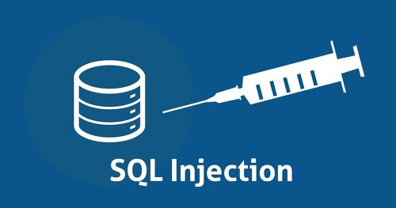
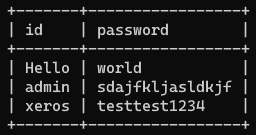
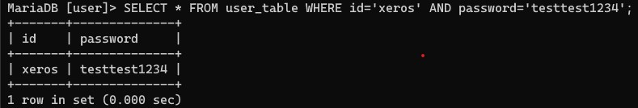
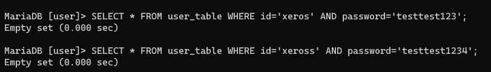
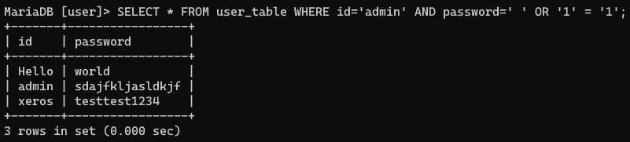

# SQL Injection

#### 작성자 : [김우영](https://github.com/0x000613)

### 주제선정 이유

앞으로 개발을 하며 항상 필수적으로 고려해야하는 보안 취약점이라고 생각하기때문에 가장 빈번하게 발생하는 침해사고 종류인 SQL Injection 공격 기법에 대해 간략하게 정리해보았습니다.

### SQL Injection

SQL Injection을 말그대로 풀이하면 "SQL 주입(삽입)"입니다.



SQL 인젝션이란 응용 프로그램 (주로 웹 프로그램을 대상으로 일어나지만 DB를 사용하는 모든 프로그램을 대상으로 합니다.)의 보안 상의 허점을 의도적으로 이용해, 악의적인 SQL문을 실행하여 데이터베이스를 비정상적으로 조작하는 코드 인젝션 기법을 뜻합니다.

#### 실습 환경 구성

1. `user` 데이터베이스를 생성합니다.

   ```sql
   create database user;
   ```

   

2. `user` 데이터베이스를 선택합니다.

   ```sql
   use user;
   ```

   

3. `user_table` 테이블을 생성합니다.

   ```sql
   create table `user_table` (
       `id` varchar(10) not null,
       `password` varchar(20) not null
   ) ENGINE=InnoDB DEFAULT CHARSET `utf8`;
   ```

4. `user_table` 에 실습을 위용한 임시 USER를 생성합니다.

   ```sql
   insert into user_table (`id`, `password`) value ("Hello", "world");
   insert into user_table (`id`, `password`) value ("admin", "sdajfkljasldkjf");
   insert into user_table (`id`, `password`) value ("xeros", "testtest1234");
   ```

위 과정을 거쳐 생성된 데이터베이스를 조회하면 다음과 같습니다.

```
select * from user_table;
```



#### 시나리오 1) Node.js 백엔드 프로그램 설계

사용자가 로그인 페이지에서 아이디, 비밀번호를 입력한 후 `POST` 요청시 MySQL 서버로 다음과 같이 별도의 보안이 적용되지 않은채 SQL문을 전송하는 Node.js 백엔드 프로그램이 있다고 가정합니다.

```sql
SELECT user FROM user_table WHERE id='[입력한 아이디]' AND password='[입력한 비밀번호]';
```

이러한 쿼리를 사용하는 Node.js 백엔드 프로그램은 입력받은 ID, PASSWORD를 우선 위 SQL문을 이용해 조회하고 검색되는 결과값이 있다면, 해당 아이디로 사용자를 로그인시킨 뒤 Session을 발급하도록 작성되었을 것입니다.

#### 시나리오 2) 정상적인 접근

만약 일반적인 사용자라면 ID, PASSWORD를 다음과 같이 입력할것입니다.

```tex
아이디: xeros
패스워드: testtest1234
```

위와 같이 입력할 경우 백엔드 서버에서 처리하는 SQL문은 다음과 같습니다.

```sql
SELECT * FROM user_table WHERE id='xeros' AND password='testtest1234';
```

이 쿼리를 실행하게 될 경우 결과값은 다음과 같습니다.



만약 입력값중 ID 혹은 PASSWORD 둘 중 하나라도 다르게 입력했을 경우에는 조회되지 않고 다음과 같은 결과를 반환할 것입니다.



#### 시나리오 2) 악의적인 접근

이번엔 SQL Injection 공격기법을 사용해서 접근해보도록 하겠습니다.

```
아이디: admin
패스워드: ' OR '1' = '1
```

위 POST 요청의 SQL문은 다음과 같습니다.

```sql
SELECT * FROM user_table WHERE id='admin' AND password=' ' OR '1' = '1';
```

위 SQL문의 실행 결과는 다음과 같습니다.



이러한 악의적인 SQL문의 실행되게되면, DB에서는 모든 결과값을 출력 및 반환하게됩니다.

공격 구문이 성립되는 SQL 질의문의 where절 이후를 살펴보면 `id='admin' AND password=' ' OR '1' = '1'` 으로 처리되는것을 확인할 수 있습니다.

프로그램에서 AND 연산은 OR 연산보다 우선순위가 빠르기때문에 먼저 실행되어버리고 `'1' = '1'`이라는 구문, 즉 `True`가 반환되기때문에 결과적으로 위 구문은 항상 참이기에 실행됩니다.

따라서 시큐어코딩이 되어있지 않은 우리의 Node.js 백엔드 프로그램은 위 로그인 요청에 대한 DB의 반환값이 존재하기 때문에 정상적인 유저로 인식하여 로그인을 시켜주게됩니다.

예시로 위대한 캐츠비는 관리자, 일반회원 로그인 페이지와 DB 테이블이 분리되어있기 때문에 관리자 페이지에서 SQL Injection 기법이 성공하게 될 경우 관리자 페이지를 장악당하고 모든 회원 데이터를 공격자가 취득할 수 있게되는 보안 침해사고가 발생하게됩니다.

아직 SQL이 미숙하여 기본적인 예제만 가져왔지만, 이 외에도 SQL Injection은 `JOIN`이나 `DROP`등 다양한 문법을 사용하여 다양한 공격이 가능합니다.

또한 이러한 SQL 공격 명령 군집을 자동으로 테스팅해주는 툴 역시도 존재하며, 리눅스(주로 칼리)에서 사용가능하도록 배포되고 있습니다.

[SQL Injector](https://linuxhint.com/sql-injection-kali-linux/)

#### 방어 방법

공격당했을때 발생하는 피해에 비해 방어 방법은 매우 간단합니다.

Node.js의 경우 `escape()` 함수를 이용해 방어 처리가 가능하며, Node.js 이외에 다른 백엔드 언어들도 대부분 이러한 escape 기능을 제공합니다.

```javascript
const id = <사용자로 부터 입력받은 값>;
const sql = 'SELECT * FROM user_table WHERE id=' + connection.escape(id);
connection.query(sql, function(err, rows) {
  ...
});
```
