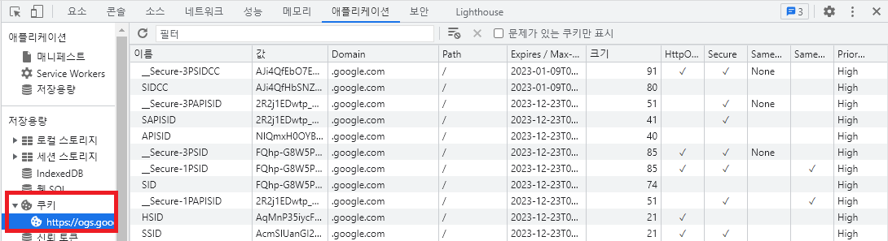
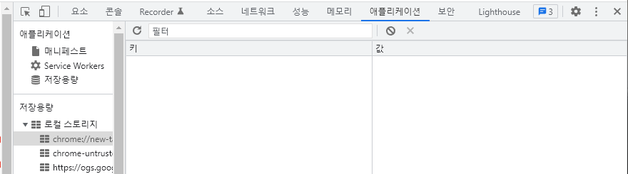
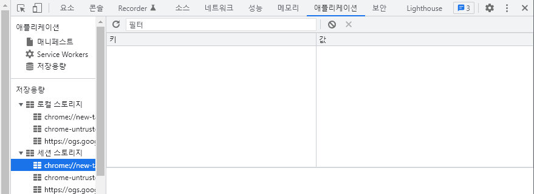

# 쿠키(cookie) 와 웹스토리지(Web Storage)

#### 작성자 : [이슬기](https://github.com/abcabcp)

## 1. 쿠키(Cookie)

### 1.1. 쿠키란 무엇인가?
- HTTP의 일종으로 사용자가 어떤 웹사이트에 방문할 경우 그 사이트가 사용하고 있는 서버를 통해 인터넷 사용자의 컴퓨터에 설치되는 작은 기록 정보 파일
- HTTP쿠키, 웹 쿠키, 브라우저 쿠키라고도 불림
- 인터넷 사용자가 같은 웹사이트를 방문할 때마다 읽히고 수시로 새로운 정보로 바뀐다.
- 대부분의 브라우저가 지원하며, 사용자 단위가 아니라 브라우저 단위로 생성된다. 때문에, 크롬에서 방문해서 생성된 쿠키와 사파리로 생성된 쿠키는 다르다.
- 데이터 형태는 key, value 형태로 string문이며, 4kb이상 저장이 불가능함.
- 유효기간을 설정할 수 있다. 설정하지 않으면 해당 세션(사용자가 사이트에 머물고 있는 시간)동안에만 유효하다.
- 매 HTTP 요청마다 포함되어 API를 호출하므로 서버에 부담이 될 수 있다.
- 소프트웨어가 아니므로 컴퓨터 내에서 프로그램처럼 실행되거나, 바이러스를 옮기거나, 악성코드를 설치할수 없다. 하지만 스파이웨어를 통해 유저의 브라우징 행동을 추적하는 데 사용되거나 쿠키를 훔쳐서 해당 사용자의 웹 계정 접근권한을 획득할 수 있다.
  
    > 스파이웨어 : 사용자의 동의 없이 설치되어 컴퓨터의 정보를 수집하고     전송하는 악성 소프트웨어. 신용 카드와 같은 금융 정보 및 주민등록번호와 같은 신상정보, 암호를 비롯한 각종 정보를 수집한다.

### 1.2 쿠키의 종류

|종류|설명|
|------|----------------------------------|
|기술적쿠키| 검색하는 주체가 사람인지 아니면 어플리케이션인지 이용자 구분 기능 수행|
|분석쿠키| 어떤 종류 검색하는지, 많이 검색하는지, 시간, 언어 등의 정보를 수집|
|광고쿠키|검색내용, 국가, 언어에 따라 광고 게재|

### 1.3 쿠키의 사용
- ID정보저장 -> 로그인 상태 유지
- 최근 검색한 정보 광고 추천
- 쇼핑몰 장바구니 저장 기능
- 하루/7일 등 일정 기간 다시 보지 않기

### 1.4 쿠키의 구성 요소

- 이름(Name) : 각각의 쿠키를 구별하는 데 사용되는 이름
- 값(value) : 쿠키의 이름과 관련된 값
- 유효시간(Expires) : 쿠키의 유지시간
- 도메인(Domain) : 쿠키를 전송할 도메인
- 경로(Path) : 쿠키를 전송할 요청 경로

--------------------------------------------------------

## 2. 웹스토리지 (Web storage)
- 서버가 아닌 클라이언트에 데이터를 저장할 수 있도록 지원하는 HTML5의 새로운 기능이다.
- 때문에 HTML5를 지원하지 않는 브라우저의 경우엔 사용이 불가능하다.
- 쿠키와 기능이 비슷하지만 웹 스토리지는 약 5MB까지 저장공간을 이용할 수 있다.
- key, value 저장소로 순서대로 저장하면 되며, 값으로는 문자열, 블리언, 숫자, null, undefined 등을 저장할 수 있으나, 모두 문자열로 변환된다. 
- 사용 메서드
    |메서드명|설명|
    |--|--|
    |setItem(key, value)|key,value 값 보관|
    |getItem(key)|키에 해당하는 값을 받아옴|
    |removeItem(key)|해당 key, value값 삭제|
    |clear()|모든 데이터 삭제|
    |key(index)|인덱스(index)에 해당하는 키를 받아옴|
    |length|저장된 데이터쌍(key,value)의 값 길이를 받아옴|
    |Object.keys| 키 전체를 얻음|

    - ex) localstorage.setItem(key, value); sessionstorage.getItem(key, value);

### 2.1 로컬 스토리지
 
- window.localStorage에 위치힌다.
- 도메인 단위로 생성이 되며 다른 도메인의 로컬 스토리지에는 접근이 불가능하다. 또한 서로 다른 브라우저의 탭이라도 도메인이 같으면 같은 로컬 스토리지를 사용한다. 브라우저를 종료해도 사용자의 디스크에 저장되어 데이터가 삭제되지 않으며 수동으로 지우지 않는한 영구적으로 저장 된다.
- 데이터를 저장, 덮어쓰기, 삭제 등 조작 가능하며 모바일에서도 사용이 가능하다.
- 주로 자동로그인 기능 구현 시 사용됨.

### 2.2 세션 스토리지

- window.sessionStorage에 위치한다.
- 탭/윈도우 단위로 생성이 되며 도메인이 같아도 탭이 다르면 데이터에 접근이 불가능하다. 브라우저나 탭을 닫을 시 데이터가 삭제가 되며 세션 스토리지끼리 서로 영향을 주지 않고 독립적으로 동작 한다.
- 주로 비로그인 장바구니 기능 등에 사용됨.
