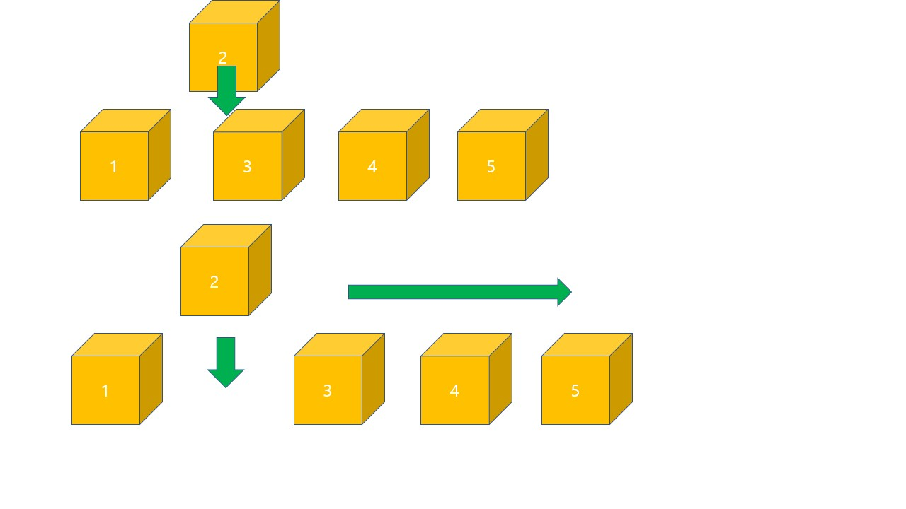
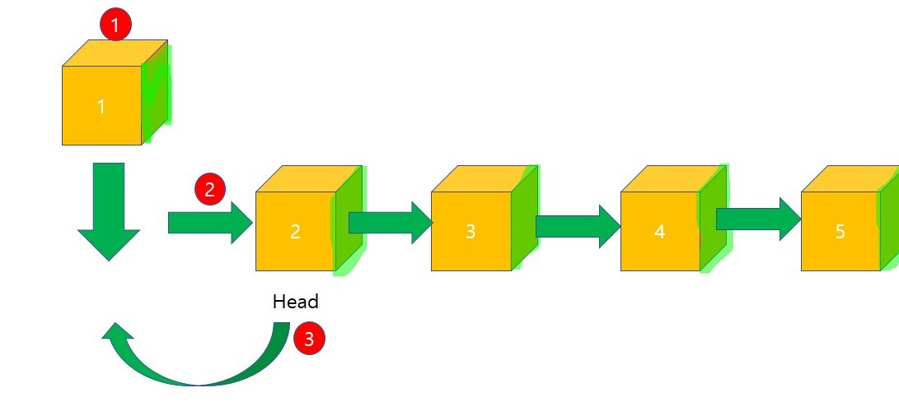

# 자료구조 (Linear_data_Structure)

#### 작성자 : [전찬민]

# 자료구조란? 

전산학에서 자료를 효율적으로 이용할 수 있도록 컴퓨터에 저장하는 방법.
신중히 선택한 자료구조는 보다 효율적인 알고리즘을 사용할 수 있게 된다.


자료구조는 선형구조(Linear) / 비선형구조(NonLinear)로 구분한다.

* 선형구조 - 배열(Arrays), 연결리스트(Linked List), 스택(Stack), 큐(Queue)
=> 자료를 구성하는 데이터를 순차적으로 나열시킨 형태

* 비선형구조 - 트리(Tree), 그래프(Graph)
=> 하나의 자료뒤에 여러개의 자료가 존재할 수 있는 것을 의미한다.
* 참고자료: [Github](https://github.com/JaeYeopHan/Interview_Question_for_Beginner/tree/master/DataStructure#personal-recommendation-1)
* 참고영상: [Youtube](https://www.youtube.com/watch?v=xnURecIJk4g)
<br>
## Array 
* 가장 기본적인 자료구조인 Array는 논리적 저장순서와 물리적 저장순서가 일치한다
따라서 index로 해당원소에 접근할 수 있다. 그렇기 때문에 찾고자 하는 원소의 
인덱스 값을 알고 있으면 해당 원소로 접근할 수 있다.
즉, Random access가 가능하다는 장점이 있는것이다.

* 하지만 삭제 또는 삽입의 과정에서는 해당 원소에 접근하여 작업을 완료한뒤,
또 한가지의 작업을 추가적으로 해야 하기 때문에 시간이 더 걸린다.
만약 배열의 원소 중 어느 원소를 삭제했다고 했을 때, 배열의 연속적인 특징이 깨지게 된다. 즉, 빈 공간이 생기게 되는것이다.

* 삽입의 경우도 마찬가지이다. 만약 첫번째 자리에 새로운 원소를 추가하고자 한다면 모든 원소들의 index를 1씩 옮겨야 하므로 시간을 요구하게 된다.


let arr[5]= {1,2,3,4,5}; 라는 배열이 있다.
6부터10까지 원소를 넣고 싶다면 어떻게 해야할까?
지금 이 구조에서는 할 수 없다. 해야 한다면.

let arr[10] = {1,2,3,4,5,6,7,8,9,0}; 이라는 배열을 `새로` 생성해야한다.

# 배열의 한계
* 1) 중간에 데이터를 저장하고 싶을경우
1, 3, 4, 5 => 1과3사이에 2를 저장하고 싶을경우 해야하는 방법
-> 1, 2, 3, 4, 5  3,4,5를 한 칸씩 뒤로 밀어야 한다. 비효율적으로 동작한다.


<br>
* 2) 중간에 데이터를 삭제하고 싶은 경우
1, 2, 2, 3, 4 => 2를 삭제하고 싶을때 해야하는 방법
->  1, 2, 3, 4 중간에 있는 2를 없애기 위해선 뒤에 있는 2, 3, 4를 차례대로 덮어씌워야 한다.


<br>
## 연결리스트 (Linked List)
* 이러한 한계점을 해결하기 위한 자료구조가 linked list이다. 각각의 원소들은 자기 자신 다음에 어떤 원소인지만을 기억하고 있다. 따라서 이 부분만 다른값으로 바꿔주면 삭제와 삽입을 큰 시간 안들이고 해결할 수 있는것이다. 

* 하지만 Linnked List 역시 한가지 문제점이 있다. 원하는 위치에 삽입을 하고자 하면 원하는 위치를 검색과정에 있어서 첫번째 원소부터 다 확인해봐야 한다는 것이다.
Array와는 달리 논리적 저장순서와 물리적 저장순서가 일치하지 않기 때문이다.
이것은 일단 삽입하고 정렬하는 것과 마찬가지이다.
* 이 과정 때문에 어떤한 원소를 삭제 또는 추가하고자 했을때, 그 원소를 찾기위해 시간이 추가적으로 발생하게 된다.

선형자료구조지만 연속된 공간에 데이터를 저장하지 않는다. 다섯개의 데이터가 각각 떨어져 있다.

이런 구조가 가능한 이유는?
데이터가 다음 저장된 데이터 주소를 함께 기억한다
Next라는 멤버에 다음 Node의 위치를 저장한다.
그러면 떨어져있는 공간이지만 연결되어 있는것 처럼 만들 수 있다.
```java
class Node {
    int data;
    Node next;
}
```

# 연결리스트 순회

```java
class LinkedList{
    Node head;
}
```
* 연결리스트는 첫 노드인 Head노드를 기억한다.
* 모든 데이터를 순회하기 위해선 첫 노드부터 마지막 노드까지 Next를 확인하며 이동해야한다.
* 마지막 노드에 도달하는데 마지막 노드는 다음 노드가 없기때문에 Null를 바라보고있다.
* 만약 Next가 Null이라면 현재 마지막 노드이기때문에 순회를 마칠 수 있다.

# 연결리스트 추가
값을 추가하는 흐름이다 .
1과 3사이에 2를 추가하고싶다. 배열은 값을 추가할려면 뒤에 값을 밀어내야 한다.
2를 가지는 새로운 노드를 만들고 Node에 Next만 바꾸면 되게 때문에 쉬운 상황이다.
다시 설명 하자면.
2라는 노드를 만들고 새로운 노드의 Head가 Next를 보게 만들고 Head는 새로운 노드를 보게 만들면 된다.


처음에 데이터를 넣는 상황은 더 쉽다.
새로운 노드를 만들고 현재 Head를 바라보게 만들고 Head를 옮겨주면된다.


# 연결리스트 삭제
삭제도 비슷하게 Next를 바꾸면 된다. 2를 삭제하고 싶으면,
1Head의 Next를 다음 다음 3을 바라보게 만들고 노드를 삭제하면 된다.


# 원형 연결리스트
처음에 소개한 기본 연결리스트는 마지막 노드를 조회하려면 Next를 타고타고 가야 했었는데
이 방식이 비효율적이라 개선을 한게 원형 연결리스트이다.
원형연결리스트는 뭐를 바라보든 마지막 노드의 Next를 처음 노드를 바라보게 한다.
그리고 또 하나 Head대신에 마지막노드인 tail을 기억한다.
이렇게 마지막 데이터가 필요하면 Tail를 살펴보면 되고,
첫번째 데이터가 필요하면 Tail의 Next를 확인하면 된다.
간단한 데이터로 처음과 마지막을 쉽게 가져올 수 있게 되었다.
```java
CircularLinkedList{
    Node Tail;
}
```


# 이중 연결 리스트 / 양방향 연결 리스트
또 다른 업그레이드 버전으로 이중연결리스트 또는 양방향 연결리스트라 부른다.
사진에서 보이듯 다음 노드인 Next뿐만 아니라 previous도 기억하고 있다.
이런 구조를 가지고 있으면 앞 뒤로 왔다갔다 할 수 있기 때문에 편리하다.

하나만 예로 들자면 역순으로 순회를 하고 싶은경우이다.
단방향이였다면 뒤로 갈 수가 없어서 불가능한일인데, 양방향이면 가능하다.


```java
class Node{
    int data;
    Node next;
    Node previous;
}
```

# 동적배열 VS 연결리스트
연결리스트가 더 좋아보이지만 실제로는 연결리스트보다 동적배열을 더 많이 쓴다.
* 조회가 느리다.
* 중간에 추가, 삭제 하는 동작도 타고 가야하는 비용이 있다.
* 다음 노드를 기억하는데 추가 메모리를 사용한다.
* 메모리가 퍼져 있으므로 캐시의 효과를 누리지 못한다.

# 연결리스트가 필요한 이유
* 잦은 추가와 삭제가 이루어지는 경우 사용
* 다른 자료구조를 공부하는 기반의 지식이 된다.


## Stack
선형 자료구조의 일종으로 Last In First Out(후입선출) 즉, 나중에 들어간 원소가 먼저 나온다.
이것은 Stack의 가장 큰 특징이다. 차곡차곡 쌓이는 구조로 먼저 Stack에 들어가게 된 원소는 맨 바닥에 깔리게 된다. 그렇기 때문에 늦게 들어간 녀석들은 그 위에 쌓이게 되고 호출기 가장 위에 있는 녀석이 호출되는 구조이다.
<br>
* 스택을 활용한 미로 만들기 : [Stack-Maze](https://www.kudryavka.me/?p=21)
<br>

<br>
그림으로 설명하자면 1, 2, 3 이 있는 상황에서 새로 추가된 데이터는 위에 생기고 이를 push라 한다. 
반대로 나중에 들어온 데이터가 나가는 연산을 pop이라 한다. 나중에 들어온 5가 먼저 나간걸 볼 수 있다.
Stack는 주로 배열로 구현한다.

## Queue
선형 자료구조의 일종으로 First In First Out(선입선출) 즉, 먼저 들어간 놈이 먼저 나온다.
Stack과는 반대로 먼저 들어간 놈이 맨 앞에서 대기하고 있다가 먼저 나오게 되는 구조이다.
참고로 Java Collection에서 Queue는 인터페이스이다. 이를 구현하고 있는 Priorty queue등을 사용 할 수 있다.
<br>

<br>
그림으로 설명하자면 1, 2, 3 이 있는 상황에서 새로 추가된 데이터는 뒤에 생긴다.
이러한 연산을 보통 enqueue라 부른다. 반대로 이미 추가된 데이터를 빼는 연산
즉, queue에서 가장 오래된 데이터가 빠져나가는 연산을 dequeue라 한다.

Queue는 배열로도 구현할 수 있고 연결리스트로도 구현할 수 있는데 연결리스트로 구현 한다면
이미 연결리스트에는 Head와 Tail에 추가, 삭제를 쉽게 할 수 있기 때문에 리스트가 가지고 있는 메소드만 호출 해주면 Queue구현은 끝이라 할 수있다.
하지만 보통 배열로 된 Queue를 많이 사용한다. 배열을 사용하는게 메모리적으로나 성능적으로 이점이 있기 때문에 배열 Queue를 사용한다.
```java
class Queue {
    LinkedList list;

    void enqueue(int data) {
        list.addFirst(data);
    }

    int dequeue() {
        return list.popLast();
    }
}
```

## Tree
트리는 스택이나 큐와 같은 선형 구조가 아닌 비선형 자료구조이다. 트리는 계층적 관계(Hierarchical Relationship)을 표현하는 자료구조이다.

<br>

# 트리를 구성하고 있는 구성요소들(용어)
* Node (노드) : 트리를 구성하고 있는 각각의 요소를 의미한다.
* Edge (간선) : 트리를 구성하기 위해 노드와 노드를 연결하는 선을 의미한다.
* Root Node (루트 노드) : 트리 구조에서 최상위에 있는 노드를 의미한다.
* leaf Node (단말 노드) : 하위에 다른 노드가 연결되어 있지 않은 노드를 의미한다.
* Internal Node (내부노드, 비단말 노드) : 단말 노드를 제외한 모든 노드로 루트 노드를 포함한다.
* Sub Tree (서브 트리) : 트리내에 또 다른 트리형태가 있는 것을 의미한다.
* Degree (노드의 차수) : 각 노드에서 뻗어나온 간선의 개수
* Depth (노드간의 거리) : 루트에서 특정 노드에 도달하기 위한 간선의 개수
* Level : 트리에서 나타내는 높이

트리의 정의를 한 문장으로 요약하자면 한개이상의 노드로 이루어진 사이클이 없는 연결그래프라 할 수 있다.

# 노드가 될 수 없는 조건

<br>
왼쪽 사진은 사이클이 돌아서 트리가 될 수 없고
오른쪽 사진은 연결그래프가 존재하지 않아 트리가 될 수 없다.
그렇다면 트리가 밀접하게 사용되는 경우는 계층이 필요한 구조에서 쓰인다.
예를들어 조직도라던가 파일시스템이다.

# 트리의 성질
* 노드의 개수가 N개라면, 엣지의 개수는 항상 N-1개이다.
* 노드를 중복해 방문하지 않으면, 노드간의 경로는 유일하다.
* 균형이 잡혀있으면 탐색에0의 수행속도를 가진다.
  
# Binary Tree (이진 트리)
루트 노드를 중심으로 두 개의 서브 트리(큰 트리에 속하는 작은 트리)로 나뉘어 진다. 또한 나뉘어진 두 서브 트리도 모두 이진 트리어야 한다. 재귀적인 정의라 맞는듯 하면서도 이해가 쉽지 않을 듯하다. 한 가지 덧붙이자면 공집합도 이진 트리로 포함시켜야 한다. 그래야 재귀적으로 조건을 확인해갔을 때, leaf node 에 다다랐을 때, 정의가 만족되기 때문이다. 자연스럽게 노드가 하나 뿐인 것도 이진 트리 정의에 만족하게 된다.
<br>


<br>
다시 말 하자면 트리는 한 부모가 여러개의 자식을 가질 수 있다. 자식을 1개를 가질 수 있고 2개를 가질 수 있고, 3개를 가질 수 있다. 하지만 이진트리는 모든 노드가 2개이하의 자식만 갖는 트리를 말하는 것이다.
또한 이진트리의 높이는 최대 N이거나 최소 log2(n+1)이 될 수 있다. 
다르게 말하면 이진트리안의 원소를 접근하는데 걸리는 최대시간이 N이거나 log2(n+1)이 될수 있다는 말이다.
N이 되는 경우는 왼쪽과 같이 한쪽으로 치우친 형태이고, log2(n+1)이 되는 경우는 오른쪽과 같이 균형이 잡힌 형태이다.

<br>
노드의 개수(N)는 3개이다. N+1이 4개이면 높이는 log2(4) = 2 즉 2가 되는 걸 볼 수 있다.


<br>
노드가 7개인것도 보면 노드의 개수(N)은 7이다. N+1 = 8이 되므로 log2(8)은 2의3승이므로 높이가 3이 된다.

* 균형 트리 (Balanced)

<br>
* 불균형 트리 (UnBalanced)

<br>
* 완전 이진 트리 (Complete Binary Tree)

<br>
완전 이진 트리는 마지막 레벨을 제외하고 모든 레벨이 완전히 채워져 있으며 마지막 레벨의 모든 노드는 가능한 왼쪽에 붙어있는 트리를 말한다. 
오른쪽 같은 경우는 균형잡힌 트리이지만 왼쪽부터 채워지지 않았으므로 완전 이진 트리가 될 수 없다.
* 포화 이진 트리 (Perfect Binary Tree)
모든 레벨이 꽉 찬 이진 트리를 가리켜 포화 이진 트리라고 한다.

<br>

# 이진트리의 순회 방식
* 전위 (Pre Order)
* 중위 (In Order)
* 후위 (Post Order)
* 레벨 (Level Order)

<br>
전위 / 중위 / 후위 순회는 부모를 언제 방문하는지를 기준으로 삼는다. 
전위 순회는 부모를 1순위로 방문하고, 중위 순회는 부모를 2순위, 후위 순회는 3순위로 방문한다.
레벨 순회는 말 그대로 레벨 순으로 방문하는 것을 말한다.

# BST (Binary Search Tree) - 이진 탐색 트리
이진 탐색 트리는 특별한 성질을 만족하는 트리를 말한다. 
여기서 말 하는 특별한 성질은 왼쪽 자식은 부모보다 작고, 오른쪽 자식은 부모보다 크다는 성질을 말한다.
이진 탐색 트리는 데이터탐색을 효율적으로 하기 위한 자료구조이다.
방문한 노드가 찾는 값보다 더 크거나 작은지 판별하면서 내려가면 선형시간이던 탐색 수행속도를
로그시간으로 줄일수 있게 된다.

# 이진 탐색 트리의 성질
* 중복된 값은 허용하지 않는다. 즉 키값은 유일하다.
* 정렬된 상태를 유지한다.
* 삽입
  * 삽입하려는 성질에서 부모보다 값이 작으면 왼쪽, 값이 크면 오른쪽으로 들어가게된다.

<br>
* 삭제
  * 지우는 노드가 자식이 없는 경우 - 그냥 지우면 된다.
  * 지우는 노드가 자식이 1개인 경우 - 자식이 부모의 위치를 대신한다.
  * 지우는 노드의 자식이 2개가 있는경우 - 이진탐색트리의 성질을 생각하면 부모보다 작은값은 왼쪽 큰 값은 오른쪽에 가면된다.

이진 탐색 트리의 탐색 연산은 O(log n)의 시간 복잡도를 갖는다. 사실 정확히 말하면 O(h)라고 표현하는 것이 맞다. 
트리의 높이를 하나씩 더해갈수록 추가할 수 있는 노드의 수가 두 배씩 증가하기 때문이다. 
하지만 이러한 이진 탐색 트리는 Skewed Tree(편향 트리)가 될 수 있다. 저장 순서에 따라 계속 한 쪽으로만 노드가 추가되는 경우가 발생하기 때문이다. 이럴 경우 성능에 영향을 미치게 되며, 탐색의 Worst Case 가 되고 시간 복잡도는 빅오표기법으로 따졌을때 O(n)이 된다.

배열보다 많은 메모리를 사용하며 데이터를 저장했지만 탐색에 필요한 시간 복잡도가 같게 되는 비효율적인 상황이 발생한다. 이를 해결하기 위해 Rebalancing 기법이 등장하였다. 균형을 잡기 위한 트리 구조의 재조정을 Rebalancing이라 한다.

## Heap

<br>
부모노드의 값이 자식노드의 값보다 크거나(작거나)같은 완전 이진트리 혹은 포화 이진트리를 말한다.
힙트리는 이진탐색트리와 비슷한 형태이지만 자식과 부모사이의 대소관계가 이진탐색트리와는 다르다.
부모노드가 자식노드보다 작거나 같으면 Heap, 부모노드보다 작으면 왼쪽, 크면 오른쪽이면 이진탐색트리이다.
그리고 가장 큰 값, 가장 작은값 외에는 특정 노드에 대한 접근이 불가능 하다.
부모노드는 자식노드보다 작다는 것만 알기에 탐색해서 들어가는것이 불가능하다.
그리고 이진탐색트리와는 다르게 중복된 값을 가질 수 있다.

* 삽입 : 신규 직원을 말단에 위치시킨뒤, 승진
* 삭제 : 막내 직원을 비어있는 이사직에 올린 뒤 강등
시킨다라고 생각하면 이해하기 쉽다. 

Heap같은 경우 최대, 최소값 접근시 수행속도는 O(1)이고 
삽입, 삭제의 수행속도는 균형잡힌 이진트리에서의 높이와 비례하므로 O(log2N)의 수행속도를 가진다.

# BST vs HEAP
BST는 특정원소에 대한 접근이 가능하고 전체가 정렬된 상태를 유지한다. 중위순회를 통해 추가적인 정렬작업 없이 정렬된 결과를 가져올 수 있고 중복된 원소의 삽입을 허용하지 않는다.

HEAP은 부모가 단순히 자식보다 작거나 크거나 하는 성질을 가지고 있기 때문에 특정원소에 대한 접근이 불가능 하다. 하지만 가장 크거나 작은 원소에 접근하는데 걸리는 시간은 루트의 노드만 보면 되기 때문에 O(1)의 시간을 수행할 수 있다. 그리고 중복된 원소의 삽입을 허용한다.

* 트리 참고 영상 : [Tree](https://www.youtube.com/watch?v=Hc6fD7uzns0&list=PLgXGHBqgT2TvpJ_p9L_yZKPifgdBOzdVH&index=35)
* 트리 참고 영상 : [Tree2](https://www.youtube.com/watch?v=I5tEBoiBae4)