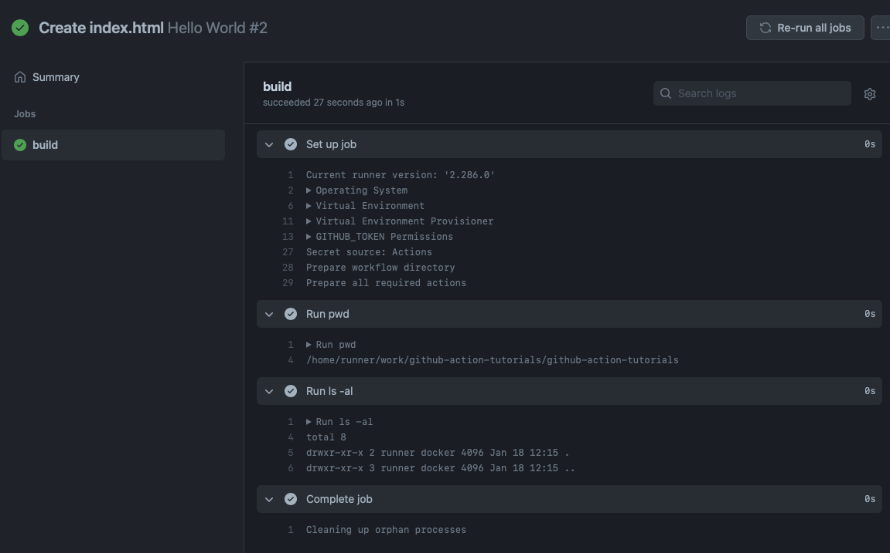

# CI/CD

#### 작성자 : [이병민](https://github.com/ByeongminLee)

<br>


### Reference

[CI/CD(지속적 통합/지속적 제공): 개념, 방법, 장점, 구현 과정](https://www.redhat.com/ko/topics/devops/what-is-ci-cd)<br>
[Github Actions으로 배포 자동화하기](https://meetup.toast.com/posts/286)

## CI/CD란?

<code>CI/CD</code>는 지속적인 통합, 지속적인 서비스 제공, 지속적인 배포를 뜻하며 어플리케이션 개발 단계 부터 배포 단계를 자동화하여 사용자에게 지속적으로 제공하는 방법이다.

<br>

<code>CI</code>는 개발자를 위한 자동화 프로세스인 지속적인 통합(Continuous Integration)을 의미하며 버그 수정이나 새로 만드는 기능을 메인 저장소에 빌드되고 테스트 하는 것이다.

개발을 할때 오랜기간 서로 변경하다가 머지를 하면 통합할때 에러를 해결하는데에 문제가 생기게 되기 때문에 작은 단위로 나누어서 개발하고 지속적으로 통합해야한다.<br>
그리고 주기적으로 Merge되는 이 변경 사항을 자동으로 빌드가 되어서 코드 변경 사항 이후에도 빌드가 되는지 확인하고 기존에 시스템에 자동으로 테스트 한다.

이렇게 자동으로 빌드하고 테스트하기 때문에 문제점을 빠르게 발견하고 수정할 수 있어 개발 생산성이 향상시킬 수 있다.

<br>

<code>CD</code>는 지속적인 제공(Continuous Delivery), 지속적인 배포(Continuous Deployment) 두가지 용어로 사용된다.

<code>CD</code>는 마지막 배포단계를 자동화하는 단계이다. <br>
<code>CI</code>를 통해서 주기적으로 변경사항들이 자동으로 빌드되고 테스트가 되었다면 <code>CD</code>에서는 유효한 코드들을 자동으로 저장소에 릴리즈하는 것을 <code>지속적 제공(Continuous Delivery)</code> 라고한다. <br>
<code>지속적 배포(Continuous Deployment)</code>는 저장소에 릴리즈하는 것 뿐만아니라 사용자가 사용할 수 있는 배포과정까지 수행하는 것을 의미한다.<br>
어느 정도까지 자동화 하냐에 따라 달라지게 된다.

>  _[출처 : CI/CD(지속적 통합/지속적 제공): 개념, 방법, 장점, 구현 과정](https://www.redhat.com/ko/topics/devops/what-is-ci-cd)_

### CI/CD 도구들

-   Jenkins
-   Buildkite
-   circleci
-   GitHub Actions

## Github Action

깃허브 액션은 깃허브에서 제공하는 <code>CI/CD</code> 툴로 <code>Workflow</code> 자동화 할 수 있게 도와주는 도구이다.

깃허브에서 제공하는 <code>Workflow</code>는 <code>YAML</code> 파일로 작성되고 <code>Github Repository</code>의 <code>.github/workflows</code> 폴더 아래에 저장하여 자동화 동작을 전달하면 <code>Github Actions</code>는 해당 파일을 기반으로 실행시켜 준다.

### Github Action의 구성

-   워크 플로우(workflows)<br>
    저장소에 추가하는 자동화된 프로세스로 하나 의상이 <code>job</code>으로 이루어져 있다.

-   이벤트(Events)<br>
    워크 플로우를 실행하는 특정 활동이나 규칙으로 push, pull request가 생성 되었을때 깃허부 외부에서 밸생하는 활동으로 이벤트를 발동 시킬 수 있다.

-   러너(runners)<br>
    Github에서 호스팅 하는 러너를 사용할 수도 있고 직접 호스팅 할 수도 있다.

-   작업(jobs)<br>
    워크플로우의 기본단위로 더 작은 단위로는 <code>step</code>으로 이루어져 있다. 기본적으로 워크플로우는 병렬적으로 실행하며 순차적으로 실행하도록 설정할 수도 있다.<br>
    예를 들면 빌드와 테스트 코드의 수행인 두 작업을 순차적으로 실행할 경우 빌드 작업이 실패하면 테스트 작업은 실행 되지 않게 된다.

-   스텝(steps)<br>
    작업에서 커맨드를 실행하는 독립적 단위이다.

-   액션(actions)<br>
    워크 플로우의 가장 작은 요소를 직접 만들어서 사용할 수 도 있고 이미 만들어진 것을 가져와서 사용할 수 있다.

### 깃허브 액션 사용하기

1. 저장소를 만들고 액션 탭에 들어간다.
   
   깃허브 액션은 템플릿을 이용하여 다른 사람들의 템플릿으로 쉽게 생성 할 수 있다.

    set up a workflow yourself 클릭 한다.

    
    <code>.github/workflows/main.yml</code>로 다음과 같이 생성 할 수 있게 나온다. <br>
    예제로 다음 사진과 같이 적어준다.

    
    (1) 다음 기본 템플릿에 push라고 되어 있는 부분을 보면 push 이벤트가 있을 때 사용된다고 보면 된다. <br>
    그리고 steps에서는 실제로 벌어지는 것들을 적어 놓는다.

    (2) <code>name: Run pwd</code>에 이름을 적고 어떤 명령어를 수행 할지를 적어준다. <code>pwd</code>는 현재 사용자의 디렉토리 경로를 보여준다.

    (3) 그리고 이렇게 커밋을 하게 되면 파일이 생성된다.

2. 이제 클론을 받고나서 아무 파일이나 생성한뒤 <code>push</code>를 진행해준다.

3. <code>push</code>를 하고 나서 action탭을 다시들어간다.

    다음과 같이 우리가 만든 Hello World라는 이름의 뜨는 것을 볼 수 있다.

    

    빌드가 진행 중이기 때문에 주황색 불이 들어오지만 시간이 지나면 초록불이 끝나서 빌드가 된 것을 볼 수 있다.

    

    

    빌드가 끝나고 난뒤 클릭해보면 다음과 같이 나온다.

    

    각 빌드 과정들을 클릭을 해보면 아까 만든 워크플로우파일의 진행 사항을 확인 할 수 있다.

    

    우리가 아까 이름을 지어주었던 <code>Run pwd</code>에서는 <code>pwd</code>가 실행되어 현재 디렉토리 경로가 뜨는 것을 볼 수 있고 <code>Run ls -al</code>에서는 현재 파일의 정보가 나오는 것을 볼 수 있다.

이런식으로 모든 명령어를 구성하기에는 귀찮은 작업일 수 있다.<br>
그렇기 때문에 <code>steps:</code>에 <code>uses</code>키워드로 다른 사람이 만든 명령어들을 가지고 와서 사용할 수 있다.

```yml
name: Hello World

on: [push]

jobs:
    build:
        runs-on: ubuntu-latest

        steps:
            - uses: actions/checkout@v2
            - name: Run pwd
              run: pwd

            - name: Run ls -al
              run: ls -al
```

예를 들면 위의 코드와 같이 <code>actions/checkout@v2</code>를 사용하면 저장소를 클론하고 체크아웃해서 다음에 나오는 명령어에서 사용할 수 있게 해준다.

### 깃허브 액션 실습 예제

실제 깃허브 액션을 사용할때는 테스트 코드를 만들어놓고 빌드하기전에 테스트 코드가 에러가 나지 않으면 빌드가 되게 한다.

<br>

위해서 했던거와 같이 저장소를 생성하고 워크플로우를 생성하여 다음 내용을 적어준다.

```yml
name: Test

on: [push]

jobs:
    build:
        runs-on: ubuntu-latest

        steps:
            - uses: actions/checkout@v2
            - name: Run pwd
              run: pwd

            - name: Run package install
              run: npm install

            - name: Run test
              run: npm test
```

이 코드를 해석하자면 <code>push</code>가 되었을때 다음 명령어들을 우분투 환경에서 테스트를 진행한다.

1. <code>uses: actions/checkout@v2</code>로 파일을 클론해서 다운 받고 파일의 경로로 이동한다.
2. <code>name: Run pwd</code>으로 파일의 경로를 확인 할 수있다.
3. <code>Run package install</code>는 <code>npm install</code> 명령어를 실행하여 패키지 파일을 받는다.
4. <code>Run test</code>는 <code>npm test</code>를 실행하여 테스트 파일을 실행 시킨다. <br> (예제 파일에 npm test로 테스트를 할 수 있는 파일을 실행 시킬 수 있도록 추가해 두었다.)

실습 예제에 사용될 파일들은 두가지 이다.<br>
테스트에 성공하는 <code>./GithubAction-example1</code>와 테스트에 실패하는 <code>./GithubAction-example2</code>이다.

이 테스트 코드들은 <code>mocha</code> 패키지를 포함하고 있기 때문에 위에서 워크플로우를 작성한것과 같이 테스트 진행전에 <code>npm install</code>로 패키지를 설치해 주어야한다.

```js
// ./GithubAction-example1/index.spec.js
const assert = require("assert");

describe("GET /tester", () => {
    it("테스트 예제1 - 성공시", (done) => {
        assert.equal(1, 1);
        done();
    });
});
```

```js
// ./GithubAction-example2/index.spec.js
const assert = require("assert");

describe("GET /tester", () => {
    it("테스트 예제2 - 실패시", (done) => {
        assert.equal(1, 2);

        done();
    });
});
```

<code>assert.equal(A, B);</code>는 A와 B가 같으면 테스트 성공 아니면 실패를 반환해준다.

> 실제로는 node.js express 서버를 테스트할때 사용한다.<br>
> GET요청으로 /tester에 접속할시에 테스트 코드를 작성할 수 있는데 githubAction의 테스트/빌드를 보기 위해서 전부 생략해 두었다.

위의 코드들을 최상의 경로에 하나씩 <code>push</code> 해준다.
(폴더가 아닌 파일들만 업로드 해주어야한다.)

<br>

먼저 첫번쨰 파일을 업로드 한다.


첫번째 파일(<code>./GithubAction-example1</code>경로의 파일들)의 경우에는 테스트를 통과하여 위와 같이 실행이 되는 것을 볼 수 있다.

깃허브에서는 이런 식으로 파일을 업로드시 자동으로 테스트를 진행하고 테스트를 통과 시에 GithubPage나 vercel, heroku와 같은 곳으로 자동으로 배포를 시켜 줄 수 있다.

<br>

이제 두번째 파일을 업로드를 한다.


이번에는 아까와 달리 붉을색으로 오류가 난 것을 알 수 있다.<br>
<code>assert.equal(1, 2);</code>로 1과 2는 같지 않기 때문에 다음과 같이 <code>Run test</code> 부분에서 테스트 오류가 난 것을 알 수 있다.

테스트를 통과하지 못했다면 빌드를 진행시키지 않고 배포 또한 진행 시키지 않아서 오류가 있는 페이지를 추가 할 경우에 그 오류를 수정하기 전까지 새로운 버전으로 배포를 하지 않도록 할 수 있다.

<br>

이런식으로 테스트 코드를 만들고 워크플로우를 작성하여 자동으로 올바른 코드인지 테스트한 뒤 빌드하게 하는 것이 <code>**CI**</code>이고 빌드가 정상적으로 진행 되었다면 자동으로 배포를 진행해주는 것을 <code>**CD**</code>라고 한다.
