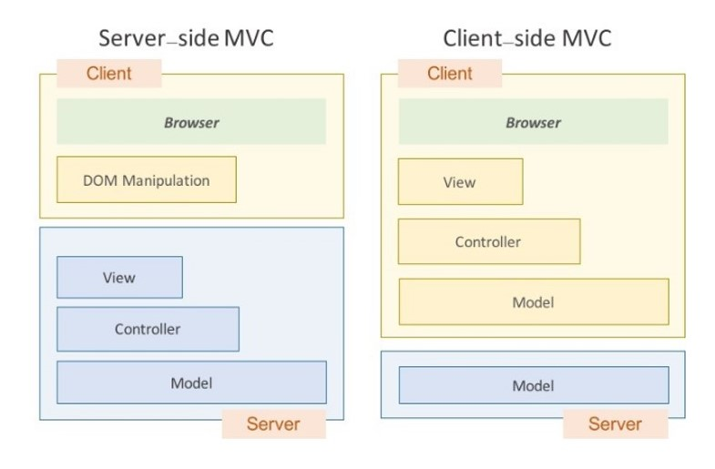
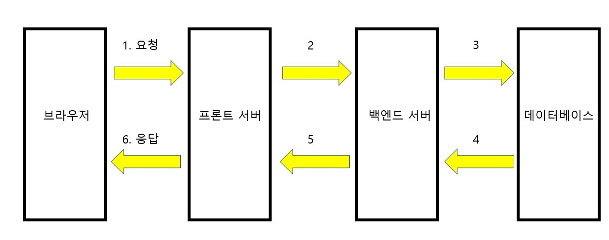
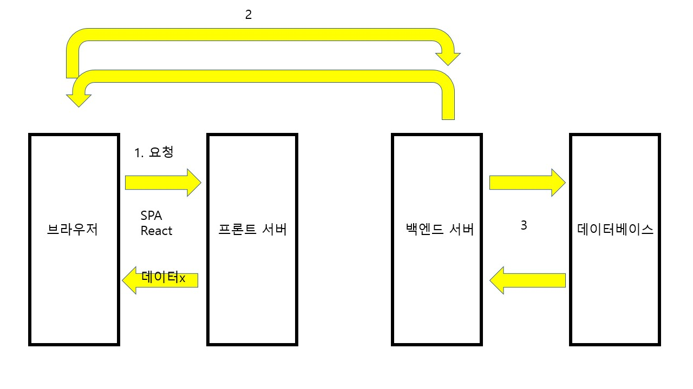
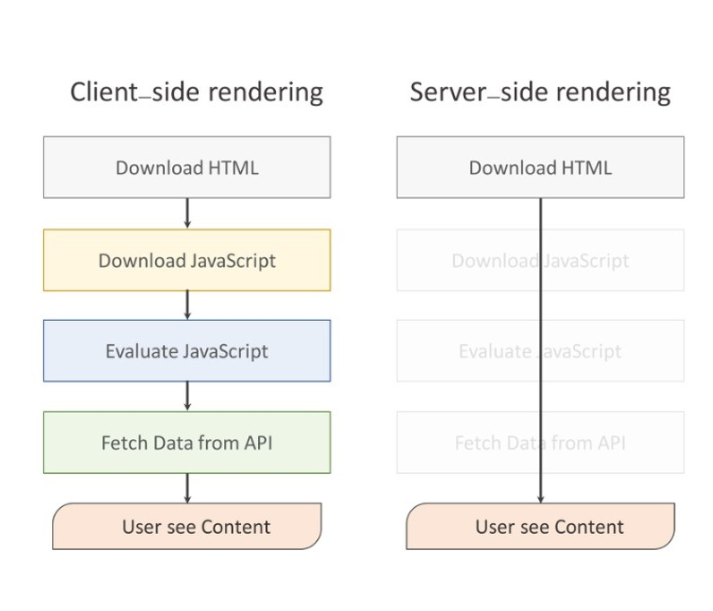
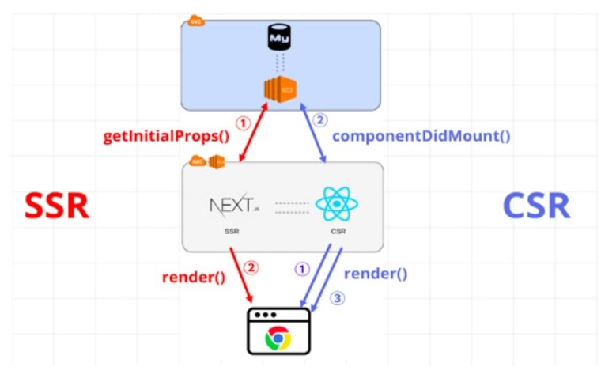

# SSR vs CSR (feat.SPA)

#### 작성자 : [전찬민](https://github.com/cksals3753)

- 참고자료: [SPA](https://jongminfire.dev/spa-single-page-application-%EB%9E%80)
- 참고자료: [SSR,CSR](https://asfirstalways.tistory.com/244)
- 참고자료: [랜더링](https://defineall.tistory.com/707)
- 참고자료: [Next.js](https://medium.com/@msj9121/next-js-%EC%A0%9C%EB%8C%80%EB%A1%9C-%EC%95%8C%EA%B3%A0-%EC%93%B0%EC%9E%90-8727f76614c9)

   

# 랜더링이란?

화면에 표시할 웹 페이지를 만드는 과정

## 랜더링과정

1. HTML을 구조별로 분류하여, DOM 객체를 생성
2. CSS를 구조별로 분류하여, 스타일 규칙 생성
3. DOM 객체, 스타일 규칙을 합쳐 화면(랜더트리) 생성
4. 랜더트리를 기준으로 레이아웃 배치, 스타일 작업

## 좀 더 자세한 설명

1. Loader가 서버로부터 HTML을 불러옴
2. HTML을 분류(Phasing)하여 DOM트리를 만든다.
3. CSS파일과 스타일 요소를 분류하여 CSSOM트리를 만든다.
4. DOM트리와 CSSOM을 결합하여 랜더링트리를 만든다.
5. 랜더링트리의 요소들의 크기와 위치를 계산한다.
6. 계산된 크기와 위치에 맞게 화면에 출력한다.

# SPA (Single Page Web Application)

> 단일 페이지로 구성된 웹 애플리케이션을 말한다. SPA가 등장하기 전 웹 애플리케이션을 구성하던 방식인
> 서버 사이드 랜더링 (SSR)의 경우, 화면에 보여질 리소스를 서버로 요청하고, 서버로부터 받아온 리소스를 렌더링 했다.

> 하지만 SPA의 경우 랜더링의 역할을 서버에게 넘기지 않고 브라우저에서 처리하는 방식이다.
> 웹 애플리케이션에 필요한 모든 정적 리소스를 최초에 한번 다운로드하고, 이후 새로운 페이지 요청 시
> 페이지 갱신에 필요한 데이터만을 전달받아 페이지를 갱신한다.

## SPA의 장점

- 새로운 페이지 요청 시 전체를 랜더링하지 않고 변경되는 부분만 갱신하기 때문에 전체적인 트래픽 감소와 랜더링에서 좋은 효율을 가진다.
- 새롭게 갱신되는 부분만 랜더링하기 때문에 새로고침이 발생하지 않아 화면깜빡임 없이 빠른화면 이동이 가능하다.
- 트래픽의 감소와 속도, 반응성의 향상으로 인해 앱처럼 자연스러운 사용자경험(UX)를 제공하며 모바일 사용이 증가하는 시점에 이는 큰 장점이 된다.
- 모듈화 또는 컴포넌트별 개발이 용이하다.
- 백엔드와 프론트엔드가 비교적 명확하게 구분된다.

## SPA의 단점

- 웹 애플리케이션에 필요한 정적 리소스를 한번에 다운로드 하기 때문에 초기 구동속도가 느리다.
- SPA 구조 상 데이터 처리를 클라이언트에서 하는 경우가 많은데, 해당 로직들은 JavaScript를 통해 구현되므로 코드가 외부에 노출되는 보안적인 문제가 있다.
- 검색엔진 최적화 (SEO)가 어렵다.

### SPA가 검색엔진 최적화(SEO)에 부적합한 이유

> 검색엔진이 크롤링 할 때 JavaScript를 실행하지 않고 어플리케이션이 로드되기 전의 빈 상태의 코드를 크롤링하기 떄문에 인덱싱이 제대로 이루어지지 않는다.

> 위처럼 SPA를 사용하면 UX의 향상과 렌더링의 장점도 있지만 검색엔진 최적화의 단점 또한 존재한다.
> SPA는 정보의 제공을 위한 웹페이지보다는 애플리케이션에 적합한 기술이므로 페이지의 목적에 따라 방식을 선택하는것도 좋은 방법이다.

# SSR과 CSR

---

💡**SSR과 CSR 개념 정리**
 

> SSR : 사용자가 웹 페이지에 접속했을 때 서버가 사용자에게 랜더링 될 HTML을 응답하여 브라우저가 바로 랜더링 할 수 있게한다. 그 후 CSR과 동일하게 자바스크림트 파일을 다운로드 받고 실행한다.

> CSR : 사용자가 웹 페이지에 들어왔을 때 브라우저가 자바스크립트 파일을 다운로드 받아 해석한 후 랜더링한다.

---

전통적인 웹 방식인 SSR(서버 사이드 랜더링)은 이 SPA 방식에 비해 성능 문제를 보였다. 요청 시 마다 새로고침이 일어나며 페이지를 로딩할 때 마다 서버로부터 리소스를 전달받아 해석하고 화면에 렌더링하는 방식이였기 떄문이다.

SPA는 트래픽을 감소시키고 사용자에게 더 나은 경험을 제공한다. 서버는 단지 JSON 파일만 보내주는 역할을 했고, HTML을 그리는 역할은 클라이언트 측에서 자바스크립트가 수행하게 된 것이다. 바로 이것이 CRS(클라이언트 사이드 랜더링)이다.

클라이언트 쪽이 점점 무거워지자 이에 반대로 View만 관리하자는 철학으로 React가 등장한다.
이렇게 클라이언트 사이드 랜더링과 서버 사이드 랜더링의 자리싸움이 시작된 것이다.
 

 

# SSR (Serve Side Rendring)

 
위의 그림은 전통적인 방식인 SSR을 표현한 것이다.
클라이언트(브라우저)가 데이터를 요청하면 그림의 순서대로
`브라우저` => `프론트서버` => `백엔드서버` => `데이터베이스` 를 거쳐 데이터베이스에서 데이터를 가져온 후 다시 브라우저에 데이터가 그려지는 형식이다.

이 방식은 서버에서 데이터까지 모두 포함하여 페이지를 구성한 후 브라우저에 전달하는데 클라이언트가 페이즈를 이동한다든가, 클릭으로 인한 다른 요청이 생길때마다 이 과정을 반복하기 때문에 화면에서 바뀌지 않아도 되는 부분도 계속해서 다시 렌더링되는 단점이 있다. 이는 곧 서버 부하 등의 문제를 일으킬 수 있다.

# CSR (Clint Side Rendring)

 
CSR은 react, vue 등의 SPA에서 쓰이는 기법으로, 서버에서 화면을 구성햇던 SSR방식과 달리 클라이언트에서 화면을 구성한다.
SPA의 경우 첫 화면에 들어가게 되면, 그림1번처럼 데이터를 제외한 화면을 그리는 코드들이 프론트 서버에서 다운받아 진다.
화면을 그리는 코드는 다운 받았지만 아직 데이터를 다운 받은 상태가 아니다.
CSR의 경우 클라이언트의 요청이 발생하면 필요한 데이터만 백엔드 서버에 요청하여 데이터만 받아온다.

CSR은 초기 진입속도가 느린 반면, 그 후론 필요한 데이터만 갱신하면 되기때문에 SSR방식에 비해 서버부하가 덜하다는 장점이 있다.
하지만 초기 HTML에 데이터가 없다보니 검색 봇이 해당페이지를 빈 페이지로 착각하여 CEO 검색엔진 최적화에 취약훌 수 있는 단점이 존재한다.

# 각 렌더링의 장단점 비교

 
클라이언트 사이드 랜더링의 경우, 사용자의 행동에 따라 필요한 부분만 다시 읽어들이기 때문에 서버 측에서 랜더링하여 전체페이지를 다시 읽어들이는 거보다 빠른 인터랙션을 기대할 수 있다. 서버 사이드 랜더링을 한다 하더라도 Ajax기능을 위해 클라이언트 랜더링 요소가 포함될 수 밖에 없다. 이러한 점으로 미루어보아 클라이언트 측에서 랜더링을 하게되면 서버 사이드 랜더링이 따로 필요하지 않기 때문에 일관성있는 코드를 작성할 수 있다.

하지만 문제점도 있는데, 클라이언트 사이드 랜더링은 페이지를 읽어들이는 시간, 자바스크립트를 읽어들이는 시간,
그리고 자바스크립트가 화면을 그리는 시간까지 모두 마쳐야 콘텐츠가 사용자에게 보여진다. 여기에 웹 서버에 콘텐츠 데이터라도 가져와야 한다면 그 시간은 더욱 길어질 수 밖에 없다.
즉, 초기 구동속도가 느리다는 단점이 존재하는 것이다.
물론 초기 구동속도를 제외하면 그 다음부터는 빠른 인터랙션의 성능을 보인다.

그리고 어떻게 보면 치명적이라고 할 수있는 검색 엔진 최적화의 문제가 존재한다.
대부분의 웹 크롤러, 봇들이 자바스크립트 파일을 실행시키지 못한다는 것이다. 때문에 HTML에서만 콘텐츠를 수집하게 되고
클라이언트 사이드 렌더링되는 페이지를 빈 페이지로 인식하게 된다. 추가적으로 보안문제가 발생한다. 기존의 서버 사이드 랜더링에서는 사용자에 대한 정보를 서버 측에서 세션으로 관리를 했다.
그러나 클라이언트 측에는 쿠키말고는 사용자에 대한 정보를 저장할 공간이 마땅치 않다.

서버사이드 랜더링의 장점은 반대의 경우로 생각하면 쉽다.
유저가 처음으로 컨텐츠를 접하게 되는 시점을 당길 수 있고, 서버따로, 클라이언트 따로 작성하던 코드가 하나로 합쳐진다.
물론 SEO 적용도 문제없다. 문제점은 사용자와 인터렉션하는 부분일 것이다. 매번 서버에 request 요청을 통해서 해결해야하기 때문이다.
DOM 조작에 있어서도 요청하는 과정과 엄청난 탐색비용으로 애를 먹고있다.
React가 이 부분에 있어서 많은 해결책을 제시했지만 이는 두고 봐야 그 결과를 알 수 있을것이다.

|                                 | SSR                                                                  | CSR                                                                          |
| ------------------------------- | -------------------------------------------------------------------- | ---------------------------------------------------------------------------- |
| 초기로딩속도                    | CSR에 비해 다운 받는 파일이 많지가 않아 속도가 빠르다.               | 모든 JS파일을 다운 받아와야 하기 때문에 초기에는 오래 걸린다.                |
| 서버 부담                       | 서버와 잦은 응답(view 변경시 마다)을 하기 때문에 서버에 부담이 된다. | data 요청이 있을때만 서버에 요청하기 때문에 서버에 부담이 적다.              |
| SEO(Search Engine Optimization) | HTML에 대한 정보가 처음에 포함되어 있어 데이터를 수집할 수 있다.     | 맨 처음 HTML파일이 비어있어, 크롤러가 데이터를 수집할 수 없다.(단 구글 제외) |

# Next.js

Next.js는 React의 SSR을 쉽게 구현할 수 있게 도와주는 간단한 프레임워크이다.
React도 SSR을 고려하여 설계되었기 때문에 자체적으로도 구현이 가능하긴 하지만, 개발환경을 만들기 위해서는 생각보다 복잡하다.
그래서 이러한 문제를 해결한 Next.js가 나왔고 사용법도 꽤 간편하다.

과거의 웹사이트들은 대부분 SSR로 동작되어 왔기 때문에, 페이지가 여러개로 구성된 Multi Page Form 방식을 사용했었습니다. 하지만 스마트폰이 등장하게 되면서, 예전 웹들은 모바일에 최적화가 되어있지 않았기 때문에 사용에 불편함이 커지게 되었습니다. 그래서 사용자들은 모바일 앱과 같은 형태의 웹 페이지가 필요하게 되었다.

 
이러한 문제를 해결하기 위해서 React, Angular, Vue 등 여러 라이브러리, 프레임워크가 생기게 되었고,
CSR이 가능한 SPA가 등장하게 되었습니다. 이 SPA의 특징은 기존의 웹페이지와는 다르게 1개의 페이지에서 여러 동작이 이루어지는 방식이다.
그래서 마치 모바일 앱과 비슷한 형태로 이루어져 있어서 Header 영역은 고정되어 있고, Main 영역의 상태만 계속 변경하는 방식을 사용한다.

## SSR vs CSR

 
먼저 일반적인 React렌더링 방식은 render() 함수가 먼저 실행되고, 그 다음에는 ComponentDidMount()함수를 통해 데이터를 가져와서 다시 한번 렌더링이 된다. 
반면에 Next는 getInitialProps()라는 함수를 사용하기 때문에 데이터를 먼저 가져와서 한 번에 렌더링을 해준다. 
보시다시피 SSR은 한 번에 렌더링이 되기 때문에 초기로딩 속도는 빠르지만, page 이동 시에는 CSR보다 느리다. 
왜냐하면 page를 요청 할 때마다 중복되는 파일을 내려받아야 하기 때문이다. 하지만 CSR은 초기로딩 속도는 느리지만, 
첫 페이지 로딩 때 모든 파일을 내려받기 때문에 페이지를 이동할 때마다 해당 페이지에서 필요한 데이터만 불러서 사용하면 된다.
