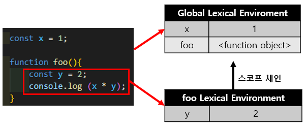
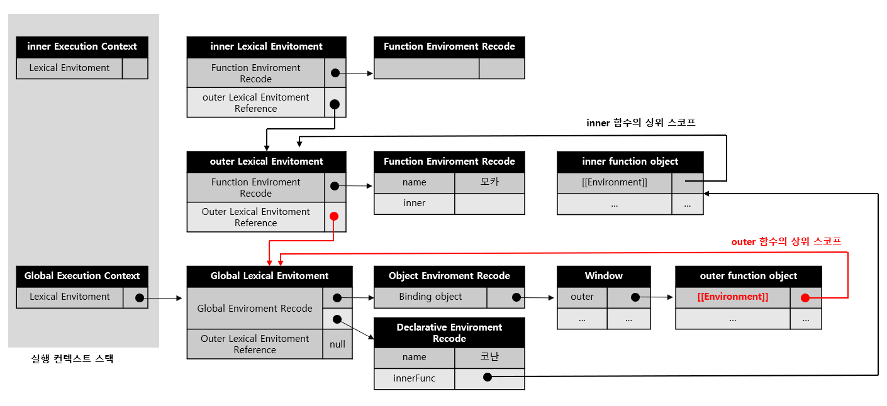
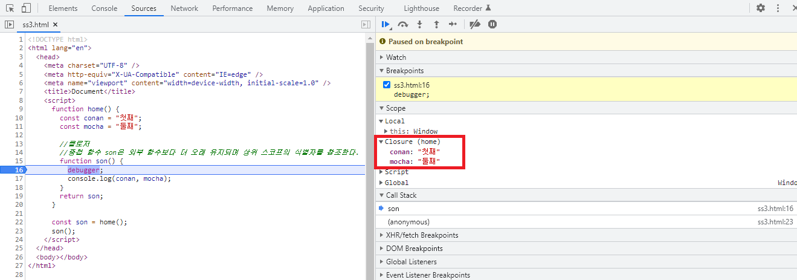
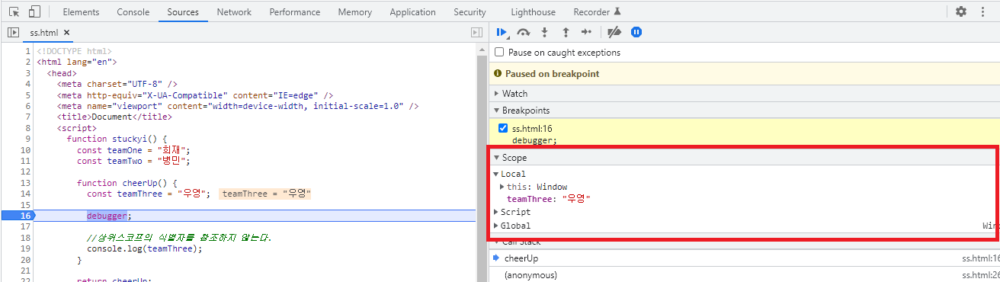
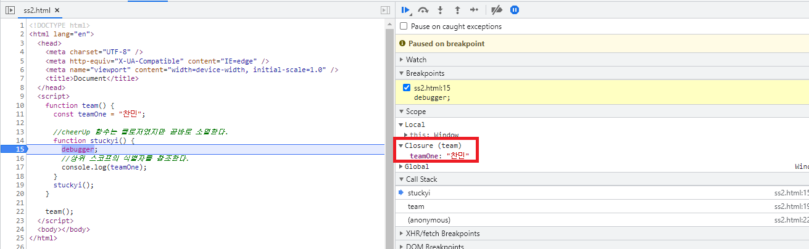

# 클로저 (Closer)

#### 작성자 : [이슬기](https://github.com/abcabcp)


## 1. 클로저를 이해하기 전에 필요한 개념

### 1.1 렉시컬 환경

클로저를 이해하기 위해서는 가장 먼저 렉시컬 환경에 대한 이해, 정확히는 '함수가 선언된 렉시컬 환경'에 대한 이해가 필요하다.

- 렉시컬 환경이란, 식별자와 식별자에 바인딩된 값. 그리고 상위 스코프에 대한 참조를 기록하는 자료로 실행 컨텍스트를 구성하는 컴포넌트이다. 실행 컨텍스트 스택이 코드의 실행 순서를 관리한다면, 렉시컬 환경은 스코프와 식별자를 관리한다.

- 아래의 그림을 보면 스코프를 구분하려 식별자를 등록하고 관리를 하는 저장소 역할을 하고 있다는 것을 알 수 있다.
  

### 1.2 렉시컬 스코프

- 렉시컬 환경에 대해 이해했다면, 렉시컬 스코프를 알아보자.
- 자바스크립트 엔진은 함수를 어디에서 호출했는지가 아니라 함수를 어디에 정의했는지에 따라 상위 스코프를 결정한다. 이를 렉시컬 스코프라고 한다.

  ```js
  const x = 1;

  function foo() {
    const x = 10;
    bar();
  }

  function bar() {
    console.log(x);
  }

  foo();
  bar();
  ```

  - 위 예제에서 만약 결과값을 10이라고 생각했다면, 렉시컬 환경과 스코프에 대해 다시 공부를 해보는 걸 추천한다...^^
  - foo와 bar는 모두 전역 함수이다. 함수를 어디서 호출하는 지는 함수의 상위 스코프 결정에 영향을 주지 못한다.
  - 즉, 함수의 상위 스코프는 함수를 정의한 위치에 의해 정적으로 결정되고 변하지 않는다.
  - 렉시컬 환경의 "외부 렉시컬 환경에 대한 참조"에 저장할 참조값, 즉 상위 스코프에 대한 참조는 함수 정의가 평가되는 시점에 함수가 정의된 환경(위치)에 의해 결정된다.
  - 이것이 바로 "렉시컬 스코프"이다.

## 2. 클로저란?

### 2.1. 클로저와 렉시컬 환경

- 클로저 : 외부 함수보다 중첩 함수가 더 오래 유지되는 경우 중첩 함수는 이미 생명 주기가 종료된 외부 함수의 변수를 참조할 수 있다. 이러한 중첩 함수를 <strong>클로저</strong>라고 한다.
- 글자로 보면 이해하기 힘드니, 예제를 보고 알아보자.

  ```js
  const name = "코난";

  //1
  function outer() {
    const name = "모카";
    const inner = function () {
      console.log(name);
    }; //2
    return inner;
  }

  const innerFunc = outer(); //3
  innerFunc(); //4 모카
  ```

  - 예제를 보면 알 수 있듯, outer 함수는 중첩 함수 inner를 반환하고 생명주기를 마감한다. outer 함수의 실행 컨텍스트는 실행 컨텍스트 스택에서 제거된다.
    > 실행 컨텍스트 : 실행할 코드에 제공할 환경 정보들을 모아놓은 객체로서, 동일한 스코프에 있는 코드들을 실행할 때 필요한 환경 정보를 모아 컨텍스트를 구성하고, 이를 호출 스택(콜 스택)에 쌓아서 실행 순서를 보장한다. 구성되는 요소로는 변수객체, 스코프 체인, this가 있다.
  - 이때, outer 함수의 지역 변수 name과 변수 값 '모카'를 저장하고 있던 outer함수의 실행 컨텍스트가 제거되었으므로 outer함수의 지역 변수 name 또한 생명주기를 마감한다.
  - 따라서 outer 함수의 지역변수 name은 더는 유효하지 않게 되어 name값에 접근하는 법은 없어 보인다.
  - 하지만, 실행결과 4번의 결과는 '모카'이다. 이것이 바로 클로저다.

- 또한, 유념해야 하는 부분은 outer 함수의 실행컨텍스트가 실행 컨텍스트 스택에서 제거되더라도, outer함수의 렉시컬 환경까지 삭제되는 것은 아니다. outer 함수의 렉시컬 환경은 inner 함수의 [environment]의 내부 슬록에 의해 참조되고 있고, inner 함수는 전역 변수 innerFunc에 의해 참조되고 있으므로 가비지 컬렉션의 대상이 되지 않는다.
  > 가비지 컬렉션: 쓰레기 수집. 동적으로 할당한 메모리 영역 중 더 이상 쓰이지 않는 영역을 자동으로 찾아내어 해제하는 기능



---

### 1.2. 일반적인 클로저

- 자바스크립트의 모든 함수는 상위 스코프를 기억하므로 이론적으로 모든 함수는 클로저다. 하지만 일반적으로 모든 함수를 클로저라고 하지 않는다.
- 클로저는 중첩 함수가 상위 스코프의 식별자를 참조하고 있고, 중첩 함수가 외부 함수보다 더 오래 유지되는 경우에 한정하는 것이 일반적이다.

  ```js
  function home() {
    const conan = "첫째";
    const mocha = "둘째";

    //클로저
    //중첩 함수 son은 외부 함수보다 더 오래 유지되며
    //상위 스코프의 식별자를 참조한다.
    function son() {
      debugger;
      console.log(conan, mocha);
    }
    return son;
  }

  const son = home();
  son();
  ```

  

- 클로저라고 할수 없는 경우

  1. 어떠한 함수도 참조하지 않는 함수는 클로저가 아니다.

     ```js
     function stuckyi() {
       const teamOne = "희재";
       const teamTwo = "병민";

       function cheerUp() {
         const teamThree = "우영";

         debugger;

         //상위스코프의 식별자를 참조하지 않는다.
         console.log(teamThree);
       }

       return cheerUp;
     }

     const cheerUp = stuckyi();
     cheerUP();
     ```

     

     - 중첩함수 cheerUp이 외부함수 stuckyi 보다 더 오래 유지되지만 상위 스코프의 어떤 식별자도 참조하지 않고 있다. 이처럼 상위 스코프의 어떤 식별자도 참조하지 않는 경우 대부분의 모던 브라우저는 최적화를 통해 상위 스코프를 기억하지 않는다. 참조하지도 않는 식별자를 기억하는 것은 메모리 낭비이기 때문이다.

  <br />

  2. 외부함수보다 생명주기가 짧은 중첩함수는 일반적인 클로저가 아니다.

     ```js
     function team() {
       const teamOne = "찬민";

       //cheerUp 함수는 클로저였지만 곧바로 소멸한다.
       function stuckyi() {
         debugger;
         //상위 스코프의 식별자를 참조한다.
         console.log(teamOne);
       }
       stuckyi();
     }

     team();
     ```

     

     - 중첩함수 stuckyi가 상위 스코프의 식별자를 참조하고 있으므로 클로저이지만, 외부함수 team의 외부로 중첩함수 stuckyi가 반환되지 않는다.
     - 즉, 외부함수보다 중첩함수의 생명주기가 짦으므로 일반적으로 클로저라고 하지 않는다.

---

### 1.3. 클로저의 활용

- 클로저는 상태를 안전하게 변경하고 유지하기 위해 사용한다.
- 즉, 상태가 의도치 않게 변경되지 않도록 상태를 안전하게 은닉하고 특정 함수에게만 상태 변경을 허용하기 위해 사용한다.

- 아래 예시 코드를 보면, 동작은 하지만 아래의 조건을 충족하지 못할 경우 오류를 발생시킬 가능성이 있다.

  - num 변수 값이 increase 함수의 호출 전까지 변경되지 않고 유지되어야 한다.
  - num 변수의 값은 increase 함수만이 변경할 수 있어야 한다.
  - 카운트 상태가 전역 변수를 통해 관리되고 있기 때문에 언제든지 누구나 접근할 수 있고 변경할 수 있기 때문이다.

    ```js
    let num = 0;

    const increase = function () {
      return ++num;
    };

    console.log(increase()); //1
    console.log(increase()); //2
    console.log(increase()); //3
    ```

- 클로저의 사용 이유를 알게 되었다면, 클로저를 활용한 코드를 확인해보자.

  ```js
  const increase = (function () {
    let num = 0;

    //클로저
    return function () {
      //카운트 상태를 1만큼 증가시킨다.
      return ++num;
    };
  })();

  console.log(increase()); //1
  console.log(increase()); //2
  console.log(increase()); //3
  ```

  - 카운트 상태를 안전하게 변경하고 유지하기 위해 num을 지역변수로 변경했다.
  - 이제 num 변수는 increase 함수만이 변경할 수 있다.

---

### 1.4 캡슐화와 정보 은닉

- 캡슐화란 객체의 상태를 나타내는 프로퍼티와 프로퍼티를 참조하고 조작할 수 있는 동작인 메서드를 하나로 묶는 것이다.
- 또한, 객체의 특정 프로퍼티나 메서드를 감출 목적으로 사용하기도 하는데 이를 <strong>정보은닉</strong>이라고 한다.
- 정보은닉은 외부에 공개할 필요가 없는 구현의 일부를 외부에 공개되지 않도록 감추어 적절치 못한 접근으로부터 객체의 상태가 변경되는 것을 방지해 정보를 보호하고, 객체간의 상호 의존성, 즉 결합도를 낮추는 효과가 있다.
  > 결합도 : 모듈과 모듈간의 상호 의존 정도. 여기서는 공통 결합도 (파라미터가 아닌 모듈 밖에 선언되어 있는 전역 변수를 참조하고 전역변수를 갱신하는 식으로 상호작용하는 경우)를 뜻한다. 낮을수록 이상적이다.
- 자바스크립트의 객체의 모든 프로퍼티와 메서드는 기본적으로 외부에 공개되어 있다.
- 그렇다면 자바스크립트는 정보은닉을 완벽히 지원할 수 있을까?

  ```js
  const Stuckyi = (function () {
    let _age = 0; //private

    function Stuckyi(name, age) {
      this.name = name; //public
      _age = age;
    }

    //프로토타입 메서드
    Stuckyi.prototype.sayHi = function () {
      console.log(`안녕, ${this.name}! 넌 이제 ${_age}살이야~^^`);
    };

    return Stuckyi;
  })();

  const byeongmin = new Stuckyi("병민", 30);
  byeongmin.sayHi(); //안녕, 병민! 넌 이제 30살이야~^^**
  console.log(byeongmin.name); //병민
  console.log(byeongmin.age); //undefined

  const heeejj = new Stuckyi("희재", 30);
  heeejj.sayHi(); //안녕, 희재! 넌 이제 30살이야~^^
  console.log(heeejj.name); //희재
  console.log(heeejj.age); //30
  ```

  - 위의 예제를 보면, 자바스크립트에서도 정보은닉이 가능한 것처럼 보인다. 즉시 실행 함수가 반환하는 Stuckyi 생성자 함수와 Stuckyi 생성자 함수의 인스턴스가 상속받아 호출할 Stuckyi.prototype.sayHi 메서드는 즉시 실행 함수가 종료된 후 실행된다. 하지만 Stuckyi 생성자 함수와 sayHi 메서드는 이미 종료되어 소멸한 즉시 실행 함수의 지역변수 \_age를 참조 할 수 있는 클로저이다. 하지만 ...
  - 위의 예제에는 문제가 있다. Stuckyi 생성자 함수가 여러 개의 인스턴스를 생성할 경우 다음과 같이 \_age 변수의 상태가 유지되지 않는 다는 것이다.

    ```js
    const heeejj = new Stuckyi("희재", 30);
    heeejj.sayHi(); //안녕, 희재! 넌 이제 30살이야~^^

    const byeongmin = new Stuckyi("병민", 40);
    byeongmin.sayHi(); //안녕, 병민! 넌 이제 40살이야~^^

    heeejj.sayHi(); //안녕, 희재! 넌 이제 40살이야~^^
    ```

    - 이것은 Stuckyi.prototype.sayHi가 단 한 번 생성되는 클로저이기 때문이다.
    - Stuckyi.prototype.sayHi가 어떤 인스턴스로 호출되더라도 하나의 동일한 스코프를 사용한다.
    - 그러므로, Stuckyi 생성자 함수가 여러 개의 인스턴스를 생성할 경우 \_age의 변수 상태가 유지되지 않는다.
    - 이처럼, 자바스크립트는 정보 은닉을 완전히 지원하지 못하였는데 .....

---

### 1.5 private 필드 정의

- 다행히 private 필드를 정의할 수 있는 새로운 표준 사양이 제안되었다.
- 해당 문법의 브라우저 지원 범위는 [Private class features](https://developer.mozilla.org/en-US/docs/Web/JavaScript/Reference/Classes/Private_class_fields) 에서 확인할 수 있다.
- private 필드의 선두에 #을 붙여 사용한다. private 필드를 참조할 때에도 #을 붙여야 한다.

  ```js
  class Stuckyi {
    //private 필드 정의
    #name = "슬기";

    constructor(name) {
      //private 필드 참조
      this.#name = name;
    }
  }

  const me = new Stuckyi("우영");

  //private 필드 #name은 클래스 외부에서 참조할 수 없다.
  console.log(me.#name); //SyntaxError: Private field '#name' must be declared in an enclosing class
  ```

- 다만 접근자 프로퍼티를 통해 간접적으로 접근하는 방법은 유효하다.

  ```js
  class Stuckyi {
    //private 필드 정의
    #name = "";

    constructor(name) {
      //private 필드 참조
      this.#name = name;
    }

    //name은 접근자 프로퍼티다.
    get name() {
      //private 필드를 참조하여 trim한 다음 반환한다.
      return this.#name.trim();
    }
  }
  const me = new Stuckyi("   희재");

  console.log(me.name); //희재
  ```

- 마지막으로 private 필드는 반드시 클래스 몸체에 정의해야 한다. private 필드를 직접 constructor에 정의하면 에러가 발생한다.
  ```js
  class Stuckyi {
    constructor(name) {
      //private 필드는 클래스 몸체에서 정의해야 한다.
      this.#name = name; //Private field '#name' must be declared in an enclosing class
    }
  }
  ```

> 출처: 모던자바스크립트 Deep Dive
