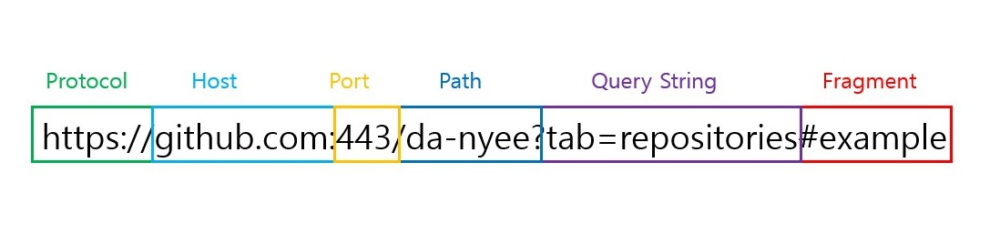
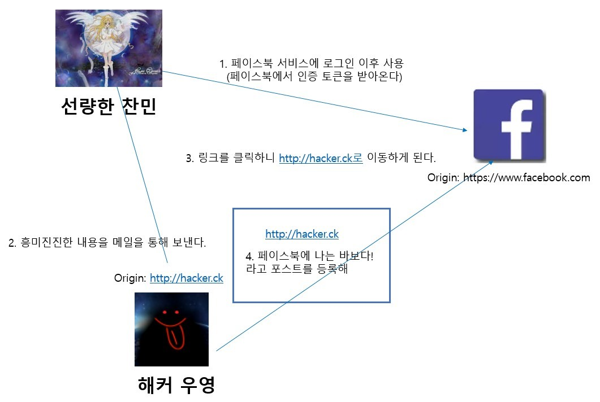
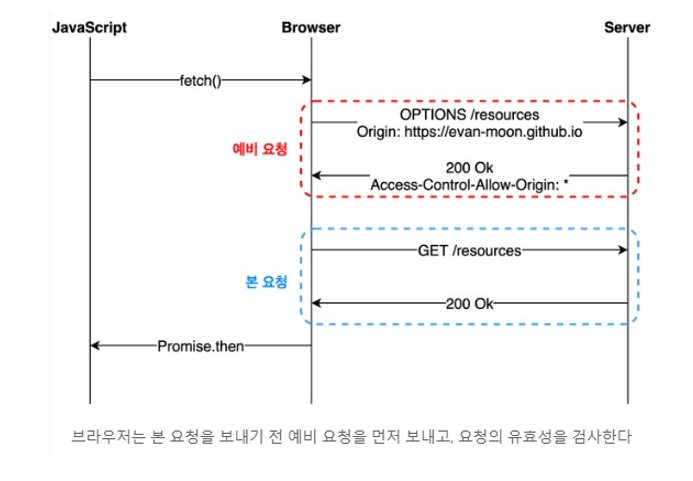
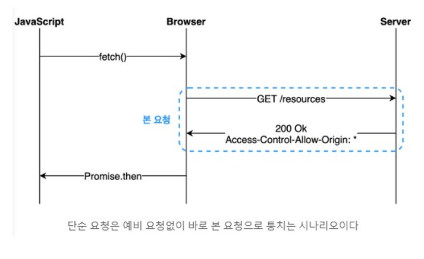

# CORS


#### 작성자 : [전찬민](https://github.com/cksals3753)

- 참고영상: [CORS](https://www.youtube.com/watch?v=-2TgkKYmJt4)
- 참고자료: [CORS](https://evan-moon.github.io/2020/05/21/about-cors/)

# SOP (Same Origin Policy)

다른 출처의 리소스를 사용하는 것에 제한하는 보안방식

### 출처(Origin)란?



URL의 <code>Protocol</code>, <code>Host</code>, <code>Port</code>를 통해 같은 출처인지 다른 출처인지 판단할 수 있다.
Protocol, Host, Port중 하나라도 다르면 다른 출처라고 하는것이고, 3가지가 모두 같아야지만 같은 출처라 하는것이다. 익스플로러 같은 경우는 Port가 출처를 판단하지 않는다. 즉, Port가 달라도 같은 출처이다 라고 인터넷 익스플로러는 판단을 한다.

### 문제!

http://localhost와 동일 출처인 url은?

1. https://localhost
2. http://localhost:80
3. http://127.0.0.1
4. http://localhost/api/cors

<span style="color:#d3d3d3">답은 2번과 4번이다.</span>
<br>
1번 보기는 http, 즉 Protocol이 다르다. 그렇기 때문에 다른 출처라 보시면 됩니다.
2번은 포트80이 붙어져 있는데 http기본 port번호가 80이다. 그렇기 때문에 같은 출처라 보시면 됩니다. 위의 보기에서는 생략이 된 상태이다.
3번은 127.0.0.1.의 IP는 localhost가 맞다. 그렇지만 브라우저 입장에서는 이거를 String value를 서로 비교를 한다고 한다. 그래서 String value가 localhost와 127.0.0.1이 서로 다르기 때문에 브라우저 입장에서는 다른출처라고 판단을 한다고 한다.
4번은 api/cors 같은 경우는 추가적으로 붙는 로케이션이다. 그렇기 때문에 api 앞에까지 비교를 해서 이것은 동일 출처이다 라고 판단을 한다고 한다.

#### SOP는 다른 출처의 리소스를 사용하는 것에 제한하는 보안방식이라고 하는데 왜 이런 SOP를 사용을 해야 보안에 도움을 줄까?


<br>
여기 선량한 찬민이 있다. 찬민이가 페이스북 서비스에 로그인을 사용한다. 이제 로그인을 하게 되면 페이스북 인증 토큰을 받아온다.
선량한 찬민은 페이스북에 인증 토큰을 가지고 있는 상태입니다. 그러다가 해커우영이 흥미진진한 내용과 링크를 메일을 통해서 보낸다.
그래서 선량한 찬민은 클릭을 한다. 클릭을 하니까 해커가 만든 주소로 이동을 하게 된다.
여기서 해커는 스크립트로 "페이스북에 나는 바보다 라는 포스트를 등록해" 라는 스트립트가 작성이 되어 있는 상태이다.
그래서 링크를 타고 들어갔더니 스크립트의 내용이 실행된다. 아까 이야기 했듯 선량한 찬민은 페이스북에 자기인증 토큰을 가지고 있다.
해커는 그 인증토큰을 가지고 페이스북에 나는 바보다 포스트를 개시하라고 명령을 하게 된다.
근데 이제 여기서 SOP가 정말로 위력을 발휘한다. 페이스북 입장에선 origin을 확인한다. 이 요청의 출처를 확인하니까
hacker.ck에서 온 것이다. 그러면 페이스북 입장에서는 자기 출처와 다르다. 그렇기 때문에 이 origin은 다른 출처라고 판단을 하기 때문에 즉, cross origin이라고 판단을 하기 때문에 SOP에 위반된다.
그래서 이 요청은 받아들일 수 없다고 이야기를 한다.

## CORS (교차 출처 리소스 공유)

CORS (Cross-Origin Resource Sharing)는 추가 HTTP헤더를 사용하여, 한 출처에서 실행중인 웹 애플리케이션이 다른 출처의 선택한 자원에 접근할 수 있는 권한을 부여하도록 브라우저에 알려주는 체제입니다. 웹 애플리케이션은 리소스가 자신의 출처(도메인, 프로토콜, 포트)와 다를 때 교차 출처 HTTP요청을 실행합니다.

## CORS의 동작 방법

기본적으로 웹 클라이언트 어플리케이션이 다른 출처의 리소스를 요청할 때는 HTTP 프로토콜을 사용하여 요청을 보내게 되는데, 이 때 브라우저는 요청헤더에 <code>Origin</code> 이라는 필드에 요청을 보내는 출처를 함께 담아보낸다.

```code
Origin : https://even-moon.github.io
```

이후 서버가 이 요청에 대한 응답을 할 때 응답 헤더의 <code>Access-Control-Allow-Origin</code>이라는 값에 "이 리소스를 접근하는 것이 허용된 출처" 를 내려주고, 이후 응답을 받은 브라우저는 자신이 보냈던 요청의 <code>Origins</code>과 서버가 보내준 <code>Access-Control-Allow-Origin</code>을 비교해본 후 이 응답이 유효한 응답인지 아닌지를 결정한다.

## CORS 접근제어 시나리오

- 단순요청 (Simple Request)
- 프리플라이트 요청 (Preflight Request)
- 인증정보 포함 요청 (Credentialed Request)

### Preflight Request

프리플라이트(Preflight) 방식은 일반적으로 우리가 웹 어플리케이션을 개발할 때 가장 많이 보이는 오류이다.
프리플라이트에 해당하는 상황일 때 브라우저는 요청을 한번에 보내지 않고 예비요청과 본 요청으로 나누어서 서버로 전송한다.
이때 브라우저가 본 요청을 보내기 전에 보내는 예비요청을 <code>Preflight</code>라고 부르는 것이며, 이 예비요청에는 HTTP 메소드 중 <code>OPTIONS</code> 메소드가 사용된다.
예비 요청의 역할은 본 요청을 보내기 전에 브라우저가 스스로 이 요청을 보내는 것이 안전한지 확인하는 것이다.


<br>
우리가 자바스크립트의 <code>fetch</code> API를 사용하여 브라우저에게 리소스를 받아 오라는 명령을 내리면 서버에게 예비요청을 먼저 보내고, 서버는 이 예비 요청에 대한 응답으로 현재 자신이 어떤 것들을 허용하고, 어떤 것들을 금지하고 있는지에 대한 정보를 응답 헤더에 담아서 브라우저에게 다시 보내주게된다.

이후 브라우저는 자신이 보낸 예비요청과 서버가 응답에 담아준 허용 정책을 비교한 후, 이 요청을 보내는 것이 안전하다고 판단되면 같은 엔드포인트로 다시 본 요청을 보내게 된다. 이후 서버가 이 본 요청에 대한 응답을 하면 브라우저는 최종적으로 이 응답 데이터를 자바스크립트에게 넘겨준다.

이 플로우는 브라우저의 개발자 도구 콘솔에서도 간단하게 재현해볼 수 있는데, RSS 파일 리소스에 요청을 보내면 브라우저가 본 요청을 보내기전에 <code>OPTIONS</code> 메소드를 사용하여 예비요청을 보내는 것을 확인할 수 있다.

```js
const headers = new Headers({
  "Content-Type": "text/xml",
});
fetch("https://evanmoon.tistory.com/rss", { headers });
```

```code
OPTIONS https://evanmoon.tistory.com/rss

Accept: */*
Accept-Encoding: gzip, deflate, br
Accept-Language: en-US,en;q=0.9,ko;q=0.8,ja;q=0.7,la;q=0.6
Access-Control-Request-Headers: content-type
Access-Control-Request-Method: GET
Connection: keep-alive
Host: evanmoon.tistory.com
Origin: https://evan-moon.github.io
Referer: https://evan-moon.github.io/2020/05/21/about-cors/
Sec-Fetch-Dest: empty
Sec-Fetch-Mode: cors
Sec-Fetch-Site: cross-site
```

실제로 브라우저가 보낸 요청을 보면, 단순히 <code>Origin</code>에 대한 정보 뿐만 아니라 자신이 예비요청 이후에 보낼 본 요청에 대한 다른 정보들도 함께 포함되어 있는 것을 볼 수 있다.
이 예비 요청에서 브라우저는 <code>Access-Control-Request-Headers</code>를 사용하여 자신이 본 요청에서 <code>Content-Type</code>헤더를 사용할 것을 알려주거나, <code>Access-Control-Request-Method</code>를 사용하여 이후 GET메소드를 사용할 것을 서버에게 미리 알려주고 있는 것이다.

```code
OPTIONS https://evanmoon.tistory.com/rss 200 OK

Access-Control-Allow-Origin: https://evanmoon.tistory.com
Content-Encoding: gzip
Content-Length: 699
Content-Type: text/xml; charset=utf-8
Date: Sun, 24 May 2020 11:52:33 GMT
P3P: CP='ALL DSP COR MON LAW OUR LEG DEL'
Server: Apache
Vary: Accept-Encoding
X-UA-Compatible: IE=Edge
```

여기서 봐야 할 것은 서버가 보내준 응답헤더에 포함된 <code>Access-Control-Allow-Origin: https://evanmoon.tistory.com</code> 라는 값이다.
서버는 이 리소스에 접근이 가능한 출처는 오직 <code>https://evanmoon.tistory.com</code> 뿐이라고 브라우저에게 이야기해준 것이고, 이 요청을 보낸 출처는 <code>https://evan-moon.github.io</code>이므로 서버가 허용해준 출처와는 다른 출처이다.
결국 브라우저는 이 요청이 CORS 정책을 위반했다고 판단하고 다음과 같은 에러를 뱉는다.

```code
🚨 Access to fetch at ‘https://evanmoon.tistory.com/rss’ from origin ‘https://evan-moon.github.io’ has been blocked by CORS policy: Response to preflight request doesn’t pass access control check: The ‘Access-Control-Allow-Origin’ header has a value ‘http://evanmoon.tistory.com’ that is not equal to the supplied origin. Have the server send the header with a valid value, or, if an opaque response serves your needs, set the request’s mode to ‘no-cors’ to fetch the resource with CORS disabled.
```

이때 예비 요청에 대한 응답에서 에러가 발생하지 않고 정상적으로 200이 떨어졌는데, 콘솔 창에는 빨갛게 에러가 표시되기 떄문에 많은 분들이 헷갈려하시는데, CORS 정책 위반으로 인한 에러는 예비 요청의 성공 여부와 별 상관이 없다.
브라우저가 CORS 정책 위반 여부를 판단하는 시점은 예비 요청에 대한 응답을 받은 이후이기 때문이다.
물론 예비 요청 자체가 실패해도 똑같이 CORS 정책 위반으로 처리될 수도 있지만, 중요한 것은 예비 요청의 성공/실패 여부가 아니라 "응답 헤더에 유효한 <code>Access-Control-Allow-Origin</code>값이 존재하는 가" 이다.
만약 예비 요청이 실패해서 200이 아닌 상태코드가 내려오더라도 헤더에 저 값이 제대로 들어가 있다면 CORS 정책위반이 아니라는 의미이다.

대부분의 경우 이렇게 예비요청, 본 요청을 나누어 보내는 프리플라이트 방식을 사용하기는 하지만, 모든 상황에서 이렇게 두 번씩 요청을 보내는 것은 아니다. 조금 까다로운 조건이기는 하지만 어떤 경우에는 예비 요청없이 본 요청만으로 CORS 정책 위반 여부를 검사하기도 한다.

### Simple Request

단순 요청은 예비요청을 보내지 않고 바로 서버에게 본 요청을 보낸 후, 서버가 이에 대한 응답의 헤더에
<code>Access-Control-Allow-Origin</code>과 같은 값을 보내주면 그때 브라우저가 CORS 정책 위반 여부를 검사하는 방식이다.
즉, 프리플라이트와 단순 요청 시나리오는 전반적인 로직 자체는 같되, 예비 요청의 존재 유무만 다르다.


<br>
하지만 아무때나 단순 요청을 사용할 수 있는 것은 아니고, 특정 조건을 만족하는 경우에만 예비 요청을 생략할 수 있다.
게다가 이 조건이 조금 까다롭기 때문에 일반적인 방법으로 웹 어플리케이션 아키텍처를 설계하게 되면 거의 충족시키기 어려운 조건들이다.

> 1. 요청의 메소드는 <code>GET</code>, <code>HEAD</code>, <code>POST</code> 중 하나여야 한다.
> 2. <code>Accept</code>, <code>Accept-Language</code>, <code>Content-Language</code>, <code>Content-Type</code>, <code>DPR</code>, <code>Downlink</code>, <code>Save-Data</code>, <code>Viewport-Width</code>, <code>Width</code> 제외한 헤더를 사용하면 안된다.
> 3. 만약 <code>Content-Type</code>를 사용하는 경우에는 <code>application/x-www-form-urlencoded</code>, <code>multipart/form-data</code>, <code>text/plain</code>만 허용된다.

1번 조건의 경우는 그냥 <code>PUT</code>이나 <code>DELETE</code>같은 메소드를 사용하지 않으면 되는 것 뿐이니 그렇게 보기 드문 상황은 아니지만, 2번이나 3번 조건 같은 경우는 까다롭다.
저 조건에 명시된 헤더들은 진짜 기본적인 헤더들이기 때문에, 복잡한 상용 웹 어플리케이션에서 이 헤더들 외에 추가적인 헤더를 사용하지 않는 경우는 드물다.
사용자 인증에 사용되는 <code>Authorization</code> 헤더 조차 저 조건에는 포함되지 않는다.

대부분의 HTTP API는 <code>text/xml</code>이나 <code>application/json</code>컨텐츠 타입을 가지도록 설계되기 때문에 이 조건들을 모두 만족시키는 상황을 만들기는 그렇게 쉽지않다.

### Credentialed Request

CORS의 기본적인 방식이라기 보다는 다른 출처 간 통신에서 좀 더 보안을 강화하고 싶을 때 사용하는 방법이다.
기본적으로 브라우저가 제공하는 비동기 리소스 요청 API인 <code>XMLHttpRequest</code>객체나 <code>fetch</code> API는 별도의 옵션 없이 브라우저의 쿠키 정보나 인증과 관련된 헤더를 함부로 요청에 담지 않는다.
이 때 요청에 인증과 관련된 정보를 담을 수 있게 해주는 옵션이 바로 <code>credentials</code>옵션이다.
|옵션 값|설명|
|------|---|
|same-origin (기본값)|같은 출처 간 요청에만 인증 정보를 담을 수 있다.|
|include|모든 요청에 인증 정보를 담을 수 있다.|
|omit|모든 요청에 인증 정보를 담지 않는다.|

만약 <code>same-origin</code>이나 <code>include</code>와 같은 옵션을 사용하여 리소스 요청에 인증 정보가 포함된다면, 이제 브라우저는 다른 출처의 리소스 요청을 할 때 단순히 <code>Access-Control-Allow-Origin</code>만 확인하는 것이 아니라 좀 더 빡빡한 검사 조건을 추가하게 된다.
<code>Access-Control-Allow-Origin</code> 값으로 모든 출처를 허용한다는 의미인 <code>\*</code>가 설정되어 있기 때문에, 다른 출처에서 리소스를 요청할 때 CORS 정책 위반으로 인한 제약을 받지 않는다.

그래서 <code>http://localhost:8000</code>과 같은 로컬의 개발 환경에서도 <code>fetch</code>API를 사용하여 마음대로 리소스를 요청하고, 또 받아올 수 있다.

```js
fetch("https://evan-moon.github.io/feed.xml");
```

```code
Request
GET https://evan-moon.github.io/feed.xml

Origin: http://localhost:8000
Referer: http://localhost:8000/2020/05/21/about-cors/
```

```code
Response
GET https://evan-moon.github.io/feed.xml 200 OK

Access-Control-Allow-Origin: *
Content-Encoding: gzip
Content-Length: 1132748
Content-Type: application/xml
Server: GitHub.com
Status: 200
```

또한 구글 크롬 브라우저의 <code>credentials</code>기본 값은 같은 출처 내에서만 인증 정보를 사용하겠다는 <code>same-origin</code>이기 때문에, 로컬 환경에서 <code>https://even-moon.github.io</code>로 보내는 리소스 요청에는 당연히 브라우저의 쿠키와 같은 인증정보가 포함되어 있지 않다.

그렇기 때문에 브라우저는 단순히 <code>Access-Control: \*</code>이라는 값만 보고 안전한 요청이다 라는 결론을 내리는 것이다. 그러나 <code>crednetials</code>옵션을 모든 요청에 인증 정보를 포함하겠다는 의미를 가진<code>include</code>로 변경하고 같은 요청을 보내면 이번에는 상황이 달라진다.

```code
fetch('https://evan-moon.github.io/feed.xml', {
  credentials: 'include', // Credentials 옵션 변경!
});
```

직접 브라우저 콘솔에서 실행해보면 알겠지만, 이번에는 <code>credentials: include</code>옵션을 사용하여 동일 출처 여부와 상관없이 무조건 요청에 인증 정보가 포함되도록 설정했으므로, 이번 요청에는 브라우저의 쿠키정보가 함께 담겨 있는것을 확인해 볼 수 있다.
호스팅하고 있는 Github서버는 이번에도 동일한 응답을 내주었지만, 브라우저의 반응은 다르다.

```code
🚨 Access to fetch at ’https://evan-moon.github.io/feed.xml’ from origin ’http://localhost:8000’ has been blocked by CORS policy: The value of the ‘Access-Control-Allow-Origin’ header in the response must not be the wildcard ’*’ when the request’s credentials mode is ‘include’.
```

브라우저는 인증모드가 <code>include</code>일 경우, 모든 요청을 허용한다는 의미의 <code>\*</code>을 <code>Access-Control-Allow-Origin</code>헤더에 사용하면 안된다고 한다.

이처럼 요청에 인증 정보가 담겨있는 상태에서 다른 출처의 리소스를 요청하게 되면 브라우저는 CORS 정책위반 여부를 검사하는 룰에 다음 두 가지를 추가하게 된다.

> 1. <code>Access-Control-Allow-Origin</code>에는 <code>\*</code>을 사용할 수 없으며, 명시적인 URL이어야 한다.
> 2. 응답 헤더에는 반드시 <code>Access-Control-Allow-Credentials: true</code>가 존재해야 한다.

인증까지 얽혀있는 이 구조는 다른 구조에 비해서 다소 복잡하게 느껴질 수는 있지만, 이렇게 CORS 정책에 대한 다양한 구조를 알아두면 실제 상황에서 CORS 정책 위반으로 인한 문제가 발생했을 경우 시간을 단축시킬 수 있을 것이다.

## CORS를 해결할 수 있는 방법

### Access-Control-Allow-Origin 세팅하기

CORS 정책 위반으로 인한 문제를 해결하는 가장 대표적인 방법은, 그냥 정석대로 서버에서 <code>Access-Control-Allow-Origin</code>헤더에 알맞은 값을 세팅해주는 것이다.

이때 <code>\*</code>을 사용하여 이 헤더를 세팅하게 되면 모든 출처에서 오는 요청을 받아먹겠다는 의미이므로 당장은 편할 수 있겠지만, 바꿔서 생각하면 정체도 모르는 이상한 출처에서 오는 요청까지 모두 받아먹겠다는 것과 다를 것 없으므로 보안적으로 심각한 이슈가 발생할 수도 있다.

가급적으면 <code>Access-Control-Allow-Origin: https://evan.github.io</code>와 같이 출처를 명시하자!

이 헤더는 Nginx나 Apache와 같은 서버 엔진의 설정에서 추가할 수도 있지만, 아무래도 복잡한 세팅을 하기는 불편하기 때문에 소스코드 내에서 응답 미들웨어 등을 사용하여 세팅하는 것을 추천한다. Spring, Express, Django와 같이 이름있는 백엔드 프레임워크의 경우에는 모두 CORS 관련 설정을 위한 세팅이나 미들웨어 라이브러리를 제공하고 있으니 세팅 자체가 어렵지는 않다.

### Webpack Dev Server로 리버스 프록싱하기

CORS를 가장 많이 마주치는 환경은 바로 로컬에서 프론트엔드 어플리케이션을 개발하는 경우라고 해도 과언이 아니다.
백엔드에는 이미 <code>Access-Control-Allow-Origin</code>헤더가 세팅되어 있겠지만, 이 중요한 헤더에 <code>http://localhost:3000</code>같은 범용적인 출처를 넣어주는 경우는 드물기 때문이다.

프론트엔드 개발자는 대부분 웹팩과 <code>webpack-dev-server</code>를 사용하여 자신의 개발 환경을 구축하게 되는데, 이 라이브러리가 제공하는 프록시 기능을 사용하면 아주 편하게 CORS 정책을 우회할 수 있다.

```js
module.exports = {
  devServer: {
    proxy: {
      "/api": {
        target: "https://api.evan.com",
        changeOrigin: true,
        pathRewrite: { "^/api": "" },
      },
    },
  },
};
```

이렇게 설정을 해 놓으면 로컬환경에서 /api로 시작하는 URL로 보내는 요청에 대해 브라우저는 <code>localhost:8000/api</code>로 요청을 보낸 것으로 알고 있지만, 사실 뒤에서 웹팩이 <code>https://api.evan.com</code>으로 요청을 프록싱해주기 때문에 마치 CORS 정책을 지킨 것처럼 브라우저를 속이면서도 우리는 원하는 서버와 자유롭게 통신을 할 수 있다. 즉, 프록싱을 통해 CORS 정책을 우회할 수 있는 것이다.

혹시 Webpack-dev-middelware와 Node 서버의 조합으로 개발 환경을 직접 구축했더라도 http-proxy-middleware 라이브러리를 사용하면 손쉽게 프록시 설정을 할 수 있다.(<code>webpack-dev-server</code>도 내부적으로는 <code>http-proxy-middleware</code>사용한다.)

그렇지만 이 방법은 실제 프로덕션 환경에서도 클라이언트 어플리케이션의 소스를 서빙하는 출처와 API 서버의 출처가 같은 경우에 사용하는 것이 좋다. 로컬 개발환경에서는 웹팩이 요청을 프록싱해주니 이상이 없지만, 어플리케이션을 빌드하고 서버에 올리고 나면 더이상 <code>webpack-dev-server</code>가 구동하는 환경이 아니기 때문에 이상한 곳으로 API요청을 보내기 때문이다.

예를 들어, API서버의 출처는 <code>https://api.evan.com</code>이고, 클라이언트 어플리케이션을 서빙하는 서버의 출처는 <code>https://www.evan.com</code>이라면, 이런 상황이 발생한다.

```js
fetch("/api/me");
```

```code
로컬환경에서는...
GET https://api.evan.com/me 200 OK

실제 서버에는 프록싱 로직이 없음...
GET https://www.evan.com/api/me 404 Not Found
```

비즈니스 로직 내에서 <code>process.env.NODE_ENV</code>와 같은 빌드 환경 변수를 사용하여 분기 로직을 작성하는 방법도 있지만, 비즈니스 로직에 이런 개발환경 전용 소스가 포함되는 것은 좋지 않다고 한다.

### 요청을 img 태그에 넣으면?

SOP(Same-Origin Policy) 정책에는 다른 출처의 리소스에 접근할 수 있는 몇 가지 예외조항이 존재하고, 그 중 하나가 CORS 정책을 지킨 요청이라고 이야기했었다. 그리고 CORS 정책을 지킨 요청을 제외한 SOP의 예외 조항은 실행 가능한 스크립트, 렌더될 이미지 스타일 시트 정도가 있다.

```html

<script src="https://evanmoon.tistory.com/rss"></script>
```

이런 식으로 접근하면 CORS를 위반하지 않고 요청 자체는 성공한다. 그리고 브라우저의 개발자 도구의 네트워크 탭에서 이 요청들의 헤더를 자세히 살펴보면 <code>Sec-Fetch-Mode: no-cors</code>라는 값이 포함되어 있는 것을 볼 수 있다.

<code>Sec-Fetch-Mode</code>헤더는 요청을 모드를 설정하는 필드인데, 브라우저는 이 필드의 값이 <code>no-cors</code>인 경우에는 다른 출처라고 해도 CORS 정책 위반 여부를 검사하지 않는다.
하지만 브라우저가 이 헤더에 값이 포함된 요청의 응답을 자바스크립트에게 알려주지 않는다는 것이다.
즉, 우리는 코드레벨에서 절대 이 응답에 담긴 내용에 접근할 수가 없다.

## 마치며

CORS 정책은 브라우저의 구현 스펙이기 때문에 정책 위반으로 인해 문제를 겪는 사람은 대부분 프론트엔드 개발자이지만, 정작 문제를 해결하기 위해서는 백엔드 개발자가 서버 어플리케이션의 응답 헤더에 올바른 <code>Access-Control-Allow-Origin</code>이 내려올 수 있도록 세팅해줘야 하기 때문이다.

<code>webpack-dev-server</code>의 프록싱 옵션을 사용하여 자체적으로 해결하는 방법도 있지만, 이 방법은 로컬 개발환경에서만 통하는 방법인데다가, 근복적인 문제 해결 방법이 아니기 때문에 결국 운영 환경에서 CORS 정책 위반 문제를 해결하기 위해서는 백엔드 개발자의 도움이 필요할 수 밖에 없다.
CORS 정책 위반을 해결하는 방법 자체가 그렇게 어렵고 복잡한 편은 아니라서 프론트엔드 개발자나 백엔드 개발자 중 한명이라도 이러한 정책에 대해서 잘 알고 있는 경우라면 생각보다 빠르고 수월하게 문제를 해결할 수 있다.
