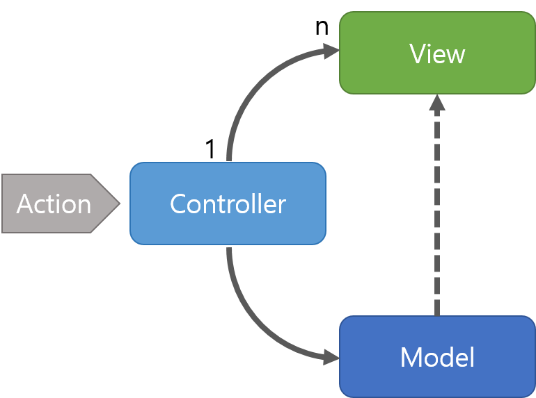
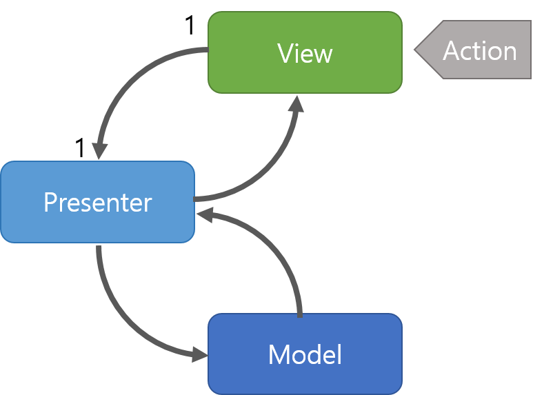
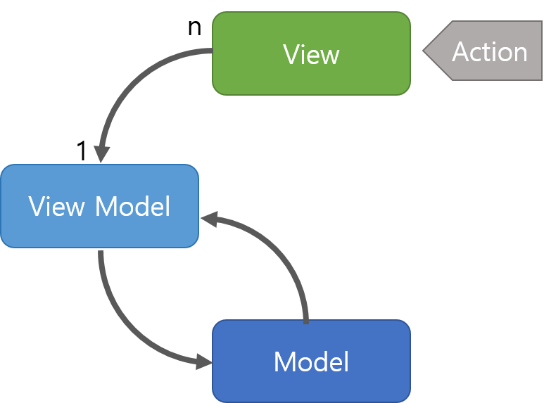

# Model View Controller (모델 뷰 컨트롤러)

#### 작성자 : [김우영](https://github.com/0x000613)

## 디자인 패턴이란?

객체 지향 프로그래밍 설계시 자주 발생하는 문제를 피하기 위해 사용되는 패턴을 의미합니다.

혼자 개발할때에 비해 여러 사람이 협업하여 작업할 때 버그를 발생시키기 쉽고 최적화 시키기도 어려우므로 이러한 문제를 해결하기 위해 디자인 패턴을 사용합니다.

디자인 패턴은 의사소통 수단의 일종으로서 이러한 문제를 해결해줍니다.

## MVC

Model + View + Controller

**구조**

-   Model : 애플리케이션에서 사용되는 데이터와 그 데이터를 처리하는 부분입니다.
-   View : 사용자에게 보여지는 UI 부분입니다.
-   Controller : 사용자의 입력(Action)을 받고 처리하는 부분입니다.

**동작**

MVC 패턴의 동작 순서는 다음과 같습니다.

1.  사용자의 Action들은 Controller에 들어오게 됩니다.
2.  Controller는 사용자의 Action을 확인하고, Model을 업데이트합니다.
3.  Controller는 Model을 나타내줄 View를 선택합니다.
4.  View는 Model을 이용하여 화면을 나타냅니다.

**\* MVC에서 View가 업데이트 되는 방법**

-   View가 Model을 이용하여 직접 업데이트
-   Model에서 View에게 Notify 하여 업데이트
-   View가 Polling으로 주기적으로 Model의 변경을 감지하여 업데이트

**특징**

Controller는 여러개의 View를 선택할 수 있는 1:n 구조입니다.  
Controller는 View를 선택할 뿐 직접 업데이트 하지 않습니다. (View는 Controller를 알지 못합니다.)

**장점**

MVC 패턴의 장점은 널리 사용되고 있는 디자인 패턴이라는 점에 걸맞게 가장 단순합니다.  
단순하다 보니 보편적으로 많이 사용되는 디자인 패턴입니다.

**단점**

MVC 패턴의 단점은 View와 Model 사이의 의존성이 높다는 것입니다. View와 Model의 높은 의존성은 애플리케이션이 커질수록 복잡해지고 유지보수의 어려움을 야기합니다.

## MVP

MVP 패턴은 Model + View + Presenter를 합친 용어입니다. Model과 View는 MVC 패턴과 동일하고, Controller 대신 Presenter가 존재합니다.

**구조**

-   Model : 어플리케이션에서 사용되는 데이터와 그 데이터를 처리하는 부분입니다.
-   View : 사용자에서 보여지는 UI 부분입니다.
-   Presenter : View에서 요청한 정보로 Model을 가공하여 View에 전달해 주는 부분입니다. View와 Model을 붙여주는 역할을 합니다.

**동작**

MVP 패턴의 동작 순서는 아래와 같습니다.

1.  사용자의 Action들은 View를 통해 들어오게 됩니다.
2.  View는 데이터를 Presenter에 요청합니다.
3.  Presenter는 Model에게 데이터를 요청합니다.
4.  Model은 Presenter에서 요청받은 데이터를 응답합니다.
5.  Presenter는 View에게 데이터를 응답합니다.
6.  View는 Presenter가 응답한 데이터를 이용하여 화면을 나타냅니다.

**특징**

Presenter는 View와 Model의 인스턴스를 가지고 있어 둘을 연결합니다.  
Presenter와 View는 1:1 관계입니다.

**장점**

MVP 패턴의 장점은 View와 Model간의 의존성이 없다는 것입니다. MVP 패턴은 MVC 패턴의 단점이었던 View와 Model의 의존성을 해결하였습니다.(Presenter를 통해서만 데이터를 전달받기 때문)

**단점**

MVC 패턴의 단점인 View와 Model 사이의 의존성은 해결되었지만, View와 Presenter 사이의 의존성이 높은 단점이 있습니다.  
애플리케이션이 복잡해질 수록 View와 Presenter 사이의 의존성이 강해지는 단점이 있습니다.

## MVVM

MVVM 패턴은 Model + View + View Model을 합친 용어입니다. Model과 View는 다른 패턴과 동일합니다.

-   Model : 어플리케이션에서 사용되는 데이터와 그 데이터를 처리하는 부분입니다.
-   View : 사용자에서 보여지는 UI 부분입니다.
-   View Model : View를 표현하기 위해 만든 View를 위한 Model입니다. View를 나타내 주기 위한 Model이자 View를 나타내기 위한 데이터 처리를 하는 부분입니다.

**동작**

MVVM 패턴의 동작 순서는 아래와 같습니다.

1.  사용자의 Action들은 View를 통해 들어오게 됩니다.
2.  View에 Action이 들어오면, Command 패턴으로 View Model에 Action을 전달합니다.
3.  View Model은 Model에게 데이터를 요청합니다.
4.  Model은 View Model에게 요청받은 데이터를 응답합니다.
5.  View Model은 응답 받은 데이터를 가공하여 저장합니다.
6.  View는 View Model과 Data Binding하여 화면을 나타냅니다.

**특징**

MVVM 패턴은[Command 패턴](https://ko.wikipedia.org/wiki/%EC%BB%A4%EB%A7%A8%EB%93%9C_%ED%8C%A8%ED%84%B4)과[Data Binding](https://en.wikipedia.org/wiki/Data_binding)두 가지 패턴을 사용하여 구현되었습니다.

Command 패턴과 Data Binding을 이용하여 View와 View Model 사이의 의존성을 없앴습니다.

View Model과 View는 1:n 관계입니다.

**장점**

MVVM 패턴은 View와 Model 사이의 의존성이 없습니다. 또한 Command 패턴과 Data Binding을 사용하여 View와 View Model 사이의 의존성 또한 없는 디자인 패턴입니다. 각각의 부분은 독립적이기 때문에 모듈화 하여 개발할 수 있습니다.

**단점**

MVVM 패턴의 단점은 View Model의 설계가 어렵다는 점입니다.
