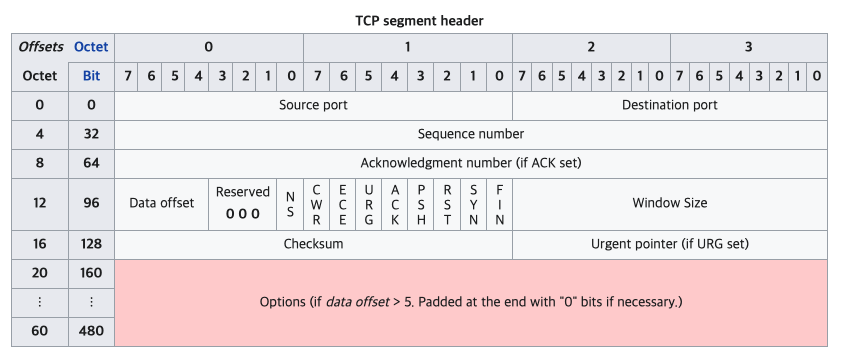

# http

#### 작성자 : [이병민](https://github.com/ByeongminLee)

<br>

### Reference

[HTTP의 진화](https://developer.mozilla.org/ko/docs/Web/HTTP/Basics_of_HTTP/Evolution_of_HTTP#%EC%9B%94%EB%93%9C_%EC%99%80%EC%9D%B4%EB%93%9C_%EC%9B%B9%EC%9D%98_%EB%B0%9C%EB%AA%85)<br>
[그림으로 쉽게 보는 HTTP변천사](https://brunch.co.kr/@swimjiy/39)<br>
[Introduction to HTTP/2](https://developers.google.com/web/fundamentals/performance/http2)

<br>

## HTTP란?

<code>HTTP</code>는 <code>Hyper Text Transfer Protocol</code>의 약자록 인터넷에서 데이터를 주고 받을 수 있는 프로토콜이다.<br>
<code>HTTP</code>는 <code>World Wide Web</code>에 내제된 프로토콜로 1989년CERN(유럽 입자 물리학 연구소)의 팀 버너스 리(Tim Berners-Lee)에 의해 <code>World Wide Web</code>을 제안했다.<br>
이때 문서 기술 언어로는 SGML을 베이스로하는 <code>HTML</code>, 문서 전송 프로토콜인 <code>HTTP</code>, 문서의 주소를 지정하는 방법인 <code>URL(Uniform Resource Locator)</code> 등이 같이 제안 되었다.

<br>

### HTTP/0.9

HTTP 초기 버전에는 버전 번호가 없었고 이 후 버전과 구별하기 위해서 0.9라고 불리게 되었다.

초기 HTTP는 요청은 단일 라인으로만 구성되었고 가능한 메서는 <code>GET</code>이 유일했다.<br>
이때문에 *원-라인 프로토콜*이라고도 불린다.

-   요청시

    ```md
    GET /mypage.html
    ```

-   응답시

    ```md
    <HTML>
    Hello World!
    </HTML>
    ```

위와 같이 오로지 파일 내용 자체로만 구성된다.<br>
이 후 버전들과는 다르게 <code>HTTP header</code>가 없이 <code>HTML</code>파일만 전송 될 수 있으며 다른 유형의 문서는 전송 될 수 없고 상태코드나 오류 코드 또한 없다.</br>그리고 커넥션 하나당 1요청, 1응답만 가능하여 매번 새로운 연결로 성능이 저하되고, 서버 부하 비용이 올라갔다.

<br>

### HTTP/1.0

이전 버전인 0.9가 매우 제한적이었던과 달리 브라우저와 서버가 모두 융통성을 가지도록 확장 되었다.

HTTP의 버전 정보나 상태 코드들을 전송 할 수 있게 되었고 <code>HTTP header</code>개념의 도입되어서 HTML 파일들 외에 다른 문서들을 전송하는 기능이 추가 되었다.(Content-Type 덕분에)

-   요청시

    ```md
    GET /mypage.html HTTP/1.0
    User-Agent: NCSA_Mosaic/2.0 (Windows 3.1)

    200 OK
    Date: Tue, 15 Nov 1994 08:12:31 GMT
    Server: CERN/3.0 libwww/2.17
    Content-Type: text/html

    <HTML>
    A page with an image
    
    </HTML>
    ```

-   응답시

    ```md
    GET /myimage.gif HTTP/1.0
    User-Agent: NCSA_Mosaic/2.0 (Windows 3.1)

    200 OK
    Date: Tue, 15 Nov 1994 08:12:32 GMT
    Server: CERN/3.0 libwww/2.17
    Content-Type: text/gif
    (image content)
    ```

<br>

### HTTP/1.1

<code>HTTP/1.1</code>은 이전 버전의 모호함을 명확하게 하고 개선하였다.

이전 버전에서는 동일한 컴퓨터 사이에서 여러 개의 요청을 해도 매 번 새 연결을 했어야한다.<br>
특히 한번 연결할 때마다 TCP에서는 <code>3-way handshaking</code>가 일어나기 때문에 통신 속도가 느려지게 된다.

그래서 <code>persist connection</code>를 도입하여 한번 TCP연결을 맺으면 끊어지지 않고 계속 유지 할 수 있게 했다.(지정된 시간동안 커넥션을 닫지 않아서 그 시간동안은 계속 그 커넥션을 사용할 수 있음)

그리고 <code>pipelining</code>를 도입해서 하나의 커넥션에서 응답을 기다리지 않고 순차적인 여러 요청을 연속적으로 보내 그 순서에 맞춰 응답을 받는 방식으로 지연 시간을 줄인다.

하지만 이때는 처음 요청이 오래 걸리면 그 뒤에 오는 요청이 이전 요청을 기다리는 <code>Head Of Line Blocking</code>이라는 문제가 있었고 연속된 요청의 경우 Header구조가 중복 될 수 있는 문제가 있다.

### HTTP/2.0

<code>HTTP/2.0</code>은 2015년도에 발표 되었으며 구글의 SPDY(스피디)라는 네트워크 프로토콜에 기반하여 개발 되었다.

우선 <code>HTTP/2.0</code>에서는 데이터 교환 방식이 바뀌었다.

HTTP용어

-   스트림 : 구성된 연결 내에 양항향 흐름, 하나 이상의 메시지가 전달 될 수 있음
-   메시지 : 논리적 요청 또는 응답 메시지에 매핑되는 프레임의 전체 시퀀스
-   프레임 : HTTP/2.0에서 통신의 최소 단위로 하나의 프레임 헤더가 포함된다.

<br>


<code>HTTP/2.0</code>에 도입된 새로운 데이터 교환 방식은 <code>바이너리 프레이밍(binary framing)</code>으로 HTTP 메시지를 더 작은 단위로 쪼개 바이너리 형태인 프레임 단위로 캡슐화하여 파싱, 전송속도를 높이고 오류 발생 가능성을 줄였다.

<br>


그리고 이 프레임 단위는 먼저 도착하는 데이터를 전송 받은 측에서 조립을 할 수 있어서 <code>Head Of Line Blocking</code>을 어느정도 해결 할 수 있게 되었다.
<br>


<code>Stream Prioritization</code>으로 리소스간에 우선 순위를 설정 할 수 있어서 먼저 전송 하고자 하는 데이터를 먼저 보낼 수 있다.<br>

> 각 스트림에 1~256사이의 정수 가중치를 할당하고 각 스트림에는 다른 스트림에 대한 명시적 종속성을 부여 할 수 있다. 스트림의 종속성 및 가중치 조합을 이용하여 '우선순위 지정 트리'를 구성하여 우선순위가 높은 응답이 클라이언트에 최적으로 전달되도록 대역폭을 할당한다.

<br>


그리고 서버가 단일 클라이언트 요청에 대해 여러 응답을 보낼 수 있는 <code>ServerPush</code>가 도입되었다. <br>
<code>ServerPush</code>로 서버는 클라이언트가 요청하지 않아도 추가적인 리소스를 클라이언트에 전송 할 수 있다.

> 만약 html파일에 참조된 css,js파일들을 html파일과 같이 클라이언트에 먼저 전송을 하게 되어 클라이언트가 html읽고 난뒤 요청학 전에 미리 전송을 할 수 있다.

<br>


이전 버전에서는 header값이 중복되더라도 모든 header값을 보냈지만 <code>Header Compression</code>을 통해서 중복된 부분을 줄여서 header자체의 크기를 줄여서 페이지 로드 시간을 감소 시켰다.

-   HTTP1.1 vs HTTP2.0 속도 비교
    <br>
    > 출처 : https://imagekit.io/demo/http2-vs-http1

<br>

### HTTP/3.0

<code>HTTP/3.0</code>은 구글에서 2013년도에 발표한 <code>QUIC(Quick UDP Internet Connections)</code>을 사용한다. (2018년에 QUIC 경우 HTTP를 HTTP/3.0로 호칭하기로 했다.)<br>
이 <code>QUIC</code>는 현재 구글에서는 대부분 서비스에 도입하고 있다.

> QUIC은 TCP가 아닌 UDP를 기반으로 사용한다.<br>
> http는 신뢰성 있는 연결을 할 수 있으면 TCP방식이든 UDP 방식이든 상관이 없다.

-   TCP vs UDP
    |-|TCP|UDP|
    |------|---|---|
    |연결 방식|연결형 서비스|비연결형 서비스|
    |패킷 교환|가상 회선 방식|데이터그램 방식|
    |전송 순서 보장|보장함|보장하지 않음|
    |신뢰성|높음|낮음|
    |전송속도|느림|빠름|

<br>

<br>

> 출처 : [wikipedia](https://en.wikipedia.org/wiki/User_Datagram_Protocol)

UDP방식을 도입한 이유는 TCP는 신뢰성을 확보하기위해 구조가 커서 지연을 줄이기 힘들었기 때문에 UDP를 바탕으로 <code>QUIC</code>을 만들었다.

UDP는 데이터 전송에 집중이 되있는 설계로 별도의 기능이 없고 원하는 기능을 개발자가 구현 할 수 있어서 TCP의 지연을 줄이면서 TCP만큼의 신뢰성을 확보 하였다.

<br>

<code>QUIC</code>는 첫 연결 설정에서 필요한 정보와 함꼐 데이터를 전송하여 연결 성공 시 설정을 캐싱하여 다음 연결때 바로 성립이 가능하다.

<code>Connection UUID</code>라는 고유한 식별자로 서버와 연결하여 클라이언트가 이 식별자를 가지고 있으면 커넥션을 재수립 하지 않아도 된다.

> IP가 변경되거나 wifi에서 LTE로 변경되어도 기존의 커넥션을 유지 시킬 수 있다.

<br>

-   2.0과 3.0의 멀티 플렉싱 비교 사진

    **HTTP 2.0**<br>
    

    **HTTP 3.0**<br>
    

    > 출처 : [http3-explained](https://http3-explained.haxx.se/)

<code>HTTP/2.0</code>에서도 멀티 플렉싱이 가능은 했었는데 스트림이 병렬로 처리 될때 데이터 자체가 손실이 되게 되면 <code>Head Of Line Blocking</code> 이슈가 다시 생기게 된다.

하지만 <code>QUIC</code>은 독립 스트림을 사용하여 향상된 멀틱 플렉싱이 가능하다.

또한 QUIC 프로토콜에는 일반 텍스트 버전이 없고 항상 TLS를 사용해서 암호화 및 보안을 수행하여야 하기 때문에 보안 면에서도 뛰어나다.

<br>

> [W3techs](https://w3techs.com/technologies/details/ce-http3)에 따르면 2022년 1월 기준 HTTP/3.0은 전체 웹사이트의 24.6%에 사용되고 있다.
