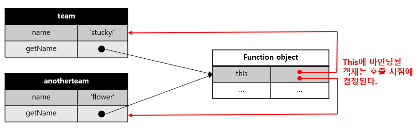

# 자바스크립트에서의 this

#### 작성자 : [이슬기](https://github.com/abcabcp)

<br />

## 1. this란?

- 여태 자바스크립트를 공부하면서, this가 간간히 등장하는 것을 보았을 것이다. 여기서도 쓰이는 것 같고, 저기서도 쓰이는 것 같은 this.... ? 정확히 정의해보자.

### 1.1 this의 정의

- this란 자신이 속한 객체 또는 자신이 생성할 인스턴스를 가리키는 자기 참조 변수다. this를 통해 자신이 속한 객체 또는 자신이 생성할 인스턴스의 프로퍼티나 메서드를 참조할 수 있다.
- 정의만 읽으면 왜 쓰이는지, 어떤 때 쓰이는 지 알기 힘드니 천천히 이해해보자.

### 1.2 this를 쓰는 이유

- 객체는 상태를 나타내는 프로퍼티와 동작을 나타내는 메서드를 하나의 논리적인 단위로 묶은 복합적인 자료구조이다. 이때, 동작을 나타내는 메서드는 자신이 속한 객체의 상태, 즉 프로퍼티를 참조하고 변경할 수 있어야 한다. 이 때 메서드가 자신이 속한 객체의 프로퍼티를 참조하려면
- 먼저 자신이 속한 객체를 가리키는 식별자를 참조할 수 있어야 한다.
- 다음 예제 코드를 보자.

  ```js
  const home = {
    //프로퍼티: 객체 고유의 상태 데이터
    mom: "슬기",
    //메서드: 상태 데이터를 참조하고 조작하는 동작
    getSon() {
      //이 메서드가 자신이 속한 프로퍼티나 다른 메서드를 참조하려면
      //자신이 속한 객체인 mom을 참조할 수 있어야 한다.
      return home.mom + "와 코난이와 모카";
    },
  };

  console.log(home.getSon()); //슬기와 코난이와 모카
  ```

  - getSon 메서드 내에서 메서드 자신이 속한 객체를 가리키는 식별자 mom을 참조하고 있다. 이 참조 표현식이 평가되는 시점은 getSon메서드가 호출되어 함수 몸체가 실행되는 시점이다.
  - 위 예제의 객체 리터럴은 home 변수에 할당되기 직전에 평가된다. 따라서 mom 메서드가 호출되는 시점에는 이미 객체 리터럴의 평가가 완료되어 객체가 생성되었고 home 식별자에 생성된 객체가 할당된 이후다. 따라서 메서드 내부에서 home 식별자를 참조할 수 있다.
    > 객체 리터럴: 자바스크립트의 유연함과 강력함을 대표하는 객체 생성 방식. 클래스를 정의하거나 new 연산자를 사용하지 않더라도 손쉽게 객체를 생성할 수 있으며, 간단히 이해하자면 const x = {y:1} 일 때 중괄호 안을 뜻한다.
  - 하지만! 자기 자신이 속한 객체를 재귀적으로 참조하는 방식은 일반적이지 않고, 바람직하지도 않다.

- 이번에는 생성자 함수 방식으로 인스턴스를 생성하는 경우를 살펴보자.

  ```js
  function Home (mom){
      //이 시점에는 생성자 함수 자신이 생성할 인스턴스를 가리키는 식별자를 알 수 없다.
      ???.mom = mom;
  }

  Home.prototype.homeMember = function (){
      //이 시점에는 생성자 함수 자신이 생성할 인스턴스를 가리키는 식별자를 알 수 없다.
      return "귀여운 코난이와 모카와 성실한 " + ???.mom;
  }

  //생성자 함수로 인스턴스를 생성하려면 먼저 생성자 함수를 정의해야 한다.
  const home = new Home("슬기");
  ```

  - 생성자 함수 내부에서는 프로퍼티 또는 메서드를 추가하기 위해 자신이 생성할 인스턴스를 참조해야 한다. 하지만 생성자 함수에 의한 객체 생성 방식은 먼저 생성자 함수를 정의한 이후 new 연산자와 함께 생성자 함수를 호출하는 단계가 추가적으로 필요하다.
  - 즉, 생성자 함수로 인스턴스를 생성하려면 먼저 생성자 함수가 존재해야 한다.
  - 생성자 함수를 정의하는 시점에는 아직 인스턴스를 생성하기 이전이므로 생성자 함수가 생성할 인스턴스를 가리키는 식별자를 알 수 없다.
  - 그렇기에 자신이 속한 객체 또는 자신이 생성할 인스턴스를 가리키는 특수한 식별자가 필요하다. 이를 위해 자바스크립트는 this라는 특수한 식별자를 제공한다.

- this는 자바스크립트 엔진에 의해 암묵적으로 생성되며, 코드 어디서든 참조할 수 있다. 함수를 호출하면 argument 객체와 this가 암묵적으로 함수 내부에 전달된다. 함수 내부에서 argument를 지역변수처럼 사용할 수 있는 것처럼 this도 지역 변수로 사용할 수 있다.
- 단, this가 가리키는 값, 즉 this 바인딩은 함수 호출 방식에 의해 동적으로 결정된다.
  > this 바인딩: 바인딩이란 식별자와 값을 연결하는 과정이다. 예를 들어 변수 선언은 변수 이름(식별자)와 확보된 메모리 공간의 주소를 바인딩 하는 것이다. this 바인딩은 this와 this가 가리킬 객체를 바인딩 하는 것이다.
- 첫번 째 예제에 this를 사용해 수정해 보았다.

  ```js
  const home = {
    mom: "슬기",
    getSon() {
      //this는 메서드를 호출한 객체를 가리킨다.
      return this.mom + "와 코난이와 모카";
    },
  };

  console.log(home.getSon()); //슬기와 코난이와 모카
  ```

  - 객체 리터럴의 메서드 내부에서의 this는 메서드를 호출한 객체, home을 가리킨다.

- 두 번째 예제를 this를 사용해 수정해 보자.

  ```js
  function Home(mom) {
    //this는 생성자 함수가 생성할 인스턴스를 가리킨다.
    this.mom = mom;
  }

  Home.prototype.homeMember = function () {
    //this는 생성자 함수가 생성할 인스턴스를 가리킨다.
    return "귀여운 코난이와 모카와 성실한 " + this.mom;
  };

  //인스턴스 생성
  const home = new Home("슬기");

  console.log(home.homeMember()); // 귀여운 코난이와 모카와 성실한 슬기
  ```

  - 생성자 함수 내부의 this는 생성자 함수가 생성할 인스턴스를 가리킨다. 이처럼 this는 상황에 따라 가리키는 대상이 다르다.

- 자바나 C++ 같은 클래스 기반 언어에서 this는 언제나 클래스가 생성하는 인스턴스를 가리킨다. 하지만 <strong>자바스크립트의 this는 함수가 호출되는 방식에 따라 this에 바인딩 될 값, 즉 this 바인딩이 동적으로 결정된다.</strong>
- this는 코드 어디에서든 참조 가능하다. 전역에서도 함수 내부에서도 참조할 수 있다.

  ```js
  //this는 어디서나 참조할 수 있다.
  //전역에서 this는 window를 가리킨다.
  console.log(this); //window

  function square(num) {
    // 일반 함수 내부에서 this는 전역객체인 window를 가리킨다.
    console.log(this); //window
    return num * num;
  }

  square(2);

  const member = {
    name: "희재",
    getName() {
      //메서드 내부에서 this는 메서드를 호출한 객체를 가리킨다.
      console.log(this); // {name: "희재", getName: f}
      return this.name;
    },
  };
  console.log(member.getName()); //희재

  function member2(name) {
    this.name = "찬민";
    //생성자 함수 내부에서 this는 생성자 함수가 생성할 인스턴스를 가리킨다.
    console.log(this); // {member2 {name: "찬민"}}
  }

  const stuckyi = new member2("병민");
  ```

  - 하지만 this는 객체의 프로퍼티나 메서드를 참조하기 위한 자기 참조 변수이므로 일반적으로 객체의 메서드 내부 또는 생성자 함수 내부에서만 의미가 있다. 따라서 strict mode가 적용된 일반 함수 내부의 this에는 undefined가 바인딩된다. 일반 함수 내부에서 this를 사용할 필요가 없기 때문이다.

    ```js
    (function () {
      "use strict";

      function ex() {
        console.log(this); //undefined
      }
      ex();

      function Ex() {
        console.log(this); //Ex
      }
      new Ex();
    })();
    ```

## 2. 함수 호출 방식과 this 바인딩

- 앞서 살펴 봤듯 this바인딩은 함수 호출 방식. 즉 함수가 어떻게 호출되었는지에 따라 동적으로 결정된다.
- 참고로 렉시컬 스코프와 this 바인딩은 결정 시기가 다르다. 함수의 상위 스코프를 결정하는 방식인 렉시컬 스코프는 함수 정의가 평가되어 객체가 생성되는 시점에 상위 스코프를 결정하지만, this 바인딩은 함수 호출 시점에 평가된다.

### 2.1 일반 함수 호출

- 일반 함수로 호출된 모든 함수 (중첩 함수, 콜백 함수 포함) 내부의 this에는 전역 객체가 바인딩된다.

  - 전역 함수
    ```js
    function hello() {
      console.log("hello's this: ", this); //window
      function world() {
        console.log("world's this: ", this); //window
      }
      world();
    }
    hello();
    ```
  - 중첩 함수

    - 메서드 내에서 정의한 중첩 함수도 일반 함수로 호출되면 중첩 함수 내부의 this에는 전역 객체가 바인딩된다.

      ```js
      //var 키워드로 선언한 전역변수 team은 전역 객체의 프로퍼티다.
      var team = "stuckyi";
      //const 키워드로 선언한 전역변수 team은 전역 객체의 프로퍼티가 아니다.
      //const team = "stuckyi";

      const cheerUp = {
        team: "flower",
        outer() {
          console.log("outer's this: ", this); //outer's this:  {team: 'flower', outer: ƒ}
          console.log("outer's this.team: ", this.team); //outer's this.team:  flower

          //메서드 내에서 정의한 중첩 함수
          function inner() {
            console.log("inner's this: ", this); //inner's this:  Window
            console.log("inner's this.team: ", this.team); //inner's this.team:  stuckyi
          }

          //메서드 내에서 정의한 중첩 함수도 일반 함수로 호출되면 중첩 함수 내부의 this에는
          //전역 객체가 바인딩된다.
          inner();
        },
      };

      cheerUp.outer();
      ```

  - 콜백 함수

    - 콜백 함수가 일반함수로 호출되면 콜백 함수 내부의 this에도 전역 객체가 바인딩된다.

      ```js
      var team = "stuckyi";

      const cheerUp = {
        team: "flower",
        outer() {
          console.log("outer's this: ", this); //outer's this:  {team: 'flower', outer: ƒ}
          //콜백 함수 내부의 this에는 전역 객체가 바인딩 된다.
          setTimeout(function () {
            console.log("inner's this: ", this); //inner's this:  Window
            console.log("inner's this.team: ", this.team); //inner's this.team:  stuckyi
          }, 100);
        },
      };

      cheerUp.outer();
      ```

- 고로, 어떤 함수라도 일반 함수로 호출되면 this에 전역 객체가 바인딩된다.
- 그렇다면... 메서드 내부의 중첩함수나 콜백 함수의 this 바인딩을 메서드의 this 바인딩과 일치시키려면?

  - 변수에 할당하기

    ```js
    var team = "stuckyi";

    const cheerUp = {
      team: "flower",
      outer() {
        // this 바인딩 (cheerUp)을 변수 that에 할당한다.
        const that = this;

        //콜백 함수 내부에서 this대신 that을 참조한다.
        setTimeout(function () {
          console.log(that.team); //flower
        }, 100);
      },
    };

    cheerUp.outer();
    ```

  - Function.prototype.call, Function.prototype.bind 메서드 사용
  - 화살표 함수 사용

    ```js
    var team = "stuckyi";

    const cheerUp = {
      team: "flower",
      outer() {
        // 화살표 함수 내부의 this는 상위 스코프의 this를 가리킨다.
        setTimeout(() => console.log(this.team), 100); //flower
      },
    };

    cheerUp.outer();
    ```

### 2.2 메서드 호출

- 메서드 내부에서 this는 메서드를 호출한 객체, 즉 메서드를 호출할 때 이름 앞의 마침표(.) 연산자 앞에 기술한 객체가 바인딩 된다.
- 주의할 점은 메서드 객체 내부의 this는 메서드를 소유한 객체가 아닌 메서드를 호출한 객체에 바인딩 된다는 것이다.

  ```js
  const team = {
    name: "stuckyi",
    getName() {
      //메서드 내부의 this는 메서드를 호출한 객체에 바인딩된다.
      return this.name;
    },
  };

  //메서드 getName을 호출한 객체는 team이다.
  console.log(team.getName()); //stuckyi
  ```

  - 위 예제의 getName 메서드는 team 객체의 메서드로 정의되었다. 메서드는 프로퍼티에 바인딩된 함수다. 즉, team객체의 getName 프로퍼티가 가리키는 함수 객체는 taem 객체에 포함된 것이 아니라 독립적으로 존재하는 별도의 객체다. getName 프로퍼티가 함수 객체를 가리키고 있을 뿐이다.
    
  - 따라서, getName 프로퍼티가 가리키는 함수 객체, 즉 getName 메서드는 다른 객체의 프로퍼티에 할당하는 것으로 다른 객체의 메서드가 될 수도 있고, 일반 변수에 할당하여 일반 함수로 호출될 수도 있다.

    ```js
    const anotherTeam = {
      name: "flower",
    };

    //getName 메서드를 anotherTeam 객체의 메서드로 할당
    anotherTeam.getName = team.getName;

    //getName 메서드를 호출한 객체는 anotherTeam이다.
    console.log(anotherTeam.getName()); //flower

    //getName 메서드를 변수에 할당
    const getName = team.getName;

    //getName 메서드를 일반 함수로 호출
    console.log(getName()); //''
    //일반 함수로 호출된 getName 함수 내부의 this.name은 브라우저환경에서 window.name과 같다.
    //브라우저 환경에서 window.name은 브라우저 창의 이름을 나타내는 빌트인 프로퍼티이며 기본값은 '' 이다.
    //Node.js 환경에서 this.name은 undefined이다.
    ```

    - 따라서 메서드 내부의 this는 프로퍼티로 메서드를 가리키고 있는 객체와는 관계가 없고 메서드를 호출한 객체에 바인딩 된다.
      

  - 프로토타입 메서드 내부에서 사용된 this도 일반 메서드와 마찬가지로 해당 메서드를 호출한 객체에 바인딩된다.

    ```js
    function Team(name) {
      this.name = name;
    }

    Team.prototype.getName = function () {
      return this.name;
    };

    const we = new Team("stuckyi");

    //getName 메서드를 호출한 객체는 we다.
    console.log(we.getName()); // ① stuckyi

    Team.prototype.name = "flower";

    //getName 메서드를 호출한 객체는 Person.prototype 이다.
    console.log(Team.prototype.getName()); // ② flower
    ```

    - ①의 경우 메서드를 호출한 객체는 we다. 따라서, getName의 메서드 내부의 this는 we를 가리키며 this.name은 'stuckyi'이다.
    - ②의 경우 getName을 호출한 객체는 Team.prototype이다. Team.prototype도 객체이므로 직접 메서드를 호출할 수 있다. 따라서, getName의 메서드 내부의 this는 Team.prototype을 가리키며 this.name은 'flower'이다.
      

### 2.1 생성자 함수 호출

- 생성자 함수 내부의 this에는 생성자 함수가 (미래에) 생성할 인스턴스가 바인딩된다.

  ```js
  function Team(member) {
    //생성자 함수 내부의 this는 생성자 함수가 생성할 인스턴스를 가리킨다.
    this.member = member;
    this.getMember = function () {
      return "스투키 멤버인 " + this.member;
    };
  }

  //멤버가 희재인 stuckyi1 객체를 생성
  const stuckyi1 = new Team("희재");

  //멤버가 우영인 stuckyi2 객체를 생성
  const stuckyi2 = new Team("우영");

  console.log(stuckyi1.getMember()); //스투키 멤버인 희재
  console.log(stuckyi2.getMember()); //스투키 멤버인 우영
  ```

  - 생성자 함수는 이름 그대로 객체 (인스턴스)를 생성하는 함수다. 일반 함수와 동일한 방법으로 생성자 함수를 정의하고 new 연산자와 함께 호출하면 해당 함수는 생성자 함수로 동작한다.
  - 만약 new 연산자와 함께 생성자 함수를 호출하지 않으면 생성자 함수가 아니라 일반 함수로 동작한다.

  ```js
  //new 연산자와 함께 호출하지 않으면 생성자 함수로 동작하지 않는다. 즉, 일반적인 함수의 호출이다.
  const stuckyi3 = Team("슬기");

  //일반 함수로 호출된 Team에는 반환문이 없으므로 암묵적으로 undefined를 반환한다.
  console.log(stuckyi3); //undefined

  //일반 함수로 호출된 Team의 내부의 this는 전역 객체를 가리킨다.
  console.log(member); //슬기
  ```

### 2.1 Function.prototype.apply/call/bind 메서드에 의한 간접 호출

- apply, call, bind는 Function.prototype의 메서드다. 즉, 이들 메서드는 모든 함수가 상속받아 사용할 수 있다.

  <b>2.1.1. Function.prototype.apply, Function.prototype.call</b>

  - apply와 call은 this로 사용할 객체와 인수 리스트를 인수로 전달받아 함수를 호출한다.

    ```js
    function getThisBinding() {
      return this;
    }

    //this로 사용할 객체
    const thisArg = { a: 1 };

    console.log(getThisBinding()); //window

    //getThisBinding 함수를 호출하면서 인수로 전달할 객체를 getThisBinding 함수의 this에 바인딩한다.
    console.log(getThisBinding.apply(thisArg)); //{ a: 1 }
    console.log(getThisBinding.call(thisArg)); //{ a: 1 }
    ```

  - apply와 call 메서드는 호출할 함수에 인수를 전닳하는 방식만 다를 뿐 동일하게 동작한다.

    ```js
    function getThisBinding() {
      console.log(arguments);
      return this;
    }

    //this로 사용할 객체
    const thisArg = { a: 1 };

    //getThisBinding 함수를 호출하면서 인수로 전달할 객체를 getThisBinding 함수의 this에 바인딩한다.

    //apply 메서드는 호출할 함수의 인수를 배열로 묶어 전달한다.
    console.log(getThisBinding.apply(thisArg, [1, 2, 3]));
    //[Arguments] { '0': 1, '1': 2, '2': 3 }
    //{ a: 1 }

    //call 메서드는 호출할 함수의 인수를 쉼표로 구분한 리스트 형식으로 전달한다.
    console.log(getThisBinding.call(thisArg, 1, 2, 3));
    ////[Arguments] { '0': 1, '1': 2, '2': 3 }
    //{ a: 1 }
    ```

  - apply와 call 메서드의 대표적인 용도는 arguments 객체와 같은 유사 배열 객체에 배열 메서드를 사용하는 경우이다. arguments 객체는 배열이 아니기 때문에 Array.prototype.slice 같은 배열의 메서드를 사용할 수 없으나, apply와 call 메서드를 사용하면 가능하다.

    ````js
    function convertArgsToArray() {
    console.log(arguments);

          //arguments 객체를 배열로 변환
          //Array.prototype.slice를 인수 없이 호출하면 배열의 복사본을 생성한다.
          const arr = Array.prototype.slice.call(arguments);
          // const arr = Array.prototype.slice.apply(arguments);
          console.log(arr);

          return arr;
        }

        convertArgsToArray(1, 2, 3); //[ 1, 2, 3 ]
        ```

    <b>2.1.1. Function.prototype.bind</b>

    ````

  - bind 메서드는 apply와 call 메서드와 달리 함수를 호출하지 않고 this로 사용할 객체만 전달한다.

    ```js
    function getThisBinding() {
      return this;
    }

    //this로 사용할 객체
    const thisArg = { a: 1 };

    //bind 메서드는 함수에 this로 사용할 객체를 전달한다.
    //bind 메서드는 함수를 호출하지 않는다.
    console.log(getThisBinding.bind(thisArg)); //getThisBinding
    //bind 메서드는 함수를 호출하지 않으므로 명시적으로 호출해야 한다.
    console.log(getThisBinding.bind(thisArg)()); //{ a: 1 }
    ```

  - bind 메서드는 메서드의 this와 메서드 내부의 중첩 함수 또는 콜백 함수의 this가 불일치하는 문제를 해결할 때 유용하게 사용된다. 예로 들어, 아래의 예제를 보자.

    ```js
    const Team = {
      name: "찬민",
      babo(callback) {
        setTimeout(callback, 10000);
      },
    };

    Team.babo(function () {
      console.log(`안녕~ ${this.name}`); //안녕~ undefined
      //일반 함수로 호출된 콜백 함수 내부의 this.name은 브라우저 환경에서 window.name과 같다.
      // 브라우저 환경에서 window.name은 브라우저 창의 이름을 나타내는 빌트인 프로퍼티이며 값은 ''이다.
      //Node.js 환경에서 this.name은 undefined 이다.
    });
    ```

    - Team.babo의 콜백함수는 외부 함수 Team.babo를 돕는 헬퍼 함수(보조 함수) 역할을 하기 때문에 외부 함수 Team.babo 내부의 this와 콜백 함수 내부의 this가 상이하면 문맥상 문제가 발생한다.
    - 따라서, 콜백 함수 내부의 this를 외부 함수 내부의 this와 일치 시켜야 한다. 이 때, bind 메서드를 사용하여 this를 일치시킬 수 있다.

      ```js
      const Team = {
        name: "찬민",
        babo(callback) {
          setTimeout(callback.bind(this), 10000);
        },
      };

      Team.babo(function () {
        console.log(`안녕~ ${this.name}`); //안녕~ 찬민
      });
      ```

## 3. 정리

| 함수 호출 방식                         | this 바인딩                                        |
| -------------------------------------- | -------------------------------------------------- |
| 일반 함수 호출                         | 전역 객체                                          |
| 메서드 호출                            | 메서드를 호출한 객체                               |
| 생성자 함수 호출                       | 생성자 함수가 (미래에) 생성할 인스턴스             |
| apply,call,bind 메서드에 의한 간접호출 | apply,call,bind 메서드에 첫번째 인수로 전달한 객체 |

> 출처 : 모던자바스크립트 deep dive
