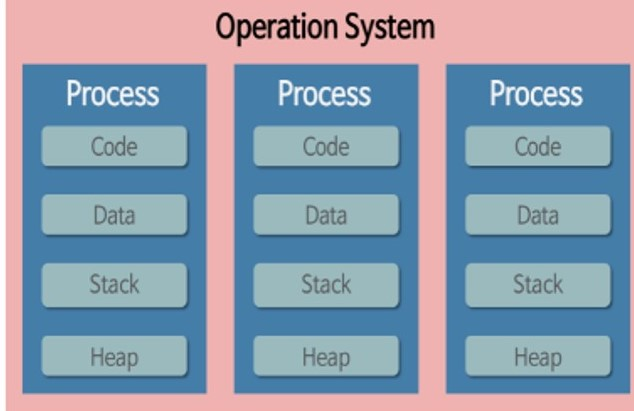
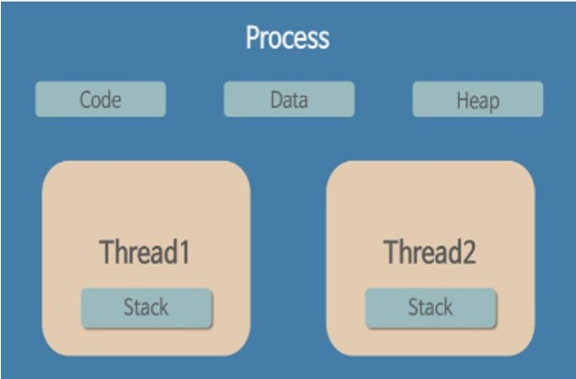
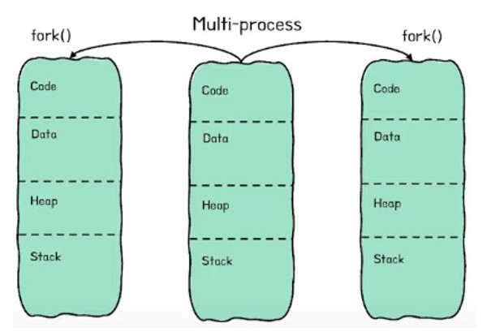
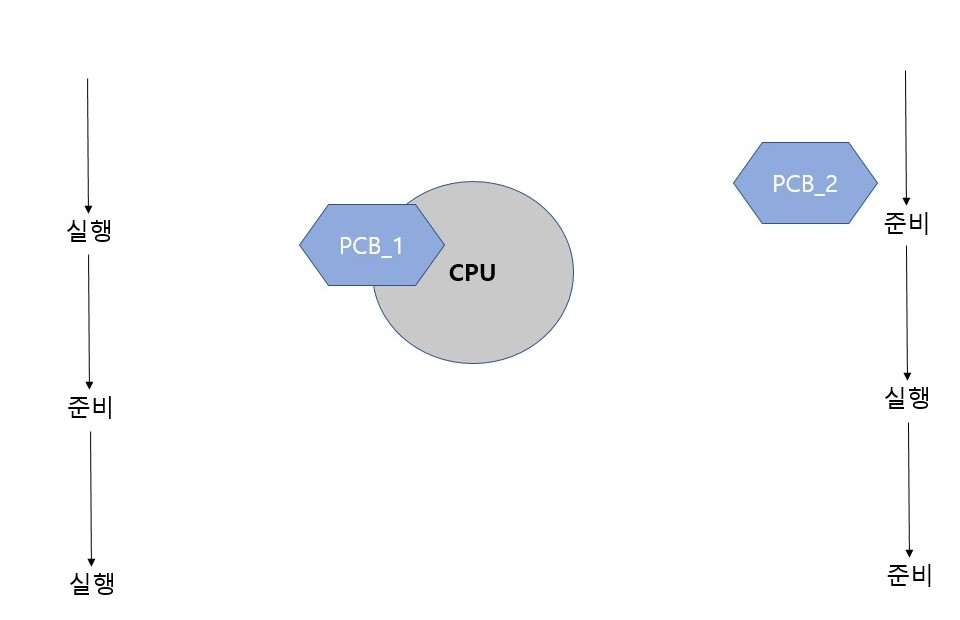
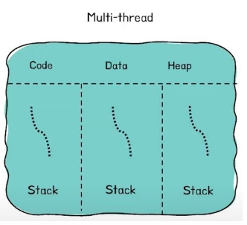
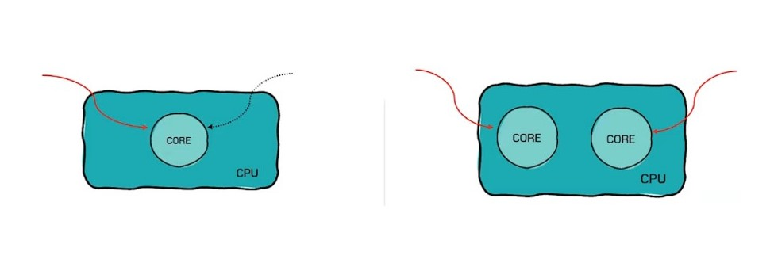

# Process & Thread

#### 작성자 : [전찬민](https://github.com/cksals3753)

- 참고자료: [Process&Thread](https://gmlwjd9405.github.io/2018/09/14/process-vs-thread.html)
- 참고영상: [Process&Thread](https://www.youtube.com/watch?v=1grtWKqTn50)
- 참고영상: [Process&Thread](https://www.yalco.kr/14_process_thread/)

## 프로세스와 스레드의 차이 (Process vs Thread)

### 프로그램(Program) 이란?

어떤 작업을 위해 실핼할 수 있는 파일

### 프로세스(Process)란?

- 컴퓨터에서 연속적으로 실행되고 있는 컴퓨터 프로그램
- 메모리에 올라와 실행되고 있는 프로그램의 인스턴스(독립적인 개체)
- 운영체제로부터 시스템 자원을 할당받는 작업의 단위
- 즉, 동적인 개념으로는 실행된 프로그램을 의미한다.

#### 할당받는 시스템 자원의 예

- CPU 시간
- 운영되기 위해 필요한 주소 공간
- Code, Data, Stack, Heap의 구조로 되어있는 독립된 메모리 영역
  > - Code는 실행 명령을 포함하는 코드들
  > - Static은 변수 혹은 Global 변수
  > - Heap은 동적 메모리 영역
  > - Stack은 지역변수, 매개변수, 반환 값 등 일시적인 데이터

- 프로세스는 각각 독립된 메모리 영역(Code, Data, Stack, Heap)을 할당받는다.
- 기본적으로 프로세스당 최소1개의 스레드(메인스레드)를 가지고 있다.
- 각 프로세스는 별도의 주소 공간에서 실행되며, 한 프로세스는 다른 프로세스의 변수나 자료구조에 접근 할 수 없다.
- 한 프로세스가 다른 프로세스의 자원에 접근하려면 프로세스간의 통신을 사용해야 한다.
- Ex, 파이프, 파일, 소켓 등을 이용한 통신 방법 이용

### 스레드(Thread)란?

- 프로세스 내에서 실행되는 여러 흐름의 단위
- 프로세스의 특정한 수행 경로
- 프로세스가 할당받은 자원을 이용하는 실행의 단위

- 스레드는 프로세스 내에서 각각 Stack만 따로 할당받고 Code, Data, Heap 영역은 공유한다.
- 스레드는 한 프로세스 내에서 동작되는 여러 실행의 흐름으로, 프로세스 내의 주소 공간이나 자원들(Heap 공간 등)을 같은 프로세스 내에 스레드끼리 공유하면서 실행된다.
- 같은 프로세스 안에 있는 여러 스레드들은 같은 힙 공간을 공유한다. 반면에 프로세스는 다른 프로세스의 메모리에 직접 접근할 수 없다.
- 각각의 스레드는 별도의 레지스터와 스택을 갖고 있지만, 힙 메모리는 서로 읽고 쓸 수 있다.
- 한 스레드가 프로세스 자원을 변경하면, 다른 이웃 스레드도 그 변경 결과를 즉시 볼 수 있다.

### 자바 스레드 (Java Thread)란?

- 일반 스레드와 거의 차이가 없으며, JVM가 운영체제의 역할을 한다.
- 자바에는 프로세스가 존재하지 않고 스레드만 존재하며, 자바 스레드는 JVM에 의해 스케줄되는 실행 단위 코드 블록이다.
- 자바에서 스레드 스케줄링은 전적으로 JVM에 의해 이루어진다.
- 아래와 같은 스레드와 관련된 많은 정보들도 JVM이 관리 한다.
  > - 스레드가 몇개 존재하는지
  > - 스레드로 실행되는 프로그램 코드의 메모리 위치는 어디인지
  > - 스레드의 상태는 무엇인지
  > - 스레드 우선순위는 얼마인지
- 즉 개발자는 자바 스레드로 작동할 스레드 코드를 작성하고, 스레드 코드가 생명을 가지고 실행을 시작하도록 JVM에 요청하는 일 뿐이다.

### 멀티 프로세스와 멀티 스레드의 차이

### 멀티 프로세스

 

#### 멀티 프로세싱이란

- 하나의 응용 프로그램을 여러개의 프로세스로 구성하여 각 프로세스가 하나의 작업을 처리하도록 하는 것이다.

#### 멀티 프로세스 장점

- 여러개의 자식 프로세스 중 하나에 문제가 발생하면 그 자식 프로세스만 죽는 것 이상으로 다른 영향이 확산되지 않는다.

#### 멀티 프로세스 단점

- Context Switching에서의 오버헤드

  > - Context Switching 과정에서 캐쉬 메모리 초기화 등 무거운 작업이 진행되고 많은 시간이 소모되는 등의 오버헤드가 발생하게 된다.
  > - 프로세스는 각각의 독립된 메모리 영역을 할당받았기 때문에 프로세스 사이에서 공유하는 메모리가 없어, Context Switching가 발생하면 캐쉬에 있는 모든 데이터를 모두 리셋하고 다시 캐쉬 정보를 불러와야 한다.

- 프로세스 사이의 어렵고 복잡한 통신기법(IPC)

  > - 프로세스는 각각의 독립된 메모리 영역을 할당받았기 때문에 하나의 프로그램에 속하는 프로세스들 사이의 변수를 공유할 수 없다.

- Context Switching란?
  > - CPU에서 여러 프로세스를 돌아가면서 작업을 처리하는데 이 과정을 Context Switching라 한다.
  > - 구체적으로, 동작 중인 프로세스가 대기를 하면서 해당 프로세스의 상태(Context)를 보관하고, 대기하고있던 다음 순서의 프로세스가 동작하면서 이전에 보관했던 프로세스의 상태를 복구하는 작업을 말한다.

 
여기 동시에 실행시키고 싶은 프로세스 두개가 있다. 이거를 동시에 실행하기 위해서 짧은 텀으로 반복되어야 한다.
 
먼저 프로세스 1이 실행상태에 있고 CPU에 적재되어 있다. 이때 프로세스2는 준비상태에 있습니다.
 
그리고 프로세스2를 실행하기 위해서는 프로세스1이 준비상태로 내려가고 프로세스2가 CPU에 적재가 되고,
 
다시 1로 전환하기 위해서는 2가 준비상태로 내려가고 1이 CPU에 올라와야 한다. 이게 컨테스트 스위칭입니다.

### 멀티 스레드

 

#### 멀티 스레딩이란

- 하나의 응용프로그램을 여러 개의 스레드로 구성하고 각 스레드로 하여금 하나의 작업을 처리하도록 하는것 이다.
- 윈도우, 리눅스 등 많은 운영체제들이 멀티 프로세싱을 지원하고 있지만 멀티 스레딩을 기본으로 하고 있다.
- 웹 서버는 대표적인 멀티 스레드 응용 프로그램이다.

#### 멀티스레드 장점

- 시스템 자원 소모 감소 (자원의 효율성 증대)
  > - 프로세스를 생성하여 자원을 할당하는 시스템 콜이 줄어들어 자원을 효율적으로 관리할 수 있다.
- 시스템 처리량 증가 (처리 비용 감소)
  > - 스레드 간 데이터를 주고받는 것이 간단해지고 시스템 자원 소모가 줄어들게 된다.
  > - 스레드 사이의 작업량이 작아 Context Switching이 빠르다.
- 간단한 통신 방법으로 인한 프로그램 응답 시간 단축
  > - 스레드는 프로세스 내의 Stack 영역을 제외한 모든 메모리를 공유하기 때문에 통신의 부담이 적다

#### 멀티스레드 단점

- 주의 깊은 설계가 필요하다.
- 디버깅이 까다롭다.
- 단일 프로세스 시스템의 경우 효과를 기대하기 어렵다.
- 다른 프로세스에서 스레드를 제어할 수 없다. (프로세스 밖에서 스레드를 각각 제어할 수 없다.)
- 멀티 스레드의 경우 자원 공유의 문제가 발생한다, (동기화 문제)
- 하나의 스레드에 문제가 발생하면 전체 프로세스가 영향을 받는다.

### 멀티 프로세스 ? 멀티 스레드 ? 무엇을 사용해야 하나

예전에 인터넷 익스플로러를 사용하다가 이런 창을 경험해 본 적이 있을 것이다.
 
이것은 멀티 스레드를 이용했기 때문인데 긴밀하게 연결되어 있기 때문에 한 스레드, 한 탭에 문제가 생기면,
 
전체 프로세스에 영향을 미치는 것이다.
 
반면에 구글 크롬은 다소 비효율적인 부분이 있을수 있지만 멀티 프로세스를 이용하기 때문에 멀티탭 간의 영향을 덜 받는다.
 
다 장단점이 있기 마련이다.

### Multi-Core (멀티코어)

앞서 소개한 멀티프로세스와 멀티스레드는 '처리방식'의 일종이기 때문에 소프트웨어의 분야에 가깝고
 
멀티코어는 조금더 하드웨어 측면에 가깝다 볼 수 있다. 멀티코어와 관련된 키워드는 동시성과 병렬처리이다.
 

 

- 동시성 : 하나의 코어에서 하나 이상의 프로세스(스레드)가 번갈아가면서 진행되지만 동시에 진행되는 것처럼 보이는 것
- 병렬처리 : 둘 이상의 코어에서 동시에 하나 이상의 프로세스(스레드)가 한꺼번에 진행되는 것
