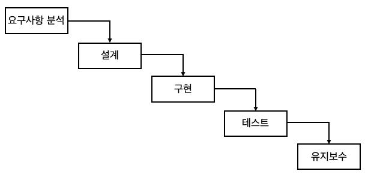
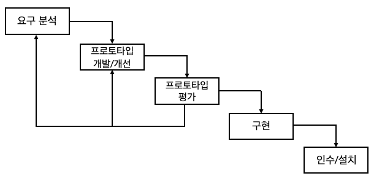
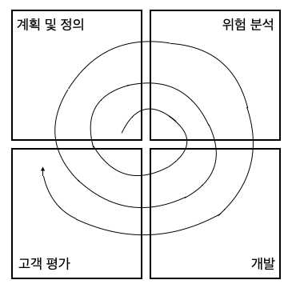
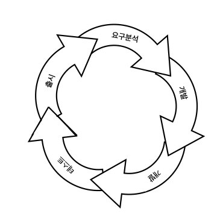
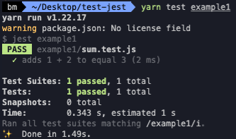
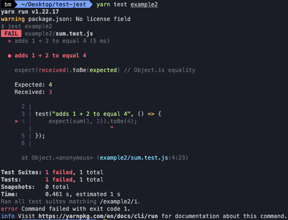

# SDLC:TDD

#### 작성자 : [이병민](https://github.com/ByeongminLee)

<br>

### Reference

[https://itwiki.kr](https://itwiki.kr/w/%EC%9D%B5%EC%8A%A4%ED%8A%B8%EB%A6%BC_%ED%94%84%EB%A1%9C%EA%B7%B8%EB%9E%98%EB%B0%8D)<br>
[http://www.extremeprogramming.org/index.html](http://www.extremeprogramming.org/index.html)<br>
[http://preview.hanbit.co.kr/2652/sample_ebook.pdf](http://preview.hanbit.co.kr/2652/sample_ebook.pdf)<br>
[https://media.fastcampus.co.kr/knowledge/dev/tdd/](https://media.fastcampus.co.kr/knowledge/dev/tdd/)<br>

<br>

## SDLC (Software Development Life Cycle)

SDLC는 소프트웨어 생명주기를 뜻하며 소프트웨어 개발 시작부터 끝까지의 전 과정을 하나의 생명주기로 정의하고 단계 별 공정을 체계화 한 모델이다.

<br>

1. 주먹구구식 개발 모델(build-Fix)

-   요구사항 분석, 설계 단계 없이 일단 개발에 들어간 후 만족할 때까지 수정 작업
-   크기가 작은 규모의 소프트웨어 개발
-   정해진 개발 순서가 없기 때문에 계획이 정확하지 않고, 진행사항 파악이 어렵고, 유지보수가 어려움

<br>

2. 폭포수 모델 (waterfall)



-   순차적으로 개발하는 개발 모델
-   각 단계가 다음 단계 시작 전에 끝나야 함<br>
    (앞 단계가 완료 될때까지 다음 단계들이 대기해야함)

<br>

3. 프로토타입 모델(원형 모델,prototype)



-   프로토타입을 만들어서 고객과 사용자가 함께 평가한 후 요구사항을 정제하여 완전한 요구사항 명세서를 완성함
-   소프트웨어 개발 초기에 고객의 요구사항을 파악하기 어려울때 사용

<br>

4. 나선형 모델 (나선형 모델, spiral)



-   위험 분석을 추가한 점증적 모델 (프로젝트 수행시 발생하는 위험을 관리하고 최소화 하려는 것이 목적)
-   개발에 따른 위험을 잘 파악하여 대처 할 수 있지만, 고비용의 시스템 개발임
-   이전 모델에 비해 상대적으로 복잡하여 프로젝트 관리 자체가 어려울 수 있음.

<br>

5. 에자일 모델 (agile)



-   agile은 민천합, 신속한 뜻을 가지고 있으며 고객의 요구사항에 대해 유연하게 대응 할 수 있다.<br>
    일정한 주기를 반복하는 개발 과정이며, 개인과 상호 작용, 고객과 협업, 문서보다 고객 중심의 개발이다.
-   에자일 모델들
    -   XP(eXtreme Programming)
    -   스크럼(scrum)
    -   ASD,FDD,Lean 등등

<br>

### XP

-   수시로 발생하는 고객의 요구사항에 대응
-   짧고 반복적인 개발 주기 + 고객의 적극적 참여 = 가시성 향상<br>
    > 사용자와 함께 1~3주 정도 반복 개발을 한 뒤 의사소통을 통해 피드백을 박으며 소프트웨어의 품질을 높일 수 있다.
-   소규모 개발 프로젝트에 사용
-   XP의 핵심 가치 : Feedback, Respect, Courage, Simplicity, Communication
-   XP의 12가지 실천 사항
    -   Pair Programming: 하나의 작업을 2명의 프로그래머가 코딩·리뷰 공동 수행
    -   Planning Game: 게임처럼 선수와 규칙, 목표를 두고 기획 수행
    -   Test Driven Development: 선 단위 테스트후 실제 코드 작성
    -   Whole Team: 개발 효율을 위해 고객을 프로젝트 팀원으로 상주
    -   Continuous Integration: 상시 빌드 및 배포가 가능한 상태로 유지
    -   Design Improvement: 코드 개선 작업 수행(가시성, 성능 등), 불필요한 기능 제거 및 리팩토링
    -   Small Releases: 짧고 잦은 릴리즈로 고객이 변경사항을 볼 수 있게 함 → 잦은 피드백
    -   Coding Standards: 표준화된 관례에 따라 코드 작성
    -   Collective Code Ownership: 시스템에 있는 소스코드는 팀의 모든 프로그래머가 언제라도 수정 가능
    -   Simple Design: 가능한 가장 간결한 디자인 상태 유지
    -   System Metaphor: 최종적으로 개발 되어야 할 시스템의 구조를 조망
    -   Sustainable Pace: 오버타임 지양

<br>

## TDD

TDD란 <code>Test Driven Development</code>의 약자로 테스트 주도 개발이라고 한다.

TDD는 코드 개발 및 테스트 케이스를 작성하는 기존의 개발 프로세스와 다르게 테스트 케이스를 작성한 후, 실제 코드를 개발하여 리펙토링하는 절차를 따르기 때문에 <code>Test First Development</code>라고도 한다.

> TDD는 코드를 쓴 후에 테스트 하는 것이 아닌, 테스트 케이스를 만들어 놓고 이에 맞추어서 실제 코드를 작성한다.

TDD는 문제가 없는지 먼저 확인을 할 수 있으며, 기능 단위로 테스트를 진행하기 때문에 개발자의 손을 떠나기 전에 피드백을 받는 것이 가능하다.

### TDD로 얻는 효과

1. 코드가 개발자의 손을 떠나기 전에 피드백을 받을 수 있다.

    > 개발 프로세스에서는 90%이상 완성된 코드를 가지고 테스트를 하기 때문에 문제를 발견할 수 잇지만, 원인을 무엇인지 진단하기 힘들다.<br>
    > TDD는 기능 단위로 테스트를 진행하기 때문에 코드가 완성되어 개발자의 손을 떠나기전 피드백을 받을 수 있다.

2. 개발자의 오버 코딩을 방지한다.

    > 테스트 코드를 먼저 작성하기 때문에 최소한의 코드로만 작성 및 개선하게 된다. <br>
    > 문제가 발견되지 않은 코드에 영향을 줄 수 있는 오버 코딩을 하지 않게 된다.

3. 개발 과정이 테스트 코드로 남기 때문에 과거의 의사 결정을 상기하기 쉽다.

    > 과거의 나 자신과 프로그래머가 협업을 하는 것을 용이하게 해준다.

### TDD의 개발 프로세스


-   RED : 실패하는 테스트 코드 작성
    → 실패하는 것이 확인 되어야 테스트가 검증력을 가진다고 신뢰할 수 있다.
-   GREEN : 테스트 코드를 성공시키기 위한 실제 코드 작성
    → 테스트 성공을 위한 최소한의 코드 그 이상을 변경하거만 추가하면 안된다.<br>
    (추 후 리팩토링 등의 다른 프로세스에서 부작용이 나올 수 있기 떄문이다.)
-   REFACTOR : 중복 코드 제거, 일반화 등의 리팩토링을 수행

    → 구현 설계를 개선하고 가독성, 적용성, 성능을 고려하게 된다.

> 1. 요구사항 파악
> 2. 테스트 코드 작성
> 3. 테스트 코드가 돌아가도록 코드 작성
> 4. 리팩토링
> 5. 과정을 다시 반복

<br>

## JEST

facebook에서 개발한 JavaScript Testing Framework이다.<br>
JavaScript 프로젝트(Node,React, Vue 등)에서 구성 없이 즉시 사용 가능하다.

<br>

### JEST 맛보기

-   설치

    ```bash
    yarn add --dev jest
    npm install --save-dev jest
    ```

    <br>

-   세팅
    `package.json`

    ```json
    {
        "scripts": {
            "test": "jest"
        }
    }
    ```

    → `yarn test` or `npm run test`으로 jest로 테스트를 진행 할수 있다.
    → 실행시 test 모든 test파일을 실행하는데 뒤에 경로를 적어서 특정 파일들만 선택적으로 실행 할 수 있다.

    <br>

-   예시 코드

    > `./example/example1` 참조

    ```bash
    yarn test example1
    ```

    > `./example/example1/sum.js`

    ```js
    function sum(a, b) {
        return a + b;
    }
    module.exports = sum;
    ```

    > `./example/example1/sum.test.js`

    ```js
    const sum = require("./sum");

    test("adds 1 + 2 to equal 3", () => {
        expect(sum(1, 2)).toBe(3);
    });
    ```

    → `sum(1, 2)`를 실행 시키면 `toBe(3)` 가 나온다.

    

    테스트를 통과 하지 못했을 경우

    > `./example/example2` 참조

    ```bash
    yarn test example2
    ```

    다음과 같이 1+2는 4가 아니므로 틀리게 된다.

    ```js
    const sum = require("./sum");

    test("adds 1 + 2 to equal 4", () => {
        expect(sum(1, 2)).toBe(4);
    });
    ```

    

    > -> 추가 적인 예쩨 코드 `./example/example3` 참조
