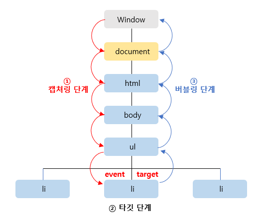

# 이벤트 전파

#### 작성자 : [이슬기](https://github.com/abcabcp)

<br />

## 1. 이벤트 전파란?

- DOM 트리 상에 존재하는 DOM 요소 노드에서 발생한 이벤트는 DOM 트리를 통해 전파된다. 이를 이벤트 전파라 한다.
  ```html
  <html>
    <body>
      <ul id="home">
        <li id="conan">Conan</li>
        <li id="mocha">Mocha</li>
        <li id="stuckyi">Stuckyi</li>
      </ul>
    </body>
  </html>
  ```
  - 위의 예제에서 ul요소의 두 번째 자식 요소인 li를 클릭하면 클릭 이벤트가 발생한다. 이 때 생성된 이벤트 객체는 이벤트를 발생시킨 DOM요소인 이벤트 타깃을 중심으로 DOM 트리를 통해 전파된다.
  - 이벤트 전파는 이벤트 객체가 전파되는 방향에 따라 다음과 같이 3단계로 구성된다.
    
    - 캡처링 단계(capturing phase) : 이벤트가 상위 요소에서 하위 요소 방향으로 전파
    - 타깃 단계(target phase) : 이벤트가 이벤트 타깃에 도달
    - 버블링 단계(bubbling phase) : 이벤트가 하위 요소에서 상위 요소 방향으로 전파

## 2. 이벤트 단계 확인

- ul 요소에 이벤트 핸들러를 바인딩하고 ul 요소의 하위 요소인 li요소를 클릭하여 이벤트를 발생시켜 보자.

  ```js
  <html>
  <body>
      <ul id="home">
      <li id="conan">Conan</li>
      <li id="mocha">Mocha</li>
      <li id="stuckyi">Stuckyi</li>
      </ul>
  </body>

  <script>
      const home = document.getElementById("home");

      //home 요소의 하위 요소인 li를 클릭한 경우
      home.addEventListener("click", (e) => {
      console.log(`이벤트 단계: ${e.eventPhase}`);
      //이벤트 단계: 3 : 버블링 단계
      console.log(`이벤트 타깃: ${e.target}`);
      //[object HTMLLIElement]
      console.log(`커런트 타깃: ${e.currentTarget}`);
      //[object HTMLUListElement]
      });
  </script>
  </html>

  ```

  - li 요소를 클릭하면 클릭 이벤트가 발생하여 클릭 이벤트 객체가 생성되고 클릭된 li 요소가 이벤트 타깃이 된다.
  - 이 때 클릭 이벤트 객체는 window에서 시작해서 이벤트 타깃으로 전파된다. <b>(캡쳐링 단계)</b>
  - 이 후 이벤트 객체는 이벤트를 발생시킨 이벤트 타깃에 도착한다. <b>(타깃 단계)</b>
  - 이 후 이벤트 객체는 이벤트 타깃에서 시작해서 window 방향으로 전파된다. <b>(버블링 단계)</b>

- 이벤트 핸들러 어트리뷰트/프로퍼티 방식으로 등록한 이벤트 핸들러는 타깃 단계와 버블링 단계만 캐치할 수 있다. 하지만, addEventListener 메서드 방식으로 이벤트 핸들러는 타깃 단계와 버블링 단계 뿐 아니라 캡쳐링 단계의 이벤트도 선별적으로 캐치할 수 있다.
- 캡처링 단계의 이벤트를 캐치하여면 addEventListener 메서드의 3번째 인수로 true응 전달해야 한다. 3번째 인수를 생략하거나 false를 전달하면 타깃 단계와 버블링 단계의 이벤트만 캐치할 수 있다.

  ```js
  <html>
      <body>
          <ul id="home">
          <li id="conan">Conan</li>
          <li id="mocha">Mocha</li>
          <li id="stuckyi">Stuckyi</li>
          </ul>
      </body>
    <script>
        const home = document.getElementById("home");
        const mocha = document.getElementById("mocha");

        //home 요소의 하위 요소인 li를 클릭한 경우 캡쳐링 단계의 이벤트를 캐치한다.
        home.addEventListener("click", (e) => {
            console.log(`이벤트 단계: ${e.eventPhase}`);
            //이벤트 단계: 1 : 캡쳐링 단계
            console.log(`이벤트 타깃: ${e.target}`);
            //이벤트 타깃: [object HTMLLIElement]
            console.log(`커런트 타깃: ${e.currentTarget}`);
            //커런트 타깃: [object HTMLUListElement]
        },true);

        //타깃 단계의 이벤트를 캐치한다.
        mocha.addEventListener("click", (e) => {
            console.log(`이벤트 단계: ${e.eventPhase}`);
            //이벤트 단계: 2 : 타깃 단계
            console.log(`이벤트 타깃: ${e.target}`);
            //이벤트 타깃: [object HTMLLIElement]
            console.log(`커런트 타깃: ${e.currentTarget}`);
            //커런트 타깃: [object HTMLLIElement]
        });

        //버블링 단계의 이벤트를 캐치한다.
        home.addEventListener("click", (e) => {
            console.log(`이벤트 단계: ${e.eventPhase}`);
            //이벤트 단계: 3 : 버블링 단계
            console.log(`이벤트 타깃: ${e.target}`);
            //이벤트 타깃: [object HTMLLIElement]
            console.log(`커런트 타깃: ${e.currentTarget}`);
            //커런트 타깃: [object HTMLUListElement]
        });
    </script>
  </html>

  ```

  - 이처럼 이벤트는 이벤트를 발생시킨 이벤트 타깃은 물론 상위 DOM요소에서도 캐치할 수 있다.
  - 대부분의 이벤트는 캡처링과 버블링을 통해 전파된다. 하지만 몇몇 이벤트는 버블링을 통해 전파되지 않는다.
    > [이벤트의 종류와 버블링 여부](https://respected-gander-3f4.notion.site/JS-f33f37ff19714a61bd44c717e87a6110)

## 3. 이벤트 위임

- 여러개의 하위 DOM 요소에 각각 이벤트 핸들러를 등록하는 대신 하나의 상위 DOM 요소에 이벤트 핸들러를 등록하는 방법을 말한다.
- 아래의 예제를 보자.

  ```js
  <!DOCTYPE html>
  <html>
  <head>
      <style>
      #home {
          display: flex;
          list-style-type: none;
          padding: 0;
      }
      #home li {
          width: 100px;
          cursor: pointer;
      }
      #home .active {
          color: aqua;
          text-decoration: underline;
      }
      </style>
  </head>
  <body>
      <ul id="home">
      <li id="conan">Conan</li>
      <li id="mocha">Mocha</li>
      <li id="stuckyi">Stuckyi</li>
      </ul>

      <nav>선택된 가족 : <em class="msg">Conan</em></nav>
  </body>

  <script>
      const home = document.getElementById("home");
      const msg = document.querySelector(".msg");

      //사용자 클릭에 의해 선택된 가족 (li요소)에 active 클래스를 추가하고
      //그 외의 모든 구성원의 active 클래스를 제거한다.
      function activate({ target }) {
        [...home.children].forEach((home) => {
            home.classList.toggle("active", home === target);
            msg.textContent = target.id;
        });
      }

      //모든 구성원 (li요소)에 이벤트 핸들러를 등록한다.
      document.getElementById("conan").onclick = activate;
      document.getElementById("mocha").onclick = activate;
      document.getElementById("stuckyi").onclick = activate;
  </script>
  </html>

  ```

  - 모든 li 요소가 클릭 이벤트에 반응하도록 모든 li 요소에 이벤트 핸들러인 activate를 등록햇다.
  - 만약 li 요소가 1000개라면 ?
  - 이 경우 많은 DOM 요소에 이벤트 핸들러를 등록하므로 성능 저하의 원인이 될 뿐더러 유지보수에도 부적합한 코드를 생성하게 된다.
  - 이벤트 위임을 시용하여 수정해 보자.

    ```js
    <!DOCTYPE html>
    <html>
    <head>
        <style>
        #home {
            display: flex;
            list-style-type: none;
            padding: 0;
        }
        #home li {
            width: 100px;
            cursor: pointer;
        }
        #home .active {
            color: aqua;
            text-decoration: underline;
        }
        </style>
    </head>
    <body>
        <ul id="home">
        <li id="conan">Conan</li>
        <li id="mocha">Mocha</li>
        <li id="stuckyi">Stuckyi</li>
        </ul>

        <nav>선택된 가족 : <em class="msg">Conan</em></nav>
    </body>

    <script>
        const home = document.getElementById("home");
        const msg = document.querySelector(".msg");

        //사용자 클릭에 의해 선택된 가족 (li요소)에 active 클래스를 추가하고
        //그 외의 모든 구성원의 active 클래스를 제거한다.
        function activate({ target }) {
            //이벤트를 발생기킨 요소 (target)가 ul#home의 자식 요소가 아니라면 무시한다.
            if (!target.matches("#home > li")) return;

            [...home.children].forEach((home) => {
                home.classList.toggle("active", home === target);
                msg.textContent = target.id;
            });
        }

        //이벤트 위임 : 상위 요소 (ul#home)는 하위 요소의 이벤트를 캐치할 수 있다.
        home.onclick = activate;
    </script>
    </html>

    ```

    > Element.prototype.matches : 인수로 전달된 선택자에 의해 특정 노드를 탐색 가능한지 확인한다.

    - 이벤트 위임을 통해 하위 DOM 요소에서 발생한 이벤트를 처리할 때 주의할 점은 상위 요소에 이벤트 핸들러를 등록하기 때문에 이벤트 타깃, 즉 실제로 발생시킨 DOM 요소가 우리가 기대한 DOM요소가 아닐 수 있다는 것이다.
    - 따라서 이벤트에 반응이 필요한 DOM 요소 (#home > li)에 한정하여 이벤트 핸들러가 실행되도록 이벤트 타깃을 검사해야 한다.

## 4. DOM 요소의 기본 동작 조작

### 4.1. preventDefault

- DOM 요소의 기본 동작을 중지 시킨다.

  ```JS
      document.querySelector("a").onclick = e => {
          //a 요소의 기본 동작을 중지한다.
          e.preventDefault();
      }

      document.querySelector("input[type=checkbox]").onclick = e => {
          //checkbox 요소의 기본 동작을 중지한다.
          e.preventDefault();
      }
  ```

### 4.2. stopPropagation

- 이벤트 전파를 중지시킨다.

  ```js
    <!DOCTYPE html>
    <html>
    <body>
        <div class="container">
        <button class="btn1">btn1</button>
        <button class="btn2">btn2</button>
        <button class="btn3">btn3</button>
        </div>

        <script>
        //이벤트 위임. 클릭된 하위 요소의 color를 변경한다.
        document.querySelector(".container").onclick = ({ target }) => {
            if (!target.matches(".container > button")) return;
            target.style.color = "blue";
        };

        //.btn2 요소는 이벤트를 전파하지 않으므로 상위 요소에서 이벤트를 캐치할 수 없다.
        document.querySelector(".btn2").onclick = (e) => {
            e.stopPropagation();
            e.target.style.color = "red";
        };
        </script>
    </body>
    </html>

  ```

<br />
<br />

> 참고: 모던 자바스크립트 deep dive
