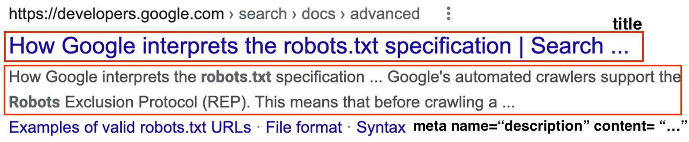

# SEO

#### 작성자 : [이병민](https://github.com/ByeongminLee)

<br>

### Reference

[https://developers.google.com/search/docs?hl=ko](https://developers.google.com/search/docs?hl=ko)<br>
[https://velog.io/@bumsu0211](https://velog.io/@bumsu0211/%EA%B2%80%EC%83%89-%EC%97%94%EC%A7%84-%EC%B5%9C%EC%A0%81%ED%99%94SEO-%EA%B0%9C%EB%85%90%EC%A0%81-%EC%9D%B4%ED%95%B4)<br>
[http://www.smartebiz.kr/new/subpage02_01.html](http://www.smartebiz.kr/new/subpage02_01.html)

<br>

# SEO란?

SEO는 <code>Search Engine Optimization</code>의 약자로 말그대로 검색엔진 최적화이다.

웹에서는 봇이 페이지들를 자동으로 읽고 분석하는 돌아니는데 이것을 크롤링(crawling)이라 하고 크롤링하는 프로그램을 크롤러(crawler) 라고 한다.

이 웹 크롤러는 웹사이트에서 좋은 정보를 찾아서 사용자에게 좋은 검색 결과를 제공해준다.

-   크롤링
    크롤링은 웹 사이트를 탐색하는 것을 뜻한다.
    비슷한 개념으로 웹 스크래핑이라는 것이 있는데 이것은 웹사이트 상에서 원하는 정보를 추출하는 방법이다.
    > 크롤링은 크게 다음과 같은 경우만 아니면 불법은 아니라고 한다. <br>
    > 상대 서버에 문제를 일으킨 경우나 상업적 이용의 경우<br>
    > 사례)<br>
    > 사람인에서 잡코리아를 무단 크롤링한 행위<br>
    > → 대법원에까지 가서도 잡코리아가 승소했었다.<br>
    > 여기어떄가 야놀자 숙박정보DB를 무단 크롤링<br>
    > → 심지어 서버에 부담을 주어서 정상 영업을 방해한 혐의도 있다.<br>

검색 사이트들은 이러한 크롤러를 통해서 웹을 돌아다니면서 페이지 정보들을 수집하여 사용자에게 검색한 정보를 보여준다.

-   React.js와 같은 CSR 사이트의 경우에 html이 구성되어 있지 않고 필요할때마다 서버에서 데이터를 받아와서 클라이언트에서 동적으로 랜더링이 이루어 지다 보니 SEO를 적용하기가 어렵다.<br>
    (react-helmet이라는 라이브러리로 SEO를 구성할 수는 있다.)
    그래서 최근에는 React.js로 만든 SSR 프레임워크인 Next.js가 뜨게 되었다.<br>

검색 엔진의 점유율은 Google이 2022년 기준으로 90%가 넘께 가지고 있어서 사실상 Google의 SEO방식이 표준이라고 할 수 있다.


> 출처 : [https://gs.statcounter.com/search-engine-market-share](https://gs.statcounter.com/search-engine-market-share)

<br>

## Google의 검색 작동 방식

구글은 *웹 크롤러*로 알려진 소프트웨어를 사용하는 완전히 자동화된 검색 엔진이다.

웹 크롤러로 정기적으로 웹을 탐색하여 Google 색인에 추가할 사이트를 찾습니다.

실제로 Google의 검색 결과에 나오는 사이트들은 직접 제출한 사이트보다 Google의 웹 크롤러가 크롤링 할때 자동으로 발견되어 추가된다.

구글의 검색의 3가진 단계

1. 크롤링

    크롤러로 신규 또는 업데이트 된 페이지를 찾고 목록에 저장한다.

2. 색인 생성

    크롤링된 페이지르 방문하여 각 페이지에 관한 정보를 분석하여 Google 색이넹 저장한다.

3. 검색 결과 게재

    사용자의 위치, 언어, 기기, 이전 검색어 등으로 검색하는 사용자마다 서로 다른 결과를 표시한다.

<br>

## 구글 SEO 최적화 하기

### 1. 사이트맵

Google에 검색되도록 하기 위해서는 Google에 `사이트맵`을 제출하는 방법이 있다.

사이트맵은 사이트에 있는 파일로 새 페이지나 변경된 페이지가 있을 때 검색 엔진에 알려준다.

-   사이트맵
    *사이트맵*은 사이트에 있는 페이지, 동영상 및 기타 파일과 그 관계에 관한 정보를 제공하는 파일입니다.<br>
    Google에서는 여러 사이트맵 형식을 지원한다. (XML, RSS, 텍스트 등)
    -   xml example
        ```xml
        <?xml version="1.0" encoding="UTF-8"?>
        <urlset xmlns="http://www.sitemaps.org/schemas/sitemap/0.9">
          <url>
            <loc>http://www.example.com/foo.html</loc>
            <lastmod>2018-06-04</lastmod>
          </url>
        </urlset>
        ```
    -   txt example
        ```
        http://www.example.com/file1.html
        ```

<br>

### 2. robots.txt

robots.txt 파일을 이용해서 크롤링를 차단 할 수 있다.<br>
root 디렉토리에 robots.txt파일을 만들어서 민간함 정보의 페이지의 경우 차단을 할 수 있다.

-   `robots.txt`란?
    ‘고양이대통령'이라는 사이트의 robots.txt는 다음과 같다.

    

    > https://catpre.com/robots.txt

    User-agent: 검색봇 이름 (googleBot 이라고 적으면 googleBot만 크롤링 할 수 있다.)
    Disallow: 접근 설정 (접근 가능한 페이지를 설정 할 수 있다.)
    즉 위 사이트는 모든 크롤링을 허용하되 /noti/ /my-page/ /cart/와 같이 사용자 개인 정보와 관련된 페이지들을 차단해 놓은 것을 볼 수 있다.

물론 크롤러를 완벽하게 차단하는 방법은 아니다.

<br>

### 3. 메타 태그

```html
<html>
    <head>
        <title>Brandon's Baseball Cards - Buy Cards, Baseball News, Card Prices</title>
        <meta
            name="description"
            content="Brandon's Baseball Cards provides a large selection of
    vintage and modern baseball cards for sale.
    We also offer daily baseball news and events."
        />
    </head>
    <body>
        ...
    </body>
</html>
```

위와 같은 타이틀과 meta는 구글 검색시 아래와 같이 노출된다.



다음과 같이 <meta>로 크롤링 대상에서 제외 할 수 있다.

```html
<!-- 모든 크롤러에 대해 크롤링을 차단 -->
<meta name="robots" content="noindex" />

<!-- 구글봇에 대해 크롤링을 차단 -->
<meta name="googlebot" content="noindex" />
```

그리고 크롤러는 페이지내에 링크들도 크롤링 대상에 들어가게 되는데 다음과 같이 <a>태그 안에 적용하면 제외 시킬 수 있다.

```html
<!-- 유저로부터 만들어진 스팸 링크 -->
<a rel="nofollow" href="https://spam.com">스팸 링크~</a>

<!-- 우리 사이트에서 표시되고 있는 광고 -->
<a rel="sponsored" href="https://ad.com">광고 링크~</a>
```

<br>

### 4. 기타 - 태그 최적화

-   콘텐츠 최적화
    <code>\<h1></code>~ <code>\<h6></code>같은 경우에는 순서대로 높은 검색 우선도를 가진다. <br>
    SEO에서는 이를 바탕으로 목차처럼 순서대로 읽어 검색 결과를 분석한다.

    그리고 <code>\<strong></code>이나 <code>\<em></code>와 같이 강조의 효과를 가지고 있는태그도 검색 우선 태그를 가진다.<br>
    텍스트가 긴 글을 효과적으로 노출하기 위해 사용하는 것이 좋다.

-   이미지 최적화
    <code>\</code> 또는 <code>\<picture></code> 사용<br>
    <code>img</code>태그의 <code>alt</code> 속성 사용 (<code>alt=””</code>를 기반으로 검색 결과를 보여 줄수 있다.)

-   Semantic Tag 사용

    ```html
    <!--일반 태그 사용-->
    <div id="header">
        <h1>header</h1>
    </div>
    <!--시멘틱 태그 사용-->
    <header>
        <h1>header</h1>
    </header>
    ```

    위와 같이 시멘틱 웹을 적용할 경우 SEO에 도움이 된다.

### 참고 사항

SEO는 웹 표준, 웹 접근성 등과 같은 말로 쓰이는 경우가 있지만 정확하게는 다른 용어 이다. <br>
SEO는 크롤링 하는 봇이 읽기 쉽게 최적화 하는 것이고 웹 표준은 웹 사이트의 정보를 누구나 동등하게 이용할 수 있게 보장 하는 것이다.

**용어의 차이**

> 참고 : http://www.smartebiz.kr/new/subpage02_01.html

-   웹 표준 (Web Standards)<br />
    브라우저 종류 및 버전에 따른 기능 차이에 대해 호환이 가능하도록 제시된 표준 <br />
-   웹 호환성 (Cross Browsing)<br />
    표준 웹 기술을 사용하여 OS나 브라우저에 어느 한쪽으로 최적화 되거나 종속되지 않도록 공통 요소를 사용하여 웹 페이지를 제작하는 기법
-   웹 접근성 (Web Accessibility)<br />
    장애인, 고령자 등 모든 사용자가 어떠한 기술이나 환경에서도 웹사이트에서 제공하는 모든 정보를 동등하게 이해할 수 있는 권리 <br />
