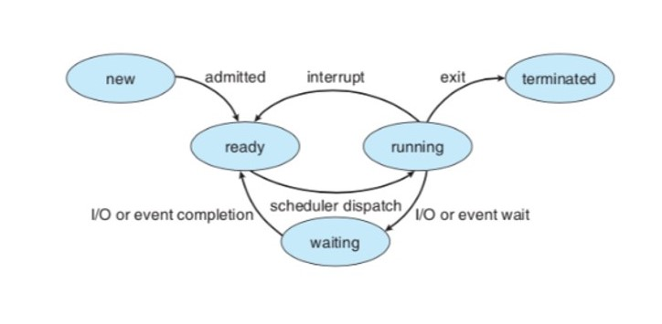
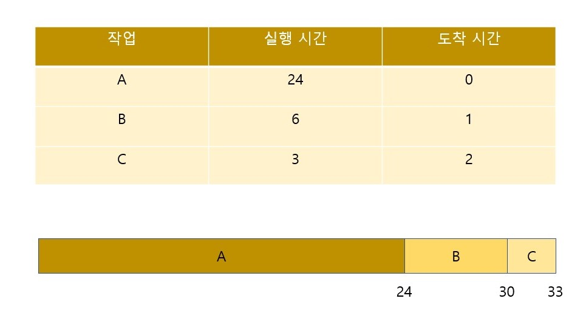
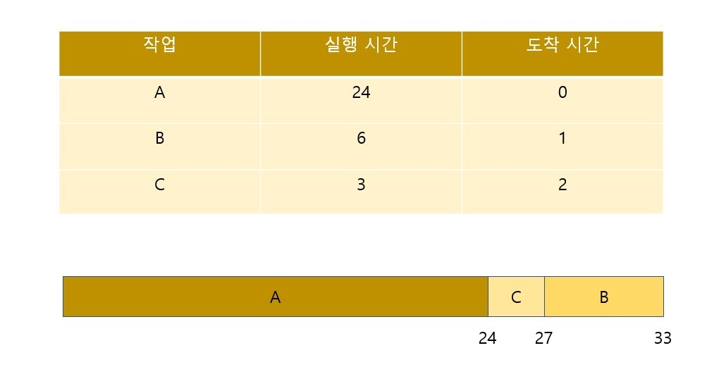
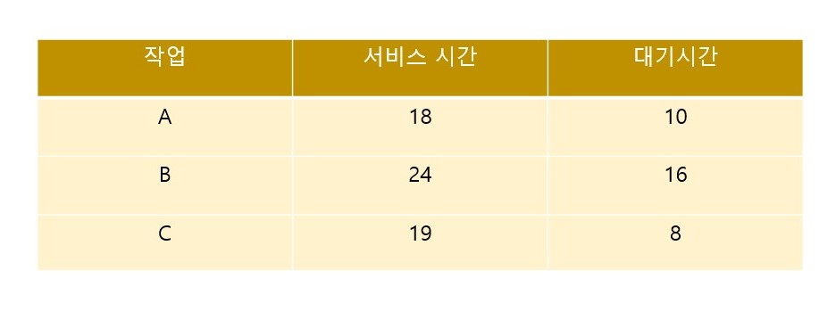
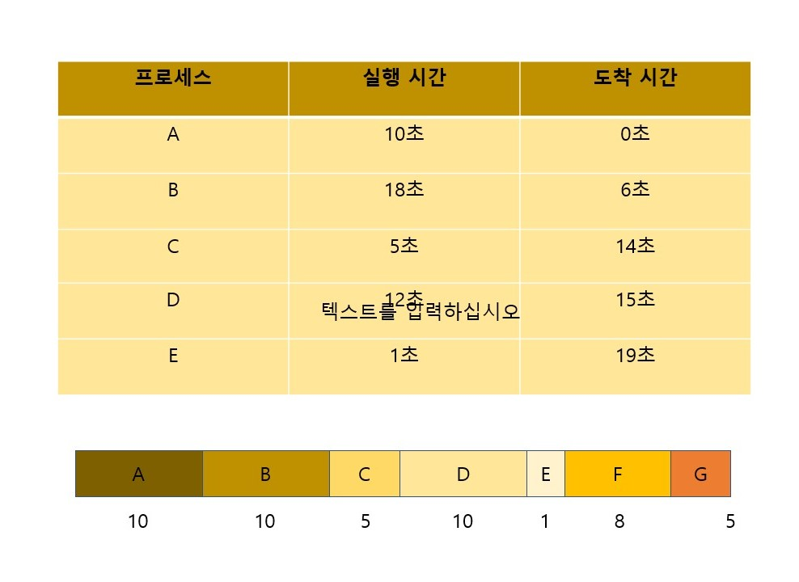
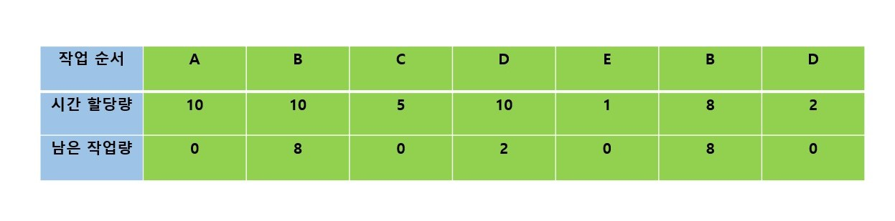

# Scheduler


#### 작성자 : [전찬민](https://github.com/cksals3753)

- 참고자료: [Scheduler](https://dduddublog.tistory.com/23)
- 참고영상: [Scheduler](https://github.com/JaeYeopHan/Interview_Question_for_Beginner/tree/master/OS#%EC%8A%A4%EC%BC%80%EC%A4%84%EB%9F%AC)

## 스케쥴러

프로세스를 스케줄링하기 위한 Queue에는 세 가지 종류가 존재한다.

> - Job Queue : 현재 시스템 내에 있는 모든 프로세스의 집합
> - Ready Queue : 현재 메모리 내에 있으면서 CPU를 잡아서 실행되기를 기다리는 프로세스의 집합
> - Device Queue : Device I/O 작업을 대기하고 있는 프로세스의 집합

각각의 Queue에 프로세스들을 넣고 빼주는 스케줄러에도 크게 세가지 종류가 존재한다.

### 장기스케줄러(Long-term scheduler or job scheduler)

메모리는 한정되어 있는데 많은 프로세스들이 한꺼번에 메모리에 올라올 경우, 대용량 메모리(일반적으로 디스크)에 임시로 저장된다
<br>
이 pool에 저장되어 있는 프로세스 중 어떤 프로세스에 메모리를 할당하여 ready queue로 보낼지 결정하는 역할을 한다.

- 메모리와 디스크 사이의 스케줄링을 담당.
- 프로세스에 memory(및 각종 리소스)를 할당(admit)
- degree of Multiprogramming 제어 (실행중인 프로세스의 수 제어)
- 프로세스의 상태 new -> read(in memory)

cf) 메모리에 프로그램이 너무 많이 올라가도, 너무 적게 올라가도 성능이 좋지 않은 것이다. 참고로 timesharing system 에서는 자기 스케줄러가 없다. 그냥 곧바로 메모리에 올라가 ready 상태가 된다.

### 단기스케줄러(Short-term scheduler or CPU scheduler)

- CPU와 메모리 사이의 스케줄링을 담당
- Ready Queue에 존재하는 프로세스 중 어떤 프로세스를 running시킬지 결정.
- 프로세스에 CPU를 할당 (scheduler dispatch)
- 프로세스의 상태 ready -> running -> waiting -> ready

### 중기스케줄러(Medium-term scheduler or Swapper)

- 여유 공간 마련을 위해 프로세스를 통째로 메모리에서 디스크로 쫒아냄 (swapping)
- 프로세스에게서 memory를 deallocate
- degree of Multiprogramming 제어
- 현 시스템에서 메모리에 너무 많은 프로그램이 동시에 올라가는 것을 조절하는 스케줄러
- 프로세스의 상태 ready -> suspended

#### Suspended (stoppd)

외부적인 이유로 프로세스의 수행이 정지된 상태로 메모리에서 내려간 상태를 의미한다. 프로세스 전부 디스크로 swap out 된다.
<br>
blocked 상태는 다른 I/O 작업을 기다리는 상태이기 때문에 스스로 ready state로 돌아갈 수 있지만 이 상태는 외부적인 이유로 suspending되었기 때문에 스스로 돌아갈 수 없다.

## 스케쥴링이란?

한정된 자원으로 최대한 성능을 이끌어내기 위해서는 CPU를 적절하고 효율적으로 사용해야한다. 따라서 OS는 실행 대기중인 프로세스들에게 자원 배정을 적절히 하여 시스템의 성능을 끌어올릴 수 있다.

### 스케쥴링의 원칙

- 모든 프로세스에 공정하게 배정해야 한다.
- 단위 시간당 가능한 최대의 처리가 될 수 있도록 해야한다.
- 처리 응답시간이 신속해야 한다.
- 같은 종류의 작업은 같은 비용으로 실행될 수 있어야 한다.
- 오버헤드를 최소화해야 한다.
- 시스템 내의 자원이 사용하지 않는 시간이 없도록 유지해야 한다.
- 응답시간과 자원활용 간의 적절한 균형이 유지되도록 해야한다.
- 프로세스의 무한대기 상태를 피해야 한다.
- 중요자원을 차지하고 있는 프로세스에 우선순위를 주어야 한다.
- 문제로 인해 불안하지 않은 프로세스에 서비스를 많이 제공하도록 한다.

### 선점 스케쥴링 (Preemptive Scheduling)

OS가 나서서 CPU사용권을 '선점'하고, 특정 요건에 따라 각 프로세스의 요청이 있을 때 프로세스에게 분배하는 방식이다.
<br>
가장 자원이 필요한 프로세스에게 CPU를 분배하며 상황에 따라 강제로 회수할 수도 있다. 따라서 빠른 응답시간을 요하는 대화식 시분할 시스템에 적합하며 긴급한 프로세스를 제어할 수 있다.

### 비선점 스케쥴링(Non-Preemptive Sceduling)

어떤 프로세스가 CPU를 할당받으면 그 프로세스가 종료되거나, 입출력 요구가 발생하여 자발적으로 중지 될 때 까지 계속 실행되도록 보장한다.
<br>
순서대로 처리되는 공정성이 있고, 다음에 처리해야할 프로세스와 상관없이 응답시간을 예상할 수 있으며 선점방식보다 스케쥴러 호출 빈도가 낮고, 문맥교환에 의한 오버헤드가 적다.
<br>
일괄처리 시스템에 적합하며 자칫 CPU사용시간이 긴 프로세스가 다른 프로세스들을 대기시킬 수 있으므로 처리율이 떨어질 수 있다는 단점이 있다.

#### 각 종류들

- 비선점형 방식 : FIFO, SJF, HRN, 우선순위, 기한부 스케쥴링
- 선점형 방식 : RR(라운드 로빈), SRT, MFQ

#### 스케쥴링이 일어나는 시점



1. 수행 -> 대기 (Running -> Waiting) : I/O 요청이 발생하거나, 자식 프로세스가 종료 대기를 할 때
2. 수행 -> 준비 (Running -> Ready) : 인터럽트가 발생했을 때
3. 대기 -> 준비 (Waiting -> Ready) : I/O가 완료되었을 때
4. 수행 -> 종료 (Running -> Terminate)

여기서 1,4은 프로세스가 스스로 CPU를 반환하기에 비선점 스케쥴링이 발생되고 2,3은 강제로 할당해야하므로 선정 스케쥴링 방식이다.

#### 스케쥴링 알고리즘 평가기준

- CPU이용률 : 전체 시스템 시간 중, CPU가 작업을 처리하는 시간의 비율 (늘림)
- 처리량 : CPU가 단위 시간당 처리하는 프로세스의 개수 (늘림)
- 총 처리 시간 : 프로세스가 시작해서 끝날때 까지 걸린 시간 (늘림)
- 대기시간 : 프로세스가 준비완료 큐에서 대기하는 시간의 총 합 (줄임)
- 응답시간 : 대화식 시스템에서 요청 후 첫 응답이 오기까지 걸린 시간 (줄임)

### FCFS (First Come, First Serve)

먼저 도착한 프로세스를 먼저 처리하는 스케쥴링 알고리즘이다. 비 선점형이며 FIFO큐를 이용하여 간단하게 구현한다.
<br>
다만 Convoy Effect(호위효과)가 발생하는데, 긴 처리시간의 프로세스가 선점되어버리면 나머지 프로세스들은 끝날때 까지 대기해야 한다.
먼저 도착한 프로세의 버스트 타임에 따라서 평균 대기시간의 편차가 크다.

```
평균 반환시간 = 평균 실행 시간 + 평균 대기 시간
```



- 도착한 시간대로 작업을 대기 리스트에 배치하면 이런 모양이다.
- 작업 A의 대기시간 0, 작업 B의 대기시간 24, 작업 C의 대기시간 30이고, 도착 시간이 각각 0, 1, 2, 이므로 평균 대기시간은 (0-0) + (24 - 1) + (30 - 2) / 3 = 17이다.
- 작업 A의 실행시간 24, 작업 B의 실행시간 6, 작업 C의 실행시간 3 이므로 평균 실행시간은 24 + 6 + 3 / 3 = 11이다.
- 따라서 평균 반환시간 (17 + 11 = 28)은 28시간이다.

#### FCFS의 특징

- 입력된 순으로 처리되기 때문에 공평하다.
- 알고리즘이 가장 간단하고 구현하기 쉽다.
- 짧은 작업이나 중요한 적읍을 오랫동안 기다리게 할 수 있다.
- 평균 반환시간이 길다.

### SJF (Shorted Job First)

최단작업우선 스케쥴링 알고리즘이다. 여기서 최단작업이란 CPU버스트 타임이 가장 짧은 프로세스를 말한다.
<br>
따라서 가장 적은 평균 대기시간을 달성할 수 있다. 만약 CPU버스트 시간이 동일하다면 FCFS방식을 따른다.
<br>
다만 선점형인 경우에는 위와같이 진행이 되지만 비 선점형일 경우엔 최소잔여시간 우선법칙을 따른다.
<br>
현재 CPU에 할당된 프로세스의 남은 잔여시간과, 새로 들어온 프로세스의 CPU버스트 타임을 비교하여 더 적은 프로세스에게 할당하게 끔 한다.



- 가장먼저 도착한 작업이 A이므로 대기 리스트에 첫번째에 배치된다. 1초후에도 A가 작업중 이므로 작업 A를 중단시킬 수 없으며 대기리스트에 대기하고 있는 작업은 짧은 작업 순으로 재배치되는 작업이 계속 진행된다.
- A의 대기시간 0, C의 대기시간 24, B의 대기시간 27이고, 도착시간이 각각 0, 2, 1 이므로 평균 대기시간은 (0 - 0) + (24 - 2) + (27 - 1) / 3 = 16이다.
- A의 실행시간 24, B의 실행시간 6, C의 실행시간 3이므로 평균 실행시간은 24 + 6 + 3 / 3 = 11이다.
- 따라서 평균 반환시간 (16 + 11= 27)은 27시간이다.

#### SJF의 특징

- 작업이 끝나기까지의 실행시간 추정치가 가장 작은 작업을 먼저 실행시키는 방식이다.
- FIFO보다 평균 대기시간이 작지만 긴 작업의 경우 FIFO기법보다 더 크고 예측이 어렵다.
- 실행시간이 많은 작업일 경우에 무한대기 상태가 발생할 수 있다.
- 무한대기 상태를 방지하기 위해 Aging(노화) 기법을 사용하여 해결한다.

#### FCFS와 SJF의 단점

- FCFS의 단점 : 평균 반환 시간이 크다.
- SJF의 단점 : 큰 작업, 큰 프로세스는 불리하다.

### HRN (Highest Response-ration Next)

```
HRN 우선순위 = (대기 시간 + 서비스 시간) / 서비스 시간
```



- A = (10 + 18) / 18 = 1.55.., B = (16 + 24) / 24 = 1.66.., C = (8 + 19) / 19 = 1.421.. 이므로 가장 큰 값인 작업 B에 우선순위를 부여한다.

#### HRN의 특징

- FCFS와 SJF의 단점을 보완하여 개발된 방법이다.
- 긴 작업과 짧은 작업간의 지나친 불평등을 해소할 수 있다.
- 대기 시간이 긴 프로세스일 경우 우선순위가 높아진다.
- HRN은 실행시간 추정과 선점기능 때문에 스케줄러가 복잡해지고 남은 계산 시간을 저장해 놓아햐하는 단점을 보완하였다.
- HRN은 작업의 서비스받을 시간과 그 작업이 서비스를 기다린 시간으로 결정되는 우선순위에 따라 CPU를 할당한다.
- HRN의 우선순위 공식으로 계산하여 그 수치가 큰 값부터 낮은 순으로 우선순위가 부여된다.

### RR (Round-Robin) - 선점형

정해진 시간 할당량만큼 프로세스를 할당한 뒤, 작업이 끝난 프로세스는 준비완료 큐(순환 큐)의 가장 마지막에 가서 재할당을 기다린다.
<br>
시간 할당량이 중요한데, 너무 작으면 비번한 Context Switching이 발생하고, 너무 길면 FCFS와 다를바 없어진다.



- 시간 할당량이 10초인 대기리스트의 모양이다.
- 작업순서는 처음부터 순차적으로 진행한다.
- 프로세스 A의 실행시간이 10초이므로 시간할당량 10초를 할당해 주고 남은 작업량은 0초가 된다. 남은 작업량이 0초이므로 프로세스가 종료된 것이다.
- 프로세스 B의 실행시간이 18초이므로 시간할당량 10초를 할당해 주고 남은 작업량은 8초가 된다. 남은작업량이 8초, 프로세스가 종료되지 않았으므로 대기리스트의 가장 뒤로 배치된다.



- A의 대기시간 : 0 (없음, 입력되지마자 실행)
- B의 대기시간 : {(10) + (5 + 10 + 1)} - 6(도착시간) = 20
- C의 대기시간 : {(10 + 10)} - 14(도착시간) = 6
- D의 대기시간 : {(10 + 10 + 5) + (1 + 8)} - 15(도착시간) = 19
- E의 대기시간 : {(10 + 10 + 5 + 10)} - 19(도착시간) = 16

* 평균 실행 시간 = (10 + 18 + 5 + 12 + 1) / 5 = 9.2
* 평균 대기 시간 = (0 + 20 + 6 + 19 + 16) / 5 = 12.2
* 평균 반환 시간 = 9.2 + 12.2 = 21.4이다.

#### RR 의 특징

- 대표적인 선점형 방식이다.
- 동일한 시간 할당량을 사용하는 시분할처리 시스템에 효과적으로 적용된다.
- 시간 할당량 안에 작엄을 마치지 않으면 준비 대기 리스트의 가장 뒤로 배치되는 방식이다.
- 시간 할당량이 크면 비선점의 FIFO와 동일하다.
- 시간 할당량이 적으면 문맥 교환수와 오버헤드가 증가한다.
- 적절한 응답 시간을 보장해주는 대화식 사용자에게 효과적이다.

### MLQ (Multi level Queue, MQ) - 혼합형

준비완류 큐를 여러개의 큐로 분류하여 각 큐가 각각 다른 스케쥴링 알고리즘을 가지는 방식. 메모리 크기, 우선순위, 유형 등 프로세스의 특성에 따라 하나의 큐에 영구적으로 할당된다.
<br>
따라서 큐와 큐 사이에도 스케쥴링이 필요하다. 우선순위 방식 혹은 시분할 방식으로 한다.

- 선점형, 비선점형 방식이다.
- 우선순위가 가장 높은 큐에서는 비선점형으로 사용된다.
- 우선순위가 낮은 큐에서는 선점형으로 사용된다.
- 상위 큐가 우선순위가 가장높은 큐로 신속한 처리를 필요로 하는 시스템 프로세스가 입력된다.
- 중위는 대화형 프로세스, 하위는 일괄처리 프로세스가 입력된다.
- 대기 리스트 간 프로세스의 이동은 되지 않는다.

### MFQ (Multi level Feedback Queue) - 선점형

기존 다단계 큐 방식은 특정 프로세스가 큐에 고정되는 방식이었다. 반면 MLQ 에서는 큐와 큐사이에 프로세스가 이동하는걸 허용한다.
<br>
큐를 구분하는 기준은 CPU버스트이며 입출력 중심의 프로세스와 대화형 중심의 프로세스를 높은 우선순위의 큐에 넣는다.
<br>
다단계 큐와 비교했을 때 프로세스를 버스트타임이나 기타 우선순위에 따라서 큐에서 내리거나 올리는 등 설계나 구현이 복잡하다는 단점이 있다.

- 짧은 작업이나 입출력 위주의 작업에 우선순위를 부여하기 위해 개발된 방식이다.
- 큐(대기 리스트)가 여러개 이며 우선순위가 있다.
- 각 큐마다 시간 할당량이 존재하며 낮은 큐 일수록 시간 할당량은 커진다.
- 각각의 큐들은 종속적으로 연결되어 있다.
- CPU를 시간 할당량만큼 사용한 프로세스는 낮은 큐로 이동된다.
- 맨 마지막 단계의 큐는 RR 스케줄러를 사용한다.
