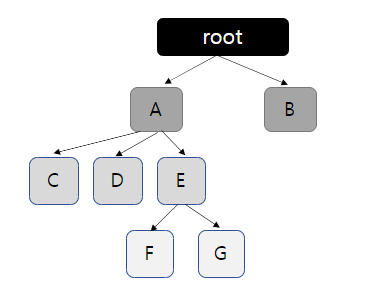
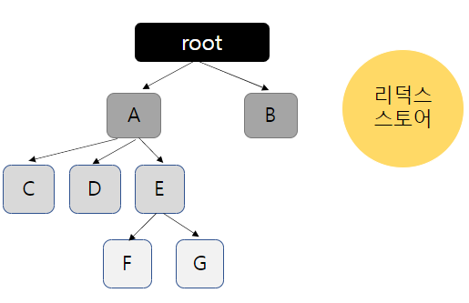
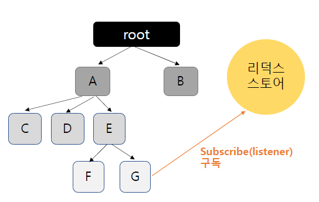
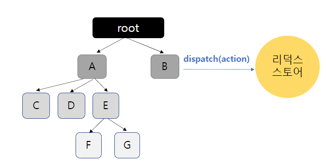
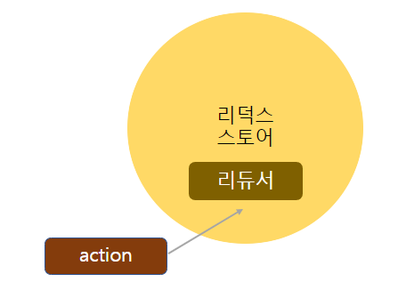
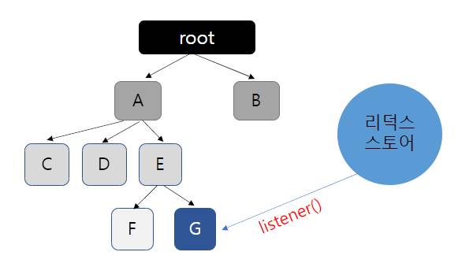

# Redux
<<<<<<< HEAD
#### 작성자 : [이슬기](https://github.com/abcabcp)

## 1. Redux 란?
=======

#### 작성자 : [이슬기](https://github.com/abcabcp)

## 1. Redux 란?

>>>>>>> 0715fd3dbf7a635bef425eb022ec6fe7a3c33572
- Redux(리덕스)는 JavaScript 상태관리 라이브러리이다.
- 리덕스의 본질은 Node.js 모듈이다.

## 2. Redux의 흐름
<<<<<<< HEAD

=======


>>>>>>> 0715fd3dbf7a635bef425eb022ec6fe7a3c33572
- 예로 들어 위와 같은 구조의 프로젝트가 있다고 생각했을 때, root 컴포넌트에서 G 컴포넌트에 어떤한 값을 전달해줘야 한다.
- 보통, 이럴 땐 root에서 A를 거쳐 E를 거쳐 G로 가야한다.
- 심지어 만약 해당 전달 값의 이름을 고쳐야 할 경우, 모든 컴포넌트에서 이름을 수정해야 한다.
- 하지만 리덕스를 사용하면 상태 관리를 <b>컴포넌트 바깥</b>에서 할 수 있다.

## 3. Redux의 구성요소
<<<<<<< HEAD
- B에서 일어나는 변화가 G에 반영된다고 가정해보자.
### 3.1 스토어 설정

- 리덕스를 프로젝트에 적용하게 되면 스토어가 생성된다. 스토어 안에는 프로젝트의 상태에 관한 데이터가 담겨있다.
### 3.2 컴포넌트의 스토어 구독

- G컴포넌트는 스토어에 구독한다. 스토어의 내장 함수인 listener가 스토어에 전달이 되고, 스토어의 값이 변경될 경우 전달 받았던 함수를 호출해 준다.
### 3.3 dispatch

=======

- B에서 일어나는 변화가 G에 반영된다고 가정해보자.

### 3.1 스토어 설정


- 리덕스를 프로젝트에 적용하게 되면 스토어가 생성된다. 스토어 안에는 프로젝트의 상태에 관한 데이터가 담겨있다.

### 3.2 컴포넌트의 스토어 구독


- G컴포넌트는 스토어에 구독한다. 스토어의 내장 함수인 listener가 스토어에 전달이 되고, 스토어의 값이 변경될 경우 전달 받았던 함수를 호출해 준다.

### 3.3 dispatch


>>>>>>> 0715fd3dbf7a635bef425eb022ec6fe7a3c33572
- B 컴포넌트에서 이벤트가 생겨서 상태를 변화해야 할 경우 스토어의 내장 함수인 dispatch를 사용하여 액션을 스토어에 전달한다.
- 이 때, 액션의 type을 전달하여 액션을 참조한다.

### 3.4 리듀서
<<<<<<< HEAD

- 액션 객체를 전달받은 액션의 타입에 따라 어떻게 상태를 업데이트 할지 전달한다. 이 때, state라는 현재 상태와 action이라는 액션 객체. 두 파라미터를 참조해서 새로운 값을 반환한다.

### 3.5 listener

- 마지막으로 상태에 변화가 생기면, 이전에 컴포넌트가 스토어에게 전달했던 함수 listener가 호출되어 컴포넌트는 새로운 상태를 받게 되고, 컴포넌트가 리렌더링 된다.

=======


- 액션 객체를 전달받은 액션의 타입에 따라 어떻게 상태를 업데이트 할지 전달한다. 이 때, state라는 현재 상태와 action이라는 액션 객체. 두 파라미터를 참조해서 새로운 값을 반환한다.

### 3.5 listener


- 마지막으로 상태에 변화가 생기면, 이전에 컴포넌트가 스토어에게 전달했던 함수 listener가 호출되어 컴포넌트는 새로운 상태를 받게 되고, 컴포넌트가 리렌더링 된다.
>>>>>>> 0715fd3dbf7a635bef425eb022ec6fe7a3c33572

## 4. 각 구성 요소의 설명 및 사용법

### 4.1 액션
<<<<<<< HEAD
- 상태에 어떠한 변화가 필요할 경우 액션이 발생된다.
- 객체 형태이며 반드시 type 필드를 가지고 있어야 한다. 그 외의 값은 나중에 상태 업데이트 시 참고할 값이며 작성자 마음대로 작성할 수 있다.
    ``` js
    {
        type: 'ADD_TODO'
        data: {
            id: 1, 
            text: "리덕스 배우기"
        }
    },
    {
        type: 'CHANGE_INPUT'
        text: "리덕스 이해하기"
    }
    ```

#### 4.1.2 액션 생성 함수
- 액션 객체를 만들어 주는 함수
- 변화가 생길 때마다 액션 객체를 만들어야 하는데 실수나 번거로움을 줄이기 위해 함수로 만들어 관리한다.
    ``` js
    //일반 함수
    function addTodo (data) {
        return {
            type: 'ADD_TODO',
            data
        };
    }

    //화살표 함수
    const changeInput = (text) => ({
        type: 'CHANGE_INPUT',
        text
    });
    ```
### 4.2 리듀서
- 변화를 일으키는 함수
- 액션을 만들어서 발생시키면 리듀서가 현재 상태와 전달받은 액션 객체를 파라미터로 받아옴
- 그리고 두 값을 참고하여 새로운 상태를 만들어서 반환함
    ``` js
    //기본 값
    const initialState = {
	    counter: 1
    };

    //state=현재상태, action=전달받은 액션
    function reducer(state = initialState, action){
        switch (action.type){
            //액션 type이 INCREASE 일때 
            case INCREASE: 
                return {
                    counter: state.counter + 1
            };
            default:
                return state;
        }
    }
    ```
### 4.3 스토어
- 프로젝트에 리덕스를 적용하기 위해 스토어를 만듬.
- 한 개의 프로젝트는 단 하나의 스토어를 가질 수 있음.
    ``` JS
    import { createStore } from 'redux';

    (...)

    const store = createStore(reducer);
    ```

### 4.4 디스패치
- 스토어의 내장 함수 중 하나. ‘액션을 발생시키는 것.’
- diapatch(action)과 같은 형태로 액션 객체를 파라미터에 넣어서 호출함.
- 이 함수가 호출되면 스토어는 리듀서 함수를 실행시켜서 새로운 상태를 만들어 줌
    ``` JS
    aa.onclick = () => {
	    store.dispatch(increase(1));
    }

    bb.onclick = () => {
        store.dispatch(decrease());
    }
    ```
### 4.5 구독
- 스토어의 내장 함수 중 하나
- subscribe 함수 안에 리스너 함수를 파라미터로 넣어서 호출해주면, 이 리스너 함수가 액션이 디스패치되어 상태가 업데이트 될 때마다 호출 됨
    ``` JS
    const listener = () => {
	    console.log("상태가 업데이트 됨");
    }

    const unsubscribe = store.subscribe(listener);

    unsubscribe(); //추후 구독을 비활성화 할 때 함수를 호출
    ```

### 4.6 리덕스의 규칙
#### 4.6.1 단일 스토어
- 하나의 애플리케이션 안에는 하나의 스토어가 들어 있다.
- 사실 여러 개의 스토어를 사용하는 것이 불가능하지 않으나, 상태관리가 복잡해질 수 있으므로 권장하지 않는다.
#### 4.6.2 읽기 전용 상태
=======

- 상태에 어떠한 변화가 필요할 경우 액션이 발생된다.
- 객체 형태이며 반드시 type 필드를 가지고 있어야 한다. 그 외의 값은 나중에 상태 업데이트 시 참고할 값이며 작성자 마음대로 작성할 수 있다.
  ```js
  {
      type: 'ADD_TODO'
      data: {
          id: 1,
          text: "리덕스 배우기"
      }
  },
  {
      type: 'CHANGE_INPUT'
      text: "리덕스 이해하기"
  }
  ```

#### 4.1.2 액션 생성 함수

- 액션 객체를 만들어 주는 함수
- 변화가 생길 때마다 액션 객체를 만들어야 하는데 실수나 번거로움을 줄이기 위해 함수로 만들어 관리한다.

  ```js
  //일반 함수
  function addTodo(data) {
    return {
      type: "ADD_TODO",
      data,
    };
  }

  //화살표 함수
  const changeInput = (text) => ({
    type: "CHANGE_INPUT",
    text,
  });
  ```

### 4.2 리듀서

- 변화를 일으키는 함수
- 액션을 만들어서 발생시키면 리듀서가 현재 상태와 전달받은 액션 객체를 파라미터로 받아옴
- 그리고 두 값을 참고하여 새로운 상태를 만들어서 반환함

  ```js
  //기본 값
  const initialState = {
    counter: 1,
  };

  //state=현재상태, action=전달받은 액션
  function reducer(state = initialState, action) {
    switch (action.type) {
      //액션 type이 INCREASE 일때
      case INCREASE:
        return {
          counter: state.counter + 1,
        };
      default:
        return state;
    }
  }
  ```

### 4.3 스토어

- 프로젝트에 리덕스를 적용하기 위해 스토어를 만듬.
- 한 개의 프로젝트는 단 하나의 스토어를 가질 수 있음.

  ```JS
  import { createStore } from 'redux';

  (...)

  const store = createStore(reducer);
  ```

### 4.4 디스패치

- 스토어의 내장 함수 중 하나. ‘액션을 발생시키는 것.’
- diapatch(action)과 같은 형태로 액션 객체를 파라미터에 넣어서 호출함.
- 이 함수가 호출되면 스토어는 리듀서 함수를 실행시켜서 새로운 상태를 만들어 줌

  ```JS
  aa.onclick = () => {
    store.dispatch(increase(1));
  }

  bb.onclick = () => {
      store.dispatch(decrease());
  }
  ```

### 4.5 구독

- 스토어의 내장 함수 중 하나
- subscribe 함수 안에 리스너 함수를 파라미터로 넣어서 호출해주면, 이 리스너 함수가 액션이 디스패치되어 상태가 업데이트 될 때마다 호출 됨

  ```JS
  const listener = () => {
    console.log("상태가 업데이트 됨");
  }

  const unsubscribe = store.subscribe(listener);

  unsubscribe(); //추후 구독을 비활성화 할 때 함수를 호출
  ```

### 4.6 리덕스의 규칙

#### 4.6.1 단일 스토어

- 하나의 애플리케이션 안에는 하나의 스토어가 들어 있다.
- 사실 여러 개의 스토어를 사용하는 것이 불가능하지 않으나, 상태관리가 복잡해질 수 있으므로 권장하지 않는다.

#### 4.6.2 읽기 전용 상태

>>>>>>> 0715fd3dbf7a635bef425eb022ec6fe7a3c33572
- 리덕스는 읽기 전용이다. 상태를 업데이트 할 때 기존의 객체는 건드리지 않고 새로운 객체를 생성해줘야 한다.
- 불변성을 유지해줘야 하는 이유는 내부적으로 데이터가 변경되는 것을 감지하기 위해 얕은 비교 검사를 하기 때문이다. 객체의 변화를 감지할 때 객체의 깊숙한 안쪽까지 비교하는 것이 아니라 겉핥기 식으로 비교해 좋은 성능을 유지한다.

#### 4.6.3 순수한 함수
<<<<<<< HEAD
- 변화를 일으키는 리듀서는 순수한 함수여야 한다.
    - 이전 상태와 액션 객체를 파라미터로 받는다.
    - 파라미터 외의 값에는 의존하면 안 된다.
    - 이전 상태는 절대로 건드리지 않고, 변화를 준 새로운 상태 객체를 만들어서 반환한다.
    - 똑같은 파라미터로 호출된 리듀서 함수는 언제나 똑같은 결과 값을 반환해야 한다.

> reference 
> 
> https://velopert.com/3528   
> 
> 리액트를 다루는 기술
=======

- 변화를 일으키는 리듀서는 순수한 함수여야 한다.
  - 이전 상태와 액션 객체를 파라미터로 받는다.
  - 파라미터 외의 값에는 의존하면 안 된다.
  - 이전 상태는 절대로 건드리지 않고, 변화를 준 새로운 상태 객체를 만들어서 반환한다.
  - 똑같은 파라미터로 호출된 리듀서 함수는 언제나 똑같은 결과 값을 반환해야 한다.

> reference
>
> https://velopert.com/3528
>
> 리액트를 다루는 기술