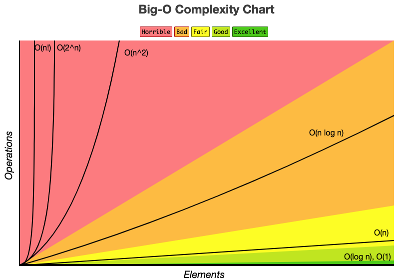

# Complexity(big-O notation)

#### 작성자 : [이병민](https://github.com/ByeongminLee)

<br>

## 목차

1.  [복잡도 (Complexity)](#복잡도-complexity)

    -   [💡 빅오 표기법 사용 이유](#-빅오-표기법-사용-이유)

2.  [빅오 표기법 (big-O notation)](#빅오-표기법-big-o-notation)

    -   [✅ 예제1](#-예제1)
    -   [✅ 예제2](#-예제2)
    -   [✅ 예제3](#-예제3)
    -   [✅ 예제4](#-예제4)

3.  [빅오 표기법 단순화하기](#빅오-표기법-단순화하기)
4.  [공간 복잡도](#공간-복잡도)

    -   [✅ 예제1](#-예제1-1)
    -   [✅ 예제1](#-예제1-2)

5.  [빅오 표기법 정리](#빅오-표기법-정리)

<br>

<br>

<br>

## 복잡도 (Complexity)

복잡도는 알고리즘의 성능을 나타내는 척도를 뜻한다.<br>
소스코드가 길고 많은 모듈이 있을때, 단순히 보기에 복잡하거나 이해하기가 복잡하다가 아니라 그 프로그램의 성능면에서의 복잡도를 의미한다.

1. 시간 복잡도<br>
   특정한 크기의 입력에 대하여 알고리즘의 수행 시간 분석<br>
2. 공간 복잡도<br>
   특정한 크기의 입력에 대하여 알고리즘의 메모리 사용량 분석<br>

시간 복잡도가 높다는 것은 수행시간이 오래 걸린다는 뜻이고 낮다는 것은 수행시간이 빠르게 실행한다는 것이고 공간 복잡도가 높다는 것은 많은 메모리가 필요하다는 것이다.

그래서 동일한 기능의 알고리즘이 있으면 복잡도가 낮을 수록 좋은 알고리즘이다.

이러한 복잡도를 표기하는 방법으로 가장 많이 쓰이는 것이 <code>빅오 표기법(Big-O notation)</code>이다.

<br>

### 💡 빅오 표기법 사용 이유

앞서 복잡도를 표기하는 방법으로 빅오 표기법이 있다고 했다.<br>
그렇다면 빅오 표기법과 같은 복잡도를 구하는 이유가 있다.<br>
예를 들어 다음은 실행 시간을 직접 계산하여 비교하는 방법이다.

-   첫번째 방법

    ```js
    function sum1(n) {
        let result = 0;
        for (let i = 1; i <= n; i++) {
            result += i;
        }
        return result;
    }

    let t1 = performance.now();
    sum1(100000000);
    let t2 = performance.now();

    console.log(`실행시간 : ${(t2 - t1) / 1000} 초`);
    ```

-   두번째 방법

    ```js
    function sum2(n) {
        return (n * (n + 1)) / 2;
    }

    let t1 = performance.now();
    sum2(100000000);
    let t2 = performance.now();

    console.log(`실행시간 : ${(t2 - t1) / 1000} 초`);
    ```

실행되기 전과 후에 각각 <code>performance.now()</code>로 실행 전 후의 차를 구해서 시간을 구하는 방식이다.

두 알고리즘은 같은 입력값에 대해서 같은 결과를 보여주지만 수행시간에 잇어서는 크게 차이가 난다.

1. 첫번째 방법 : 0.1266...<br>
2. 두번째 방법 : 0.00001950..

위의 두가지 코드의 수행시간 시간은 약 1000배정도 나는 것을 알 수 있거 알고리즘의 중요성을 알 수 있다. <br>

> 참고로 실행시간은 실행 환경에 따라 다르다.<br>
> 그렇기 때문에 시간이 어느정도 걸린다보다는 어느것이 빠른지만 비교하는 것이 좋다.

입력값이 작을때는 상관없지만 입력값이 억,조단위로 넘어가고 시간이 3~4시간 걸리는 실행 속도를 측정할때는 알고리즘을 서로 비교를 하기가 힘들다.

그렇기 때문에 빅오 표기법을 통해서 직접 실행을 하지 않고도 실행 시간을 비교 할 수 있다.

<br>

<br>

## 빅오 표기법 (big-O notation)

빅오는 입력 값이 늘어나는 것과 실행 시간이 변화는 관계를 의미한다.<br>
_(입력의 크기와 실행 시간의 관계)_

### ✅ 예제1

```js
function sum1(n) {
    let result = 0;
    for (let i = 1; i <= n; i++) {
        result += i;
    }
    return result;
}
```

위에서 봤던 <code>sum1()</code> 이 함수는 n이 커질 수록 실행 시간에 영향을 받는다. <br>
실행시간이 n의 곱과 연결되어 있어서 실행시간이 n의 값과 1:1로 증가하게 된다. <br>
**이 알고리즘을 <code>$O(N)$</code> 으로 표기 한다.**

<br>

### ✅ 예제2

```js
function sum2(n) {
    return (n * (n + 1)) / 2;
}
```

두 번째 방법은 실행시간이 n의 값과 상관이 없다. <br>
실제로 값이 얼마가 입력되든 상관없이 값을 보여주기 때문이다.<br>
**이 알고리즘은 <code>$O(1)$</code>로 표기한다.**

<br>

### ✅ 예제3

```js
function updown(n) {
    for (let i = 0; i < n; i++) {
        console.log(i);
    }
    // -> O(n)
    for (let j = n - 1; j >= 0; j--) {
        console.log(j);
    }
    // -> O(n)
}
```

위의 코드는 1~n까지와 n~1까지의 수를 출력하는 두개의 반복문을 사용했다.<br>
각각의 반복문은 n의 값에 따라 실행 시간이 바뀌기 때문에 <code>$O(N)$</code>으로 표기 할 수 있다. <br>
그리고 두개의 <code>$O(N)$</code> 이기 때문에 <code>$O(2N)$</code>으로 표기를 할 수 있는데 빅오 표기법에서는
상수의 경우 표시 하지 않고 똑같이 <code>$O(N)$</code>으로 표기한다.

> ❓ 상수를 표시 하지 않는 이유는 아래 단순화하는 방법에서 따로 설명한다.

### ✅ 예제4

```js
function printvalue(n) {
    for (let i = 0; i < n; i++) {
        for (let j = 0; j < n; j++) {
            console.log(i, j);
        }
    }
}
printvalue(10);
```

이 코드는 이중 반복문을 사용한다.<br>
<code>$O(N)$</code>안에 <code>$O(N)$</code>이 있는 구조이다.

n이 값이 커질 수 록 실행 시간이 n제곱 만큼 커진다.<br>
즉,<code>$O(N^2)$</code>으로 표기 할 수 있다.

<br>

<br>

## 빅오 표기법 단순화하기

빅오 표기법에서는 전체적인 큰 그림만을 보여주기 때문에 상수는 표기 하지 않고 가장 큰 빅오표기법만 표기한다.

-   $O(2n)$, $O(n+10)$ == $O(n)$ <br>
-   $O(500)$, $O(50n+50)$ == $O(1)$ <br>
-   $O(13n^2)$, $O(n^2 +3n + 4)$ == $O(n^2)$ <br>

처음에 이야기 할때 실제 실행 시간은 크게 중요하지 않다고 했다.<br>
실행 시간은 환경에따라 바뀔 수 있기 때문에 정확한 시간값보다는 값이 입력값에 따르 어떻게 바뀌는가가 중요하다.

다음과 같은 그래프로 *입력값*과 *실행시간*을 시각화해서 비교해보면 그 이유를 알 수 있다.<br>
값이 무한이 커진다 했을때 상수는 무의미해진다.

,O(n)O(n^2).png>)

위의 그래프를 보면 알 수 있듯이 입력값과 시간은 비례해서 늘어나게 되기때문에 값이 커질 수록 상수 값은 무의미 해지는 것을 알 수 있다.

<br>

그리고 상수 뿐만 아니라 빅오표기가 두개 이상일때는 가장 큰 빅오 표기만을 표기한다.

$O(n^2 +3n + 4)$의 경우에는 $O(n)$과 $O(n^2)$가 둘다 있어 보인다.<br>
하지만 무한이 커질때로 보면 이 역시 $O(n^2)$만 시간에 영향을 끼친다.<br>
예시로 $O(n^2)$와 $O(n^2 +3n + 4)$에 각각 입력값으로 1조를 넣는다고 했을때의 값음 다음과 같다.

-   1000000000000000000000000 <br>
-   1000000000000300000000004 <br>

이 두수는 크기는 사실 차이가 없다.<br>
👉 &nbsp; **그렇기 때문에 가장 큰 복잡도만을 표기하게 된다.**

<br>

<br>

## 공간 복잡도

지금 까지 시간 복잡도는 입력값에 따라 시간이 얼마나 걸리는지에 관한 것이다.<br>
공간 복잡도는 입력이 커질 수록 알고리즘이 얼마나 많은 공간을 차지 하는지에 관한 복잡도이다.

### ✅ 예제1

```js
function sum(arr){
	let result = 0; //1
	for(let i = 0; i < arr.length; i++){ // 2
		result += arr[i];
	}
	retrun result
}
```

이 코드에서의 공간은 <code>result = 0</code>와 <code>for문</code>에서 <code>let i = 0</code>이라고 볼 수 있다.<br>
함수 <code>sum</code>은 새로운 변수를 만들어 내지 않고 결국 result 에 값을 더한것을 반환한다.<br>

입력한 값과 상관없이 새롭게 공간을 만들거나 하지 않으므로 공간 복잡도는 <code>$O(1)$</code>으로 표기할 수 있다.

### ✅ 예제1

다음은 배열을 받아서 값을 두배로 하고 반환하는 함수이다.

```js
function double(arr){
	let newARR = [];
	for(let i = 0; i < arr.length; i++){
		newArr.push(2 * arr[i);
	}
	return newArr;
}
```

여기서 중요한 것은 입력된 배열을 새로운 배열에 저장한다.<br>
시간 복잡도에서 설명했듯이 입력된 값에 2배, 3배와 같은 상수는 중요하지 않다.<br>
입력한 배열의 길이가 50개이면 새로운 배열 (=새로운 공간)에 저장되는 아이템이 50개가 되어서 리턴된다.

즉, 차지하는 공간은 입력 된 배열의 크기와 비례해서 커지게 되서 <code>$O(N)$</code>으로 표기 할 수 있다.

<br>

<br>

## 빅오 표기법 정리

위에서 나타낸것 처럼 빅오 표기법으로 시간 복잡도와 공간 복잡도를 나타내여 알고리즘 성능을 테스트하지 않고도 비교할 수 있다.

빅오 표기법이 무엇인가에 대해 설명하기 위해 3가지 표기법만 보였지만 빅오 표기법은 다음과 같이 세분화 할 수 있다.

(위에 있을 수록 좋은 성능을 나타낸다.)

| 순위       | 명칭           |
| ---------- | -------------- |
| $O(1)$     | 상수 시간      |
| $O(logN)$  | 로그 시간      |
| $O(N)$     | 선형 시간      |
| $O(NlogN)$ | 로그 선형 시간 |
| $O(N^2)$   | 이차 시간      |
| $O(N^3)$   | 삼차 시간      |
| $O(2^n)$   | 지수 시간      |

<br>

<br>

## 추가 복잡도에 관한 참고 사항

하단 내용은 다음 내용을 참고한 내용입니다.

reference : [BigO Reference](http://bigocheatsheet.com/)

<br>



### 입력 데이터 크기에 따른 성능 비교

| Big O 표기     | 10 개 일때 | 100 개 일때 | 1000 개 일때 |
| -------------- | ---------- | ----------- | ------------ |
| **O(1)**       | 1          | 1           | 1            |
| **O(log N)**   | 3          | 6           | 9            |
| **O(N)**       | 10         | 100         | 1000         |
| **O(N log N)** | 30         | 600         | 9000         |
| **O(N^2)**     | 100        | 10000       | 1000000      |
| **O(2^N)**     | 1024       | 1.26e+29    | 1.07e+301    |
| **O(N!)**      | 3628800    | 9.3e+157    | 4.02e+2567   |

### 자료 구조 작업별 복잡도

| Data Structure (자료구조)               | Access (접근) | Search (검색) | Insertion (삽입) | Deletion (삭제) | Comments (비고)               |
| --------------------------------------- | :-----------: | :-----------: | :--------------: | :-------------: | :---------------------------- |
| **Array** (배열)                        |       1       |       n       |        n         |        n        |                               |
| **Stack** (스택)                        |       n       |       n       |        1         |        1        |                               |
| **Queue** (큐)                          |       n       |       n       |        1         |        1        |                               |
| **Linked List** (연결 리스트)           |       n       |       n       |        1         |        n        |                               |
| **B-Tree** (B-트리)                     |    log(n)     |    log(n)     |      log(n)      |     log(n)      |                               |
| **Red-Black Tree**                      |    log(n)     |    log(n)     |      log(n)      |     log(n)      |                               |
| **AVL Tree** (AVL 트리)                 |    log(n)     |    log(n)     |      log(n)      |     log(n)      |                               |
| **Bloom Filter**                        |       -       |       1       |        1         |        -        | 거짓 양성이 탐색 중 발생 가능 |
| **Binary Search Tree** (이진 탐색 트리) |       n       |       n       |        n         |        n        | 균형 트리의 경우 O(log(n))    |
| **Hash Table** (해시 테이블)            |       -       |       n       |        n         |        n        | 완벽한 해시 함수의 경우 O(1)  |

### 정렬 알고리즘 복잡도

| Name (이름)               |  Best (최적)  |        Average (평균)        |        Worst (최악)         | Memory (메모리) | Stable (동일값 순서 유지) | Comments (비고)                                                      |
| ------------------------- | :-----------: | :--------------------------: | :-------------------------: | :-------------: | :-----------------------: | :------------------------------------------------------------------- |
| **Bubble sort** (거품)    |       n       |        n<sup>2</sup>         |        n<sup>2</sup>        |        1        |            Yes            |
| **Insertion sort** (삽입) |       n       |        n<sup>2</sup>         |        n<sup>2</sup>        |        1        |            Yes            |
| **Selection sort** (선택) | n<sup>2</sup> |        n<sup>2</sup>         |        n<sup>2</sup>        |        1        |            No             |                                                                      |
| **Heap sort** (힙)        | n&nbsp;log(n) |        n&nbsp;log(n)         |        n&nbsp;log(n)        |        1        |            No             |                                                                      |
| **Merge sort** (병합)     | n&nbsp;log(n) |        n&nbsp;log(n)         |        n&nbsp;log(n)        |        n        |            Yes            |
| **Quick sort** (퀵)       | n&nbsp;log(n) |        n&nbsp;log(n)         |        n<sup>2</sup>        |     log(n)      |            No             | 퀵 정렬은 보통 제자리(in-place)로 O(log(n)) 스택공간으로 수행됩니다. |
| **Shell sort** (셸)       | n&nbsp;log(n) | 간격 순서에 영향을 받습니다. | n&nbsp;(log(n))<sup>2</sup> |        1        |            No             |
| **Counting sort** (계수)  |     n + r     |            n + r             |            n + r            |      n + r      |            Yes            | r - 배열내 가장 큰 수                                                |
| **Radix sort** (기수)     |    n \* k     |            n \* k            |           n \* k            |      n + k      |            Yes            | k - 키값의 최대 길이key                                              |
