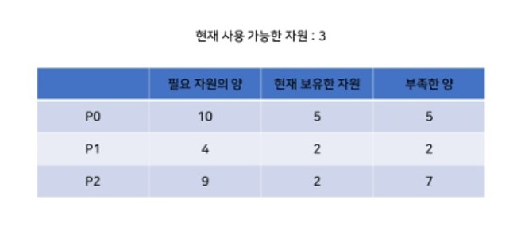

# Deadlock

#### 작성자 : [전찬민](https://github.com/cksals3753)

- 참고자료: [Deadlock](https://4legs-study.tistory.com/45)

### Deadlock (교착상태)

운영체제에서 데드락(교착상태)이란, 시스템 자원에 대한 요구가 뒤엉킨 상태입니다.
 
즉, 둘 이상의 프로세스가 다른 프로세스가 점유하고 있는 자원을 서로 기다릴때 무한 대기에 빠지는 상황을 말한다.
 

P0은 P1이 signal(Q)를 실행하기 전까진 wait(Q) 문장에서 계속 대기한다.
 
마찬가지로 P1도 P0이 signal(S)를 실행하기 전까진 wait(S) 문장에서 계속 대기한다.
 
두 프로세스 모두 결국 signal() 문장을 실행할 수 없기 때문에, 두 프로세스 모두 무한히 대기하게 된다.
 
이러한 상황을 교착상태라 한다. 즉, 한 프로세스가 요구하는 자원을 대기중인 다른 프로세스가 가지고 있는 경우를 말한다.

#### 용어

- Request : 프로세스가 해당 자원을 요청한다. 만약 자원을 요청한 프로세스가 그 즉시 해당 자원을 받을 수 없다면, 자원을 요청한 프로세스는 해당 자원을 얻을 때까지 대기한다.
- Use : 프로세스는 해당 자원을 통해 동작할 수 있다.
- Release : 프로세스가 자원의 사용을 마치고, 다른 프로세스들이 그 자원을 사용할 수 있게끔 소유권을 포기한다.

### Deadlock Conditions (교착상태 발생조건)

교착상태는 다음과 같은 네 조건이 동시에 만족될 때 발생한다.

#### Mutual Exclution (상호 배제)

> 적어도 하나의 자원은 공유 불가능한 상태여야한다. (Non-shareable mode)
>  

> 자원에 대해 한 번에 하나의 프로세스에게만 사용을 허가한다는 의미이다. (정확히는 그 자원의 instance 하나에 대해)
>  

> 다른 프로세스가 사용중인 자원을 요청한 프로세스는 그 자원이 Release 될 때까지 대기해야 한다.

#### Hold and Wait (점유대기)

> 프로세스는 적어도 하나의 자원을 들고 있는 상태에서 다른 프로세스가 가지고 있는 추가적인 자원을 요청해야 한다.

#### No Preemption (비선점)

> 자원이 선점될 수 없다. 이는 그 자원을 사용하는 프로세스에 의해서만 Release 될 수 있음을 의미한다.
>  

> 이미 할당된 자원을 강제로 빼앗을 수 없다

#### Circular Wait (순환대기)

> 대기중인 프로세스의 집합 {P0, P1, P2...Pn}에 대해 P0은 P1의 자원을, P1은 P2의 자원을.. Pn은 P0의 자원을 요청하는 상태여야 한다. (이는 자원요청에 대한 사이클이 발생해야 한다는 의미와 같다)

### Resource-Allocation Graph

교착상태는 방향 그래프인 System Resource-Allocation Graph를 통해 나타낼 수 있다.
 
그래프는 프로세스를 나타내는 P = {P1, P2,...Pn}와 자원을 나타내는 R = {R1, R2, ... Rm}으로 나뉘어지는 정점들의 집합 V와 프로세스와 자원의 관계를 나타내는 간선의 집합 E로 표현된다.
 
그래프의 Pi -> Rj 는 프로세스 Pi가 자원 Rj를 Request 했고, 현재 그 자원에 대해 대기하고 있다는 의미이다.
 

> (이를 Request Edge라 하며, 정확히는 Rj 유형 자원의 instance 하나를 요청한 것이다.)

그래프의 Rj -> Pi는 자원 Rj가 프로세스 Pi에 의해 사용되고 있음을 의미한다.

> (이를 Assignment Edge라 하며, 마찬가지로 Rj 유형 자원의 instance 하나에 대한 것이다.)

Resouce-Allocation Graph에서 사이클이 발생했다고 해서 반드시 교착 상태는 아니나,
 
Resouce-Allocation Graph에 사이클이 존재하지 않는다면 교착상태는 발생하지 않는다.

### Deadlock Handling (교착상태 해결법)

일반적으로 교착상태는 3가지 방법으로 다룰 수 있다.
 

1. 교착상태를 회피하거나 예방하여 교착상태가 아예 일어나지 않도록 하는 방법이 있다.
2. 교착상태는 허용하나, 교착상태가 발생했을 때 이를 감지하고 회복하도록 하는 방법이 있다.
3. 교착상태가 발생하지 않을 것으로 생각해 교착상태 자체를 무시하는 방법이 있다.

이 중 세 번째 방법이 UNIX를 포함한 대부분의 운영체제에서 사용되는 방법이다.

### Deadlock Prevention (교착상태 예방)

교착상태가 발생하는 4가지 조건들 중 하나 이상을 발생하지 않도록 하여 교착상태를 예방한다.

#### Mutual Exclusion (자원의 상호 배제 조건방지)

> 한 번에 여러 프로세스가 공유 자원을 사용할 수 있게 한다.

#### Hold and Wait (점유 대기 조건 방지)

> 프로세스가 자원을 요청할 때, 다른 어떤 프로세스도 그 자원을 들고 있지 않도록 보증한다.
>  

> 프로세스가 반드시 실행 전에 필요한 자원을 모두 들고 있도록 하거나, 어떤 자원도 가지지 않은 프로세스에 한해 자원을 요청하도록 한다.

#### No Premption (비선점 조건 방지)

> 이미 다른 프로세스에게 할당된 자원이 선점권이 없다고 가정할 때, 높은 우선순위의 프로세스가 해당 자원을 선점할 수 있도록 한다.

#### Circular Wait (순환 대기 조건 방지)

> 자원을 순환 형태로 대기하지 않도록 일정한 한 쪽 방향으로만 자원을 요구할 수 있도록 합니다.

### Deadlock Avoidance (교창상태 회피)

자원들이 어떻게 요청되는지에 대한 정보를 통해, 프로세스의 대기 결정을 내림으로써 교착상태를 회피할 수 있다.

#### Safe State

이 상태에서 시스템은 각 프로세스들에게 자원을 할당하고도 교착상태가 발생하지 않는다.

P1에서 현재 사용 가능한 자원 2개를 받아, 자신의 일을 마칠 수 있다. 일을 마치고 자원 4개를 Release하여 사용 가능한 자원은 총 5개가 된다.
 
이후 P0에서 사용 가능한 자원 5개를 받아, 일을 마치고 자원10개를 Release하여 사용 가능한 자원은 10개가 된다.
 
마지막으로 P2에서 사용 가능한 자원7개를 받아, 교착상태 없이 모든 프로세스가 일을 마칠 수 있다.

#### Unsafe State

교착상태가 발생할 수 있는 상태를 말한다. (모든 Unsafe State가 교착상태를 일으키진 않는다.)

이 상황에서는 이전에시와 마찬가지로 P1이 일을 종료할 수 있다.
 
하지만 P1이 일을 마치고 Release하는 자원이 4개이므로 P0, P2 어떤 프로세스도 일을 종료할 수 없게된다.
 
이를 통해 교착상태가 발생하는 경우를 미리 알 수 있다.
 
따라서 교착상태 회피의 핵심은 항상 Safe State가 되는 방향으로 자원을 할당하는 것이다.

#### Resource-Allocation-Graph Algorithm

위 그래프에서 점선으로 표시된 화살표를 Claim Edge라 하고, 미래에 프로세스가 해당 자원을 요청할 것을 의미한다.
 
만약 프로세스가 자원을 실제로 요청한다면, 기존의 Requset Edge(실선)으로 표기된다.
 
자원이 사용을 마치고 Release 된다면, Claim Edge로 돌아간다.
 
그래프 내에서 사이클이 발생하지 않는 경우에 한해 자원을 할당한다.

#### Banker's Algorthm

Resource-Allocation-Graph Algorithm은 자원에 여러개의 instance가 존재할 때 문제를 해결해 주지 못한다.
 

1. 새로운 프로세스는 반드시 각 자원들에 대해 최대 필요량을 미리 선언한다.
2. 요청이 발생했을 때, 해당 요청을 수행하여도 Safe State가 되는지 확인한다.
3. Safe State가 된다면 자원을 할당하고, 아니라면 대기한다.

Banker's Algorthm은 위의 테이블들을 사용하여 다음과 같이 동작한다.

1. 모든 프로세스들에 대해, 각 프로세스의 Work값은 그 자원의 Available, Finish값은 False를 갖는다.
2. Finish[i] == False이고, Need <= Work 인 i를 찾는다. 만약 없다면 4로 간다.
   > 이는 현재 완료되지 않고, 사용 가능한 자원을 통해 완료시킬 수 있는 프로세스를 찾는 것과 같다.
3. Work += Allocation[i], Finish[i] = True 를 진행한 뒤 2로 돌아간다.
   > 사용 가능한 자원을 통해 프로세스를 완료시킬 수 있다면, 완료했음을 표시하고
   > 완료 이전에 해당 프로세스가 들고있던 자원 (Allocation[i])을 Release할 것이므로 Work에 더해준다.
4. 모든 프로세스들의 Finish값이 True라면, Safe State이다.

### Deadlock Detection (교착상태 감지)

감지되지 않은 교착상태는 시스템 전체의 성능을 약화시킬수 있기 때문에, 이를 감지하고 회복하도록 한다.
